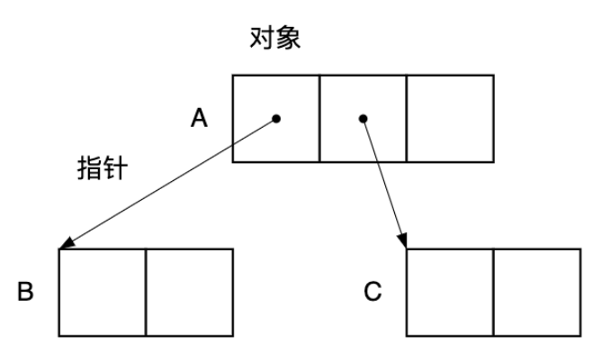
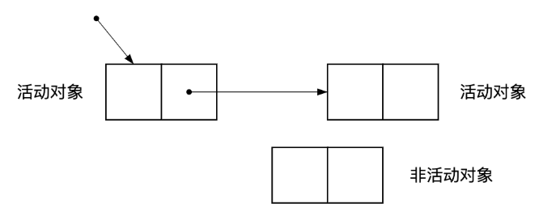
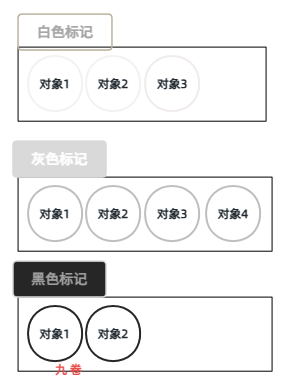

Go GC 垃圾回收发展历史和三色标记算法原理简析

## Go GC 发展史简介

- **Go1.0**：STW，采用最朴素的**标记 - 清除**（Mark-and-Sweep）算法，执行 GC 时必须完全暂停所有 goroutine（Stop The World，STW），然后单线程完成标记和清除两个阶段。STW 过程中，CPU 不执行代码，全部用于垃圾回收，对程序性能影响很大。

- **Go1.1-1.4**：并发标记。Go 1.1 引入精确式 GC（Precise GC），编译器生成精确的指针位图，GC 不再将普通整数误判为指针。Go 1.3 开始并行执行标记阶段，利用多核加速。

- **Go1.5**：GC 里程碑，引入 **Dijkstra 三色并发标记算法**。Go 1.5 是 GC 历史上最重要的版本，引入 Dijkstra 三色标记算法，实现了 GC 与程序真正意义上的并发执行，将 STW 停顿从数百毫秒降低到 <10ms。

- **Go1.6-1.13**：这一时期（2016-2019）通过多项精细化工程优化，将 STW 从 <10ms 进一步压缩到 <1ms，同时降低写屏障开销，引入更智能的 GC 触发控制。Go 1.12，典型应用的 GC 停顿稳定在 0.1–1ms 级别。**混合写屏障**（**插入写屏障**（Dijkstra）和**删除写屏障**（Yuasa）的优点）显著降低了写屏障开销，GC 吞吐量提升明显。
  - Go1.8 混合写屏障
  - GC Pacing（自动调步）
  - 栈扫描优化
  
- **Go1.14-1.24**：这一阶段专注于内存归还操作系统的效率（Scavenger）、更灵活的内存限制机制，以及运行时核心数据结构的优化。
  - Go1.19，GOMEMLIMIT。软性内存上限，防止 OOM；超限时主动触发更频繁 GC；与 GOGC 协同控制内存/CPU 平衡。
  
  - Go 1.14，后台 Scavenger。异步将空闲内存归还操作系统；不再等待 runtime.GC() 触发。
  - Go 1.24，Swiss Tables。map 内部哈希表重新实现；SIMD 友好的探测策略。
  - Go1.21，PGO（Profile-Guided Opt）。根据真实 profile 优化逃逸分析；减少不必要的堆分配。

- **Go1.25-1.26**：Green Tea GC，Go 1.26 默认启用 ，基于 Span 的内存感知并行标记，GC CPU 开销下降 10 - 40%，AVX-512向量加上，再额外减少约 10% 的 GC CPU 时间。
  - CPU 开销能下降，主要是因为它把“标记阶段的遍历粒度”从“对象”改成“8 KiB 页”，并配合 seen/scanned 2‑bit 元数据 + 页队列 + SIMD 向量扫描，从而显著改善了缓存命中、降低队列争用、充分利用现代向量硬件。

## GC 中的一些术语

### 垃圾(Garbage)和垃圾回收GC(**G**arbage **C**ollection)

垃圾(Garbage)就是需要回收的对象，就像我们日常丢弃的垃圾一样。

在计算机程序中，“垃圾”指程序运行过程中分配的、但已经不再被使用的内存；“回收”指操作系统或运行时环境把这些没用的内存重新收回来，以便分配给新的对象使用。

它是一种**自动内存管理机制**。程序员在写代码时只需要申请内存（比如创建对象），而不需要手动释放内存。系统会自动追踪哪些内存还在用，哪些内存已经死了，然后自动把死掉的内存清理掉。

因此需要一些算法来判断，比如程序直接或者间接地引用一个对象，那么它就会被计算机标记为“存活”；相反的，没有被引用到的对象就被视为“死亡”。GC 程序需要把把这些“死亡”的对象找出来，然后作为垃圾进行回收，这就是 GC 的本质。

### 根（Root）

根(Root)，就是判断对象是否可被引用的起始点，根是指向对象的指针的“起点” 部分。

### GC 算法

主流算法包括标记-清除、引用计数、标记-复制和标记-整理。现代 JVM 多采用分代收集算法，根据对象存活周期将内存划分为新生代和老年代，采取不同的高效回收策略。

### 对象、指针、活动对象、非活动对象、堆

GC 操作的基本单元可以叫做对象。对象是内存空间的某些数据的集合。

指针是指向内存空间中某块区域的值。GC 是根据对象的指针指向去搜寻其他对象的。对象和指针的关系如图所示

我们将内存空间中被其他对象通过指针引用的对象成为活动对象，没有对象引用的对象是非活动对象，也就是GC需要回收的垃圾，

   （图片来自：https://zhuanlan.zhihu.com/p/690601125 腾讯技术工程）

## Go垃圾回收：三色并发标记

### 标记-清除算法缺点

在 Go1.5 版本时，引入 Dijkstra 三色并发标记算法，是 Go GC 的一个里程碑，将 STW 停顿从数百毫秒降低到 <10ms，所以分析下这个垃圾回收算法。

在引入三色并发标记算法前，是标记-清除算法，这个算法在 STW 过程中，CPU 不执行代码，全部用于垃圾回收，对程序性能影响很大。

标记-清除算法的缺点：程序在 GC 期间完全冻结，延迟从数百毫秒到数秒，完全不适合延迟敏感型服务。堆越大，停顿越久，无法线性扩展。

### 三色标记法介绍

三色标记法是对传统图遍历可达性分析的一种并发化改造。是并发 GC 的基础，它将对象分为三种颜色：

- **白色**：未被 GC 访问过的对象。GC 开始时所有对象都是白色，GC 结束后，剩余的白色对象不可达，即为垃圾。最开始时，白色对象可能是死亡的对象，需要经过 GC 扫描验证。
- **灰色**：对象已被 GC 访问到，但其引用的其它对象还未被完全扫描。需要对其中的一个或多个指针进行扫描，因为他们可能还指向白色对象。
- **黑色**：对象已被 GC 访问到的对象，且它引用的所有对象都已经被扫描，黑色对象中任何一个指针都不能再直接指向白色对象了。**黑色是绝对安全的存活对象**。

### 并发标记过程

**1**：初始状态，将所有对象标记为白色。

**2**：根对象，从根节点集合出发，将第一次遍历到的节点标记为灰色放入集合列表中。

**3**：遍历灰色集合，将灰色节点遍历到的白色节点标记为灰色，并把灰色节点标记为黑色。

**4**：重复上一个步骤，直到灰色对象队列为空。

**5**：剩下的所有白色对象都是垃圾对象

​                                                （gif动态图，来自 https://cloud.tencent.cn/developer/article/2388013）

其执行过程是从根对象（全局变量、goroutine栈等）开始，像墨水扩散一样将可达对象由白变灰、再由灰变黑。最终，未被染色的白色对象就是需要回收的垃圾。

### 并发标记存在的问题

在“并发标记”阶段，用户程序和 GC 线程是同时运行的。假设有以下场景：

初始阶段：对象 A（黑色） -> 对象 B（白色） -> 对象 C（白色）。此时 B 是垃圾。

z这时用户程序把 A 的指针指向了 C（`A.ptr = C`），同时断开了 B 的指针（`B.ptr = nil` 或者 B 被其他地方切断）。到直接结果，GC 线程永远不会再去扫描黑色的 A 了，C 永远保持白色。本该存活的对象 C 被错误地当成了垃圾回收！

错误回收通常需要同时满足以下条件：

1. 一个黑色对象新增了指向一个白色对象的引用。
2. 该白色对象原本的所有引用（来自灰色对象）被同时删除。

怎么解决？

写屏障的作用就是在指针更新时“拦截”这些危险操作，确保GC标记的正确性，且几乎不需要暂停程序。

### 写屏障的演进

我们就需要在用户程序修改指针的瞬间，插入一段保护代码，这就是**写屏障**。它类似于数据库的触发器。

#### Dijkstra 插入写屏障

当创建一个新引用（插入指针）时，将被引用的对象标记为灰色。这能有效避免“黑色对象引用白色对象”，但它不作用于性能敏感的栈。

标记结束后需要一次STW来重新扫描所有栈，确保没有遗漏，这在高并发场景下会产生约10-100ms的延迟。

> 当 `A.ptr = C` 发生时，把 C 强制标灰

这个方法的**缺点**：STW 会导致栈重新扫描。

于是引入 删除写屏障（Yuasa）。

#### Yuasa 删除写屏障

当一个引用被覆盖（删除指针）时，将被覆盖的对象标记为灰色。它能保证所有存活对象都被扫描，但需要在GC开始时进行一次STW来拍摄堆内存快照，并且会导致扫描精度下降，不适用于大内存场景。

> 当 `A.ptr = C` 发生时，把被覆盖的**旧值**（假设是 `B`）强制标灰。
>
> 即使 B 真的是垃圾，被标灰后，这一轮 GC 也不会回收它，只能留到下一轮。
>
> 优点是不需要重新扫描栈。

这个方法缺点：会误标垃圾为存活（浮动垃圾）

解决方法：将 Dijkstra 和 Yuasa 结合起来，发明了混合写屏障。

#### 混合写屏障

Go 1.8 巧妙地将 Dijkstra 和 Yuasa 结合起来，发明了混合写屏障，彻底消灭了栈重扫描的 STW，同时保证了极低的浮动垃圾。

它通过在指针更新时执行两个核心操作来解决全部问题：

1. **操作1：`shade(*slot)`** (继承删除写屏障) — 将被覆盖的指针指向的对象标记为灰色。
2. **操作2：`shade(ptr)`** (继承插入写屏障) — 如果当前 Goroutine 的栈尚未被扫描（为灰色），则将新写入的指针指向的对象标记为灰色。

混合写屏障彻底消除了为重新扫描栈而设的 STW，将 GC 停顿时间压缩到了微秒级别

**混合屏障带来的好处**：

- 消灭了栈重扫描：GC 结尾不需要再 STW 去扫描百万个 Goroutine 的栈，STW 时间从 Go 1.7 的几十/几百毫秒，骤降到几十微秒甚至更低。
- 屏障开销可控：只在堆指针赋值时生效，且相比纯粹的 Dijkstra，少了一部分对栈指针的 shade 操作。

### GC全生命周期分析

**第一阶段**：GC Start，极短 STW

首先开启混合写屏障（设置全局标志位）。扫描所有的 GC Roots（全局变量、各个 G 的栈）。

注意：在这里，所有的 G 栈被直接标黑，不进灰色队列。

将全局变量指向的堆对象标灰，加入工作队列。恢复用户程序执行。

**第二阶段**：并发标记

1、后台 GC Worker：不断从灰色队列取对象，标黑，将其子对象标灰。

2、用户 Goroutine（Mutator）：正常执行。如果触发了堆指针赋值，混合写屏障生效，将被覆盖的旧对象标灰，将新的堆对象标灰，放入队列。

3、辅助标记：如果此时用户程序分配内存太快，GC 跟不上，为了防止内存爆掉，用户 Goroutine 会被强制拉去帮忙做标记（这就是 `runtime.ReadMemStats` 里看到的 `GCCPUFraction` 的来源）。

**第三阶段**：Mark Termination（极短 STW）

这个触发条件为灰色队列为空。关闭混合写屏障。

做一些收尾工作（清理 gcWork 缓存、重置 GC 状态、计算下一次触发阈值等）。

此时，全堆的对象非黑即白。存活对象全黑，垃圾对象全白。恢复用户程序。

**第四阶段**：并发清除

1、后台 Sweep 协程：遍历所有的内存页。

- 如果发现一页上没有黑色对象（全是白色垃圾），直接将这页交还给分配器。
- 如果一页上有黑色对象，将其中的白色对象清理掉，组成空闲链表。

2、用户程序：正常执行，分配内存时可以直接从 Sweep 回收的空闲链表中拿。

[完]

## 参考

- https://go.dev/doc/devel/release  Go Release History
- https://go.dev/doc/go1.26 Go 1.26 Release Notes
- https://juejin.cn/post/6844903857609244685 垃圾回收(GC)浅谈 ，里面有标记-清除图解，应用技术、复试收集图解
- https://zhuanlan.zhihu.com/p/690601125  一文搞懂七种基本的GC垃圾回收算法-腾讯技术工程
- https://zhuanlan.zhihu.com/p/297177002 图示Golang垃圾回收机制
- https://cloud.tencent.cn/developer/article/2388013?from=15425 Golang GC 介绍
- https://zhuanlan.zhihu.com/p/334999060 [Go三关-典藏版]Golang垃圾回收+混合写屏障GC全分析 ，图解分析

 