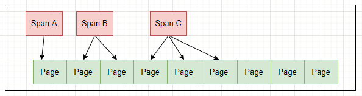
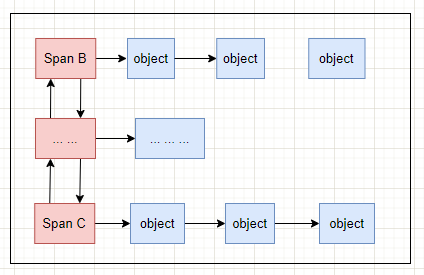

## 一、TCMalloc

### TCMalloc简介
为啥要介绍 [TCMalloc](https://github.com/google/tcmalloc)？
因为golang的内存分配算法绝大部分都是来自 [TCMalloc](https://github.com/google/tcmalloc)，golang只改动了其中的一小部分。所以要理解golang内存分配算法，就要先了解下TCMalloc，为后面分析golang内存做一做功课。

[tcmalloc](https://github.com/google/tcmalloc) 是google开发的内存分配算法库，最开始它是作为google的一个性能工具库 [perftools](https://github.com/gperftools/gperftools) 的一部分。TCMalloc是用来替代传统的malloc内存分配函数。它有减少内存碎片，适用于多核，更好的并行性支持等特性。
前面TC就是Thread Cache两英文的简写。

它提供了很多优化，如：
- TCMalloc用固定大小的page(页)来执行内存获取、分配等操作。这个特性跟Linux物理内存页的划分是不是有同样的道理。
- TCMalloc用固定大小的对象，比如8KB，16KB 等用于特定大小对象的内存分配，这对于内存获取或释放等操作都带来了简化的作用。
- TCMalloc还利用缓存常用对象来提高获取内存的速度。
- TCMalloc还可以基于每个线程或者每个CPU来设置缓存大小，这是默认设置。
- TCMalloc基于每个线程独立设置缓存分配策略，减少了多线程之间锁的竞争。

### TCMalloc架构简图

>来自：[google tcmalloc design](
>https://github.com/google/tcmalloc/blob/master/docs/design.md#overview) 

- Front-end：
它是一个内存缓存，提供了快速分配和重分配内存给应用的功能。它主要有2部分组成：Per-thread cache 和 Per-CPU cache。

- Middle-end：
职责是给Front-end提供缓存。也就是说当Front-end缓存内存不够用时，从Middle-end申请内存。它主要是 Central free list 这部分内容。

- Back-end：
这一块是负责从操作系统获取内存，并给Middle-end提供缓存使用。它主要涉及 Page Heap 内容。

TCMalloc将整个虚拟内存空间划分为n个同等大小的Page。将n个连续的page连接在一起组成一个Span。
PageHeap向OS申请内存，申请的span可能只有一个page，也可能有n个page。

ThreadCache内存不够用会向CentralCache申请，CentralCache内存不够用时会向PageHeap申请，PageHeap不够用就会向OS操作系统申请。

### TCMalloc中的概念

#### Page
操作系统对内存管理的单位，TCMalloc也是以页为单位管理内存，但是TCMalloc中Page大小是操作系统中页的倍数关系。2，4，8 ....

#### Span
Span 是PageHeap中管理内存页的单位，它是由一组连续的Page组成，比如2个Page组成的span，多个这样的span就用链表来管理。当然，还可以有4个Page组成的span等等。

#### ThreadCache
ThreadCache是每个线程各自独立拥有的cache，一个cache包含多个空闲内存链表（size classes），每一个链表（size-class）都有自己的object，每个object都是大小相同的。

#### CentralCache
CentralCache是当ThreadCache内存不足时，提供内存供其使用。它保持的是空闲块链表，链表数量和ThreadCache数量相同。ThreadCache中内存过多时，可以放回CentralCache中。

#### PageHeap
PageHeap保存的也是若干链表，不过链表保存的是Span（多个相同的page组成一个Span）。CentralCache内存不足时，可以从PageHeap获取Span，然后把Span切割成object。

### 小对象内存分配 ThreadCache

TCMalloc 定义了很多个size class，每个size class都维护了一个可分配的的空闲列表，空闲列表中的每一项称为一个object（如下图），同一个size-class的空闲列表中每个object大小相同。
在申请小内存时(小于256K)，TCMalloc会根据申请内存大小映射到某个size-class中。
比如，申请0到8个字节的大小时，会被映射到size-class1中，分配8个字节大小；申请9到16字节大小时，会被映射到size-class2中，分配16个字节大小….以此类推。

上面每一个object都是 N bytes。用于Thread Cache小内存分配。
这个就组成了每一个ThreadCache的free list，thread可以从各自的free list获取对象，不需要加锁，所以速度很快。

如果ThreadCache的free list为空呢？那就从CentralCache中的CentralFreeList中获取若干个object到ThreadCache对应的size class列表中，然后在取出其中一个object返回。
如果CentralFreeList中的object不够用了呢？那CentralFreeList就会向PageHeap申请一连串由Span组成页面，并将申请的页面切割成一系列的object之后，再将部分object转移给ThreadCache。
如果PageHeap也不够用了呢？那就向OS操作系统申请内存。
从上面论述可以看出，这也是一个多级缓存思想的应用。

当申请的内存大于256K时，不在通过ThreadCache分配，而是通过PageHeap直接分配大内存。

### 大对象内存分配 PageHeap

PageHeap负责向操作系统申请内存。
tcmalloc也是基于页的分配方式，即每次申请至少一页（page）的内存大小。tcmalloc中一页大小为8KB(默认，可设置)，多数linux中一页为4KB，tcmallo的一页是linux一页大小的2倍。

PageHeap申请内存时按照页申请，但它管理分配好的page内存时的基本单位是Span，Span对象代表了连续的页。如下图所示：

PageHeap中是如何组织Span，如下图

### Middle end-Central Free List
CentralFreeList是CentralCahe中，它的作用就是从PageHeap中取出部分Span，然后按照预定大小将其拆分成固定大小的object，提供给ThreadCache使用。

[完]

## 二、参考
- [TCMalloc](https://github.com/google/tcmalloc)
- [TCMalloc Design](https://github.com/google/tcmalloc/blob/master/docs/design.md)
- [TCMalloc : Thread-Caching Malloc](http://goog-perftools.sourceforge.net/doc/tcmalloc.html)
- [google gperftools](https://github.com/gperftools/gperftools)
- [图解TCMalloc](https://zhuanlan.zhihu.com/p/29216091)
- [TCMalloc的工作原理](http://blog.chinaunix.net/uid-24990614-id-3911071.html)