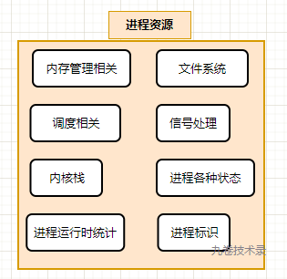
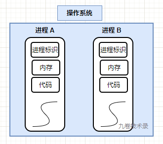
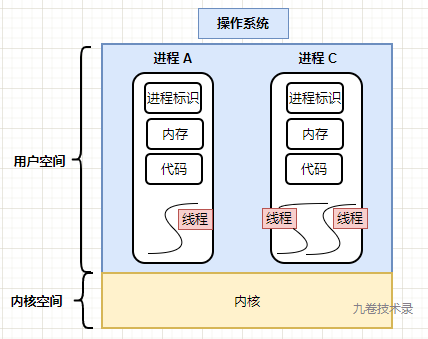
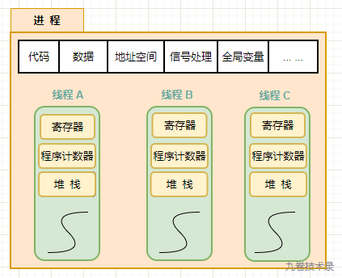
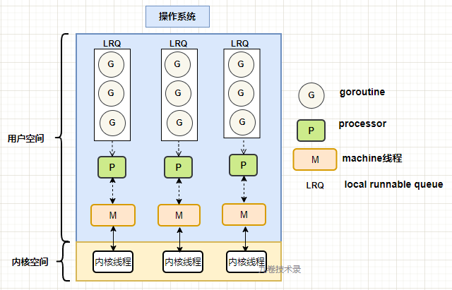

## 一、进程

先来了解一下操作系统的进程：

> 操作系统对正在运行程序的抽象，这个就是进程（process）。

比如运行一个 web 浏览器，一个 text 文本，都是运行的一个一个进程。

有的人说：进程是程序运行资源的集合。进程是系统资源分配的最小单位等等。

从静态的角度来说，进程确实是运行程序的各种资源集合。

如果你进一步思考，进程里的各种资源都有哪些呢？如下图所示：

                                    （图1：进程资源）

> - 内存管理相关
> - 文件系统
> - 调度相关
> - 信号处理
> - 内核栈
> - 进程各种状态
>
> - 进程运行时统计信息
> - 进程标识
>
> 等等。
>
> 可以看出，进程中的资源是相当多的。
>
> 从 Linux 操作系统对进程的定义也可以看出。我以前对进程结构 task_struct 分析文章：[Linux进程: task_struct结构体成员](https://www.cnblogs.com/jiujuan/p/11715853.html)

多进程：操作系统有多个程序运行，那么就有多个进程，如下所示简图：

                                   （图2：多进程简图）

## 二、线程

### 2.1 什么是线程？

《操作系统设计与实现》里说：

在传统操作系统中，每个进程中只存在一个地址空间和一个控制流（thread）。

然后，有些情况下，需要在相同地址空间中有多个控制流并行的运行，就像他们是单独的进程一样（只是他们共享相同的地址空间）。

这些控制流通常被称为线程（thread），有时也称为轻量级进程（lightweight process）。

尽管线程必须在进程中执行，但是线程和进程是可以分别对待处理的两个概念。进程用来集合资源，而线程是 CPU 调度的实体。

线程给进程模型增加的是，允许在同一个进程环境中有多个执行流，这些执行流在很大程度上相对独立。

也即是说，在进程中，程序执行的最小单位（执行流）是线程，可以把线程看作是进程里的一条执行流。

一个进程里可以有一条或多条线程。

                                    (图3：进程里的线程)

### 2.2 为什么会有多线程？

在一个应用程序执行过程中，应用程序里可能会有多种事件执行。

而有些事件执行一段时间后可能会被阻塞。如果把应用程序执行事件分解成多个并行运行的线程，即可以让程序设计变得简单，如果有阻塞的，

可以把这部分让出行换其他线程执行。

还有一个原因是：

线程比进程更轻量级。所以线程比进程更加容易创建，销毁。

第三个跟第一个有点关系，是关于性能的，若多线程都是 CPU 密集型的，那么不能获取性能上增强。如果有大量计算和大量 I/O 处理，那么

多线程就可以获取性能上的优势，因为允许多线程重叠执行。

多线程的缺点：

> 1. 对于多线程来说，进程中的资源是共享的，所以会产生资源竞争。
> 2. 当进程中的一个线程崩溃了，会导致这个进程里的其他线程也崩溃。所以有时多进程程序更好，一个进程崩溃不会导致其他进程也崩溃。

## 三、进程与线程区别

从上面进程和线程介绍知道，线程是程序执行流的最小单位，进程是操作系统分配资源的单位。

进程与进程之间关系：

> 进程与进程之间是相互独立的。

线程与进程关系：

> 线程是进程里的执行流，进程里的线程可以是一个，也可以是多个。
>
> 所有线程共享进程里一些资源，比如代码，数据，地址空间，信号处理，打开文件，全局变量等。
>
> 同时，线程也有自己的寄存器，程序计数器，堆栈，线程状态等

                                    （图4：进程与线程关系）

## 四、协程

协程是建立在线程之上，一般是语言级别的 ”多线程“ 模型，比线程更加的轻量级。有的叫它微线程。它是完全运行在用户态里。

协程是在线程之上在进行抽象，它需要线程来承载运行。一个线程可以有多个协程。

比如 Go 语言的 goroutine，它用一个关键字 `go` 就可以运行一个协程程序。

在 Go 语言里面，协程是由 Go 提供的 runtime 来控制和调度。

协程的优点：

1. 协程栈很小，只有几KB，而线程栈是 1 M，对比起来，创建大量协程需要的内存更少。

2. 协程的调度是语言提供的 runtime 来调度，是在用户空间直接调度，不需要在内核空间和用户空间来回切换，浪费效率。
3. 能更好的利用 cpu 的多核，提高程序执行性能。
4. 避免阻塞，如果协程所在的线程发生了阻塞，那么协程调度器可以把运行在阻塞线程上的协程，调度到其它没有发生阻塞的线程上，继续运行。

## 五：协程与线程区别

1. 协程是运行在线程之上，一个线程可以有多个协程。就像一个进程里可以有多个线程一样。
2. 协程能更好的控制利用多核机制。比如 Go 协程可以控制运行在多少个 CPU 的核上。
3. 协程是在用户空间完成调度，由语言提供的 runtime 进行调度完全用户态。线程由内核调度。
4. 协程使用内存更小。

## 六：Golang 中协程与线程关系

Go 中的协程相当于一个”微线程“，由 Go runtime 调度使用。它的调度模型是一个 GMP 模型，对于 Go 调度的基本了解可以看 [这里](https://www.cnblogs.com/jiujuan/p/12735559.html)，[还有这里](https://www.cnblogs.com/jiujuan/p/12977832.html)。

简单介绍下 GMP :

> G：goroutine，表示 go 的一个协程，也就是”微线程“。
>
> M：machine，表示线程，G 在 M 上运行。
>
> P：processor，它包含了运行 goroutine 所需资源。如果一个 M 想运行一个 goroutine，那么先要获取 processor。

Go 中 goroutine 和线程关系？

> goroutine 协程都是运行在线程上的。

GMP 与线程关系简图：

                        （图5：协程、线程关系简图）                       

## 七、几点思考

- 1.从上面进程、线程再到协程的发展来看，技术是一直在进步。

- 2.但是进步有多快？

> 它是一个缓慢发展的过程。重要的技术进步，并不是 1 年，2 年内就能完成的，而是要发展多年才慢慢完成，到能工程使用。

- 3.我们常说 IT 技术发展很快，到底是快在哪里呢？

> 是技术本身发展很快吗？
> 重要的 IT 技术发展其实没有多快。单位都是以年计量。

> 是技术应用发展快吗？
> 也没有，要么从线下搬到了线上，本质还是没变，IT 技术使资源分配效率加快。但 IT 技术并没有改变事情的本质。

- 4.从进程、线程到协程，可以看出，技术是在往用户（用户空间）方向发展，往上层发展，人可以控制的方向发展。

- 5.我们常说跟不上 IT 技术的发展，跟不上的原因是什么，问题到底出在哪儿？

> 我说个原因：可能是年龄大了后，花在 IT 技术上的时间慢慢变少了。大了后，事情变多了，刚毕业时事情少，最重要的就是工作。
> 后面，成家了，家里的事情会分掉你的一部分时间和精力。
> 老人年纪大了，也需要你照料，以前是他们照顾你，让你专心上学和工作。

> 年龄慢慢变大后，可能那种 “stay hungry” 的心也在渐渐消退，追新 IT 技术，学新知识意愿减退。

> 另外，虽然技术进步不是很快，但是还是会进步，你不跟上技术进步的步伐，就可能会落伍。

> 最后，行业也会变化，也可能是一部分原因。比如现在互联网教育行业的变化。

> **其他原因留给读者思考，评论。** 当然，更欢迎大家点推荐！

## 八、参考

- [《操作系统设计与实现》](https://book.douban.com/subject/3108799/)作者: (美)ANDREW S.TANENBAUM / ALBERT S.WOODHULL
- https://www.zhihu.com/question/20511233 协程有哪些好处
- https://zh.wikipedia.org/wiki/%E8%A1%8C%E7%A8%8B 进程
- https://zh.wikipedia.org/wiki/%E7%BA%BF%E7%A8%8B 线程
- https://zh.wikipedia.org/wiki/%E5%8D%8F%E7%A8%8B 协程
- https://www.ardanlabs.com/blog/2018/08/scheduling-in-go-part2.html Go 调度器(2)，作者：William Kennedy