这是GopherCon 2017大会上，go开发专家 [kavya Joshi](https://kavyajoshi.me/) 的一篇关于 channel 的演讲，讲的通俗易懂。

[Understanding Channels 演讲](https://www.youtube.com/watch?v=KBZlN0izeiY)<br />by [kavya Joshi](https://kavyajoshi.me/)<br />at GopherCon 2017  <br />演讲地址：[https://www.youtube.com/watch?v=KBZlN0izeiY](https://www.youtube.com/watch?v=KBZlN0izeiY)

幻灯：[https://github.com/gophercon/2017-talks/blob/master/KavyaJoshi-UnderstandingChannels/Kavya%20Joshi%20-%20Understanding%20Channels.pdf](https://github.com/gophercon/2017-talks/blob/master/KavyaJoshi-UnderstandingChannels/Kavya%20Joshi%20-%20Understanding%20Channels.pdf)

博文：[https://about.sourcegraph.com/go/understanding-channels-kavya-joshi](https://about.sourcegraph.com/go/understanding-channels-kavya-joshi)


# 一、channel 简介

- goroutines: Go 的协程，能独立执行每个任务，能并行执行
- channels: 用于 goroutines 之间的通讯、同步数据信息

channel 可以让一个 goroutine 发送特定值到另一个 gouroutine 里，channel有这样的一个信息通信功能。channel 可以理解为某种类型的值传递的中间管道。

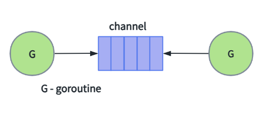

channel 没有缓冲的 unbuffered channel
```go
ch := make(chan int)
```

channel 有缓冲的 buffered channel
```go
ch := make(chan int, 0) // unbuffered channel
ch := make(chan int, 3) // buffered channel , 容量 3
```

## 1.1 一个简单的程序处理的例子

对于下面这样的非并发的程序：

```go
func main() {
    tasks := getTasks()
    // 处理每个任务
    for _, task := range tasks {
      process(task)
    }
}
```

将其转换为 Go 的并发模式很容易，使用典型的 Task Queue 的模式：

```go
func main() {
    //  创建带缓冲的 channel
    ch := make(chan Task, 3)
    //  运行固定数量的 workers
    for i := 0; i < numWorkers; i++ {
    	go worker(ch)
    }

    //  发送任务到 workers
    hellaTasks := getTasks()
        for _, task := range hellaTasks {
        ch <- task
    }
    ...
}

func worker(ch chan Task) {
    for {
        //  接收任务
        task := <-ch
        process(task)
    }
}
```

## 1.2 channels 的特性

- goroutine-safe
goroutine 安全，多个 goroutine 可以同时访问一个 channel 而不会出现竞争问题

- 可以用于在 goroutine 之间存储和传递值

- 提供 FIFO 语义，先入先出

- 可以导致 goroutine 的 block阻塞 和 unblock释放


# 二、分析 channel 原理特性


## 2.1 构造 channel

一个 channel 的诞生

```go
//  带缓冲的 channel，容量值为 3
ch := make(chan Task, 3)

```

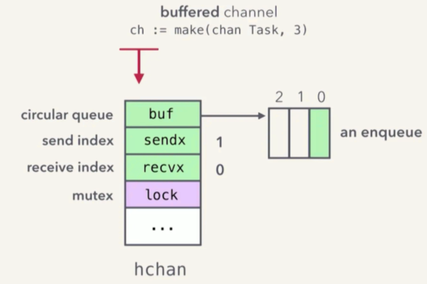
（图片来自 kavya 演讲ppt - Understanding Channels)

在 heap 上分配一个 hchan 类型的对象，并将其初始化，然后返回一个指向这个 hchan 对象的指针。
- heap 上而不是 stack 上
- hchan 类型
- 返回的是指针

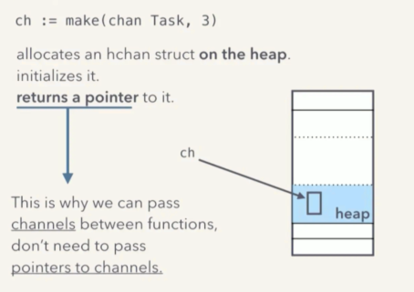
（图片来自 kavya 演讲ppt - Understanding Channels)


channel 数据结构：

[https://golang.org/src/runtime/chan.go](https://golang.org/src/runtime/chan.go)

```go
type hchan struct {
    ...
    buf      unsafe.Pointer // 指向一个环形队列
    ...
    sendx    uint   // 发送 index
    recvx    uint   // 接收 index
    ...
    lock     mutex  //  互斥量
}
```

buf 的具体实现很简单，就是一个环形队列的实现。sendx 和 recvx 分别用来记录发送、接收的位置。然后用一个 lock 互斥锁来确保无竞争冒险。

对于每一个 ch := make(chan Task, 3) 这类操作，都会在堆中，分配一个空间，建立并初始化一个 hchan 结构变量，而 ch 则是指向这个 hchan 结构的指针。

因为 ch 本身就是个指针，所以我们才可以在 goroutine 函数调用的时候直接将 ch 传递过去，而不用再 &ch 取指针了，所以所有使用同一个 ch 的 goroutine 都指向了同一个实际的内存空间。


## 2.2 发送、接收

为了方便描述，我们用 G1 表示 main() 函数的 goroutine，而 G2 表示 worker 的 goroutine。

```go
// G1
func main() {
    ...
    for _, task := range tasks {
    	ch <- task
    }
    ...
}
```

```go
// G2
func worker(ch chan Task) {
    for {
        task :=<-ch
        process(task)
    }
}
```


### 发送、接收分析

**goroutine-safe 的实现**

假设发送方先启动，执行 G1 中的 ch <- task0 ：

1、获取 lock，加锁

2、enqueue(task0)-对 Task 类型的对象 task0 执行入队操作（这里是内存复制 task0）

3、完成入队操作后，释放锁

> 说明：这里的入队 enqueue 操作实际上是一次内存复制，将整个 task0 复
> 制一份到 buf ，也就是 FIFO 缓冲队列中。

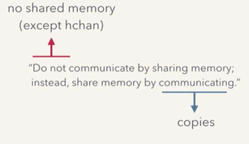
（图片来自 kavya 演讲ppt - Understanding Channels)

上一步很简单，接下来看 G2 的 t := <- ch 是如何读取数据的。

1、获取锁
2、 t = dequeue()（同样，这里也是内存复制）
3、释放锁

在这个操作流程里， `sender goroutine -> channel -> receiver goroutine` 之间， hchan 是唯一的共享内存，而这个唯一的共享内存又通过 mutex 来确保 goroutine-safe ，所有在队列中的数据都只是副本。

这便是 go 并发设计中的一个核心理念的体现:
> “Do not communicate by sharing memory;instead, share memory by communicating.”
> 不要通过共享内存来通信，而是通过通信来共享内存。


## 2.3 阻塞和恢复


### 发送方被阻塞

当 channel 中的缓冲满了，发送方继续发送，会发生什么？

假设 G2 需要很长时间的处理，在此期间，G1 不断的发送任务：

> 1. ch <- task1
> 2. ch <- task2
> 3. ch <- task3


当再一次 ch <- task4 的时候，由于 ch 的缓冲容量只有 3 个，这时 channel 中的缓冲满了，所以没地方放了。
这时发送方 goroutine G1会 被 block阻塞，暂停，并在收到 receive 后才恢复。

也就是当有 goroutine 从队列中取走一个 Task 的时候，G1 才会被恢复。

这些是咋做到的？

这就涉及到 goroutine 的运行时调度。


### goroutine 运行时调度

首先，goroutine 不是操作系统线程，而是用户空间线程（goroutine协程）。它由 go runtime 创建并管理，比操作系统线程更轻量。

当然，goroutine 最终还是要运行于操作系统 OS 的某个线程中，控制 goroutine 如何运行于操作系统线程中的是 go runtime 中的 scheduler （调度器）。

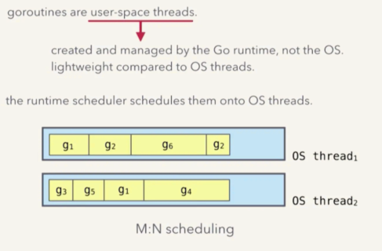
（图片来自 kavya 演讲ppt - Understanding Channels)


go runtime scheduler 怎么把 goroutine协程调度到操作系统线程上？

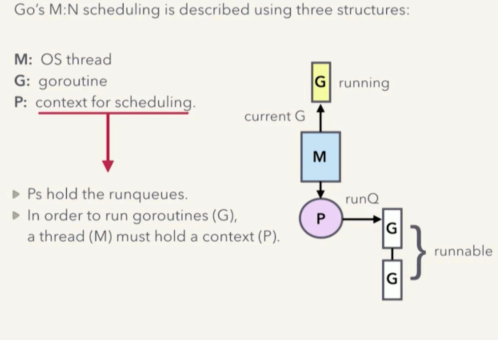
（图片来自 kavya 演讲ppt - Understanding Channels)


Go 运行时调度器是 M:N 调度模型，既 N 个 goroutine，会运行于 M 个 OS 线程中。换句话说，一个 OS 线程中，可能会运行多个 goroutine。

Go 的 M:N 调度模型中 3 个重要结构 GPM：

- M: OS 线程
- G: goroutine，协程
- P: 调度上下文
  - P 拥有一个运行队列，里面是所有可以运行的 goroutine 及其上下文

要想运行一个 goroutine - G，那么一个线程 M 就必须持有一个该 goroutine 的上下文 P。


### 阻塞发生时一次 goroutine 上下文切换过程分析

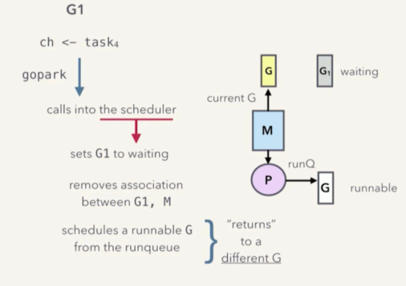
（图片来自 kavya 演讲ppt - Understanding Channels)

当发送方 goroutine 向已经满了的 channel 发送 ch <- task4 数据后，发生了 goroutine 阻塞，需要阻塞 G1。这个时候：

1. goroutine G1 会对 go runtime scheduler 发起一次 gopark 调用

2. 当 go runtime scheduler 接到了 gopark 调用，会将 goroutine G1 的状态从 running 设置为 waiting 状态

3. 并将 goroutine G1 和 运行它的操作系统线程 M 之间的关系（switch out)接触，因此 G1 脱离 M，换句话说，此时这个 M 空闲了，可以安排别的任务了

4. 此时从 runqueue 运行队列中，取得一个 runnable 状态的 goroutine G

5. 并将这个 G 绑定到 M 上（Switch in)， G 就准备好运行了

6. 当调度器返回的时候，新的 G 就开始运行了，而 G1 则不会运行，也就是 block阻塞 了

从上面的流程可以看出，对于 goroutine 来说，G1 被阻塞了，新的 G 开始运行了；而对于操作系统线程 M 来说，则根本没有被阻塞。

我们知道 OS 线程要比 goroutine 要沉重的多，因此这里尽量避免 OS 线程阻塞，可以提高性能。


### 被阻塞的 goroutine 怎么恢复？

前面说了阻塞，那么接下来分析一下如何恢复 goroutine 运行。

在继续了解如何恢复之前，我们需要先进一步理解 hchan 这个结构。因为，当 channel 没有满的时候，调度器是如何知道该让哪个 goroutine 继续运行呢？而且 goroutine 又是如何知道该从哪取数据呢？

在 hchan 中，除了之前提到的内容外，还定义有 sendq 和 recvq 两个队列，分别表示等待发送、接收的 goroutine，及其相关信息。

```go
type hchan struct {
    ...
    buf      unsafe.Pointer // 指向一个环形队列
    ...
    sendq    waitq  // 等待发送的队列
    recvq    waitq  // 等待接收的队列
    ...
    lock     mutex  //  互斥量
}
```

其中 `waitq` 是一个链表结构的队列，每个元素是一个 `sudog` 的结构，其定义大致为：

```go
type sudog struct {
    g          *g //  正在等候的 goroutine
    elem       unsafe.Pointer // 指向需要接收、发送的元素
    ...
}
```

[https://golang.org/src/runtime/runtime2.go?h=sudog#L270](https://golang.org/src/runtime/runtime2.go?h=sudog#L270)


**那么现在开始看一下如何恢复？**

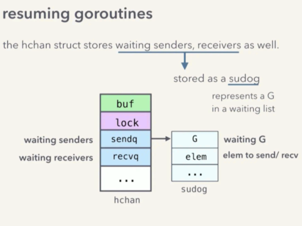


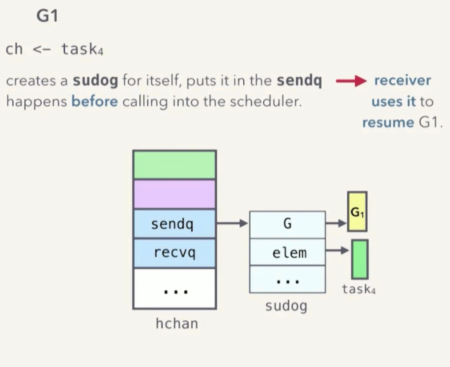
（图片来自 kavya 演讲ppt - Understanding Channels)

阻塞发生时，调用 go runtime sheduler 执行 gopark 之前， G1 会创建一个 sudog ，并将它存放在 hchan 的 sendq 中。 sudog 中便记录了即将被阻塞的 goroutine G1 ，以及它要发送的数据元素 task4 等等。

接收方将通过这个 sudog 来恢复 G1。

当接收方 G2 调用 t := <- ch 的时候，channel 的状态：缓冲是满的，而且还有一个 G1 在等候发送队列里，然后 G2 执行下面的操作：

1. G2 执行 dequeue() 让缓冲队列中的task1 出队 给 t
2. G2 从 sendq 中弹出一个等候发送的 sudog 也就是出队列
3. G2 将出队列的 sudog 中的 task4 的值 enqueue() 入队到 buf 中。
4. G2 将出队列的 sudog 中的 goroutine G1，状态从 waiting 改为 runnable
  1. 然后，G2 通知 runtime sheduler， G1 已经可以进行调度了，此时 runtime sheduler 发起一次调用 `goready(G1)`。
  2. runtime sheduler 将 G1 的状态改为 runnable
  3. runtime sheduler 将 G1 压入 runqueue 运行队列，将来某个时刻调度的时候，G1 就恢复运行。
  4. 最后返回到 G2
> 注意，这里是由 G2 负责将 G1 的 task4 压入队列 buf 的，这是一个优化。这样将来 G1 恢复运行后，就不必再次获取锁、enqueue()、释放锁了。这样就避免了多次锁的开销。

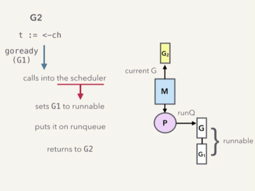
（图片来自 kavya 演讲ppt - Understanding Channels)


### 如果接收方 G2 先阻塞呢？


分析接收方先阻塞的流程。

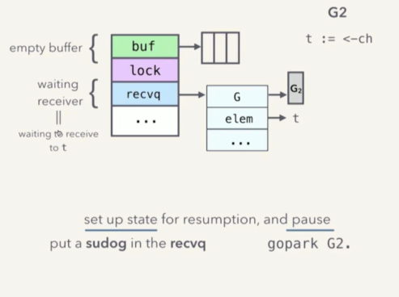
（图片来自 kavya 演讲ppt - Understanding Channels)

如果 G2 先执行了 t := <- ch，此时 buf 是空的，因此 G2 会被阻塞，G2 会创建

 sudoq ，存放在 recvq ，基本过程和发送方阻塞一样。

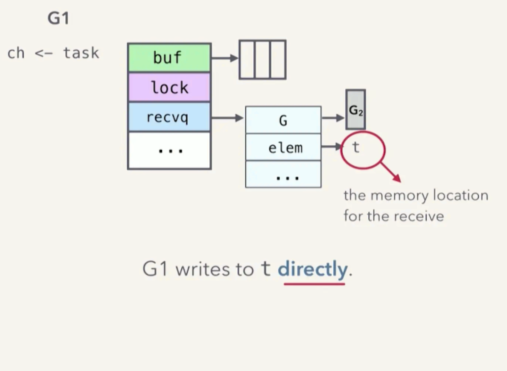

流程如下：

1. G2 给自己创建一个 sudog 结构变量。其中 g 是自己，也就是 G2，而 elem 则指向 t
2. 将这个 sudog 变量压入 recvq 等候接收队列
3. G2 需要告诉 sheduler，自己要 pause 阻塞了，于是调用 gopark(G2)

4. 和之前一样，sheduler 将 G2 的状态改为 `waiting`
5. 断开 G2 和 M 的关系
6. 从 runqueue运行队列中取出一个 goroutine
7. 建立新的 goroutine 和 M 的关系
8. 返回，开始继续运行新的 goroutine

这些应该已经不陌生了，那么当 G1 开始发送数据的时候，流程是什么样子的呢？

>G1 可以将 enqueue(task)，然后调用 goready(G2)。不过，我们可以更聪明一些。

我们根据 hchan 结构的状态，已经知道 task 进入 buf 后，G2 恢复运行后，会读取其值，复制到 t 中。那么 G1 可以根本不走 buf，G1 可以直接把数据给 G2。

goroutine 通常都有自己的栈，互相之间不会访问对方的栈内数据，除了 channel。这里，由于我们已经知道了 t 的地址（通过 elem 指针），而且由于 G2 不在运行，所以我们可以很安全的直接赋值。当 G2 恢复运行的时候，既不需要再次获取锁，也不需要对 buf 进行操作。从而节约了内存复制、以及锁操作的开销。


## 2.4 总结

- goroutine-safe
  - 通过 hchan 中的 lock mutex 实现

- 存储、传递值，FIFO
  - 通过 hchan buf 环形缓冲区来实现
  - 通过共享 hchan buffer 进行传值（实际上是传递副本)
  - 唯一共享的 buffer 使用 hchan mutex 保证 goroutine 安全

- goroutine 的阻塞和恢复
  - 通过 hchan 中的 sendq 和recvq，也就是 sudog 结构的链表队列
  - 调用 runtime sheduler 的 gopark(), goready() 实现


# 三、其它 channel 的操作


## 3.1 无缓冲 channel

无缓冲的 channel 行为就和前面说的直接发送的例子一样：

- 接收方阻塞 → 发送方直接写入接收方的栈
- 发送方阻塞 → 接受法直接从发送方的 sudog 中读取


## 3.2 select

[https://golang.org/src/runtime/select.go](https://golang.org/src/runtime/select.go)

1. 先把所有需要操作的 channel 上锁
2. 给自己创建一个 sudog，然后添加到所有 channel 的 sendq 或 recvq（取决于是发送还是接收）
3. 把所有的 channel 解锁，然后 pause阻塞 当前调用 select 的 goroutine（gopark()）
4. 然后当有任意一个 channel 可用时，select 的这个 goroutine 就会被调度执行。
5. resuming mirrors the pause sequence


# 四、为什么 Go 会这样设计？

## 4.1 Simplicity

更倾向于带锁的队列，而不是无锁的实现。
> “性能提升不是凭空而来的，是随着复杂度增加而增加的。” - dvyokov


后者虽然性能可能会更好，但是这个优势，并不一定能够战胜随之而来的实现代码的复杂度所带来的劣势。


## 4.2 Performance

- 调用 Go 运行时调度器，这样可以保持 OS 线程不被阻塞

跨 goroutine 的栈读、写。

- 可以让 goroutine 醒来后不必获取锁

- 可以避免一些内存复制

当然，任何优势都会有其代价。这里的代价是代码实现的复杂性，所以这里有更复杂的内存管理机制、垃圾回收以及栈收缩机制。

在这里性能的提高优势，要比复杂度的提高带来的劣势要大。

所以在 channel 实现的各种代码中，我们都可以见到这种 simplicity vs performance 的权衡后的结果。