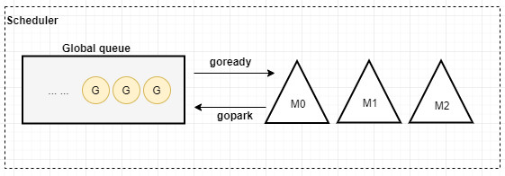
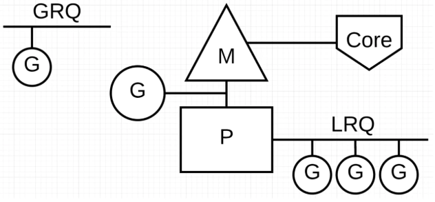

## 一：什么是调度

平常我们在生活中会有哪些调度的例子呢？比如十字路口的红绿灯，它就是一种调度系统。在交通十字路口，每个路口上多多少少有一些车辆，为了限制这些车辆不随意行驶，就建起了红绿灯调度系统。红绿灯可以有序的调度这些车辆行驶，使这些车辆快速的通过路口。

**那为什么需要红绿灯来进行调度呢？**

1：使车辆有序的行驶不至于相撞

2：使车辆能快速的通过路口

上面的红绿灯系统有哪些元素呢？1. 红绿灯系统-负责调度车辆  2. 车辆  3. 十字路口

由此我们可以看出一个调度系统基本元素有2个：1. 调度系统 2. 被调度的东西 3. 应用的资源

因为资源（十字路口）是有限的，每个方向只有一条路可供车辆行驶，而车辆在每个路口又是很多的，这是不是就形成了资源和使用者之间的矛盾了，为了解决这个矛盾，红绿灯调度系统应运而生。

如果我有多层路口，比如高架桥，多了一层，那走上面的车辆是不是就不需要等红绿灯了。这应该是调度系统在生活中的启示。

所以我们可以说调度系统是协调被调度的物件合理的使用资源。

也可以回顾下以前学习Linux系统中的调度，被调度的物件是线程或者进程，资源是cpu，为了协调有限的cpu资源在多个线程（进程）中合理公平使用，就有了调度器。

**那golang中的调度呢？**

跟上面的红绿灯调度有一些相似点。

golang的调度是为了多个协程能合理的利用线程。这里的协程（goroutine）相当于车辆了，线程相当于十字路口（也许不恰当）。

go在运行时，会运行很多协程goroutine，也就是我们常说的并发，go为了能使这些协程有序的快速的在线程上执行，就需要进行调度了。

还有，go为了方便的控制goroutine，比如把当前线程中的goroutine移交到其他线程继续执行，从而避免应线程阻塞影响协程的运行。

还有，go中引入了GC，在执行GC的时候，要求所有goroutine停止，自己实现调度器，就可以方便实现这个功能了。

相对于操作系统的线程来说，goroutine更加的轻量，占用的内存更小，上下文进行切换时换入换出的数据也更少。

## 二：goroutine简介
我们说Go是语言级别的并发语言。为什么是语言级别？那不还有系统级别，对，操作系统级别就实现了多线程，多进程这种并发。

有2个支持高并发的模型：[CSP](https://en.wikipedia.org/wiki/Communicating_sequential_processes) 和 [Actor](https://en.wikipedia.org/wiki/Actor_model)（erlang）。Go 选择了[CSP](https://en.wikipedia.org/wiki/Communicating_sequential_processes)，Go为了提供更容易的并发使用方法，提供了2个重要的概念 `goroutine`和`channel`。

**goroutine**来自协程的概念，让一组可复用的函数运行在一组线程之上，即使有协程阻塞，该线程的其他协程也可以被`runtime`调度，转移到其他可运行的线程上。最关键的是，程序员看不到这些底层的细节，这就降低了编程的难度，提供了更容易的并发。

goroutine非常的轻量，只占几KB，并且这几KB足够goroutine运行完。所以我们运行成千上万的goroutine成为可能，因为不会占用太多的内存资源。

**channel**为goroutine之间提供了通信功能。

> 不要通过共享内存来通信，而应该通过通信来共享内存

## 三：go调度模型GMP
go的调度模型，一开始并不是GPM模型，而是经过了一个发展过程。

老的调度模型只有G和M，没有P。为什么只有GM呢？因为这是一个简单的模型，最开始开发时一定容易实现。

> M：代表OS线程，它是运行goroutine的
> G：就是goroutine

它还有一个重要的数据结构：全局队列global runqueue。

为什么会有队列？它有什么作用？

全局队列是用来存放goroutine（G）的。启动那么多goroutine，总要一个地方把G存起来以便M来调用。

多个M会从这个全局队列里获取G来进行运行。

**GM模型如下图：**

M要执行G，或者把G放回去，都要访问全局队列，而且M还是多个，所以必须对全局队列加锁保证互斥。

这必然导致多个M对锁的竞争。这也是老调度器的一个缺点。

其实**老调度器**有4个缺点：详见[Scalable Go Scheduler Design Doc](https://docs.google.com/document/d/1TTj4T2JO42uD5ID9e89oa0sLKhJYD0Y_kqxDv3I3XMw/edit#!)

1. 创建、销毁、调度G都需要每个M获取锁，这就形成了激烈的锁竞争

2. M转移G会造成延迟和额外的系统开销。

3. M中的mcache是用来存放小对象的，mcache和栈都和M关联造成了大量的内存开销和差的局部性

4. 系统调用导致频繁的线程阻塞和取消阻塞操作增加了系统开销。

   

所以Go语言在2012年重新设计了调度器方案（[Scalable Go Scheduler Design Doc](https://docs.google.com/document/d/1TTj4T2JO42uD5ID9e89oa0sLKhJYD0Y_kqxDv3I3XMw/edit#!)，[设计方案](https://golang.org/s/go11sched)）。

**在GO1.1中新调度器引入了：**

> - P（processor），它包含了运行goroutine的资源。如果线程M想运行G（goroutine），比如先获取P，P中还包含了可运行的G队列。
> - work stealing：当M绑定的P没有可运行的G时，它可以从其他运行的M那里偷取G来运行。这个的作用就是避免M因为没有可运行的G时产生饥饿的问题。
>   [work stealing算法地址](http://supertech.csail.mit.edu/papers/steal.pdf) 

**新调度器就是一个GPM模型了：**

> - G：goroutine，用户级别的线程（协程）。我们在程序里用go关键字创建的一个协程。
> - P：processor，相当于一个处理器，它包含了goroutine运行的资源，M必须和一个P关联才能运行G。P还包含自己的本地队列（local runqueue）来保存G。为什么要搞一个本地队列？这样就可以避免竞争锁了。
> - M：工作线程，代表机器（machine）。这个线程是OS来处理的，OS负责把线程放到cpu上去运行。

当然新调度器也有一个很重要的数据结构：全局运行队列 global runqueue。

> 题外话：引入P，解决了老调度器的一些问题，但是同时也增加了调度器的复杂度。这个是必然的，引入新东西必然会增加系统的复杂度。就看能不能很好的解决问题，权衡利弊。

**GPM模型如下图：**

（图来自：[https://www.ardanlabs.com/blog/2018/08/scheduling-in-go-part2.html](https://www.ardanlabs.com/blog/2018/08/scheduling-in-go-part2.html))

> GRQ：全局队列 global runqueue
> LRQ：P的本地队列 local runqueue
> G：goroutine协程
> M：OS的线程，用来绑定P，运行G，真正执行指令的人。
> P：processor，goroutine运行时所需要的资源。P的数量可以用runtime.GOMAXPROCS()来控制。

每个P会分配一个LRQ(本地队列)去处理P的上下文要执行的Goroutines 。这些Goroutines会在绑定到P的M上进行上下文的切换。GRQ(全局队列)会处理还没有分配到P上的Goroutines 。

新的调度器中有全局队列，但功能已经被弱化了，当M执行work stealing从其他P偷不到G时，它可以从全局队列获取G。

**抢占式调度**

G-P-M模型的实现算是Go scheduler的一大进步，但Scheduler还有一个很头疼的问题，那就是不支持抢占式调度。
为什么要抢占式调度？
因为一旦某个G出现死循环或者永久循环的代码逻辑，那么G将永久占用分配给他的P和M，位于同一个P中的其他G将得不到调度，出现饿死的情况。还有一种情况，当只有一个P（GOMAXPROCS=1）,
整个Go程序中的其他G都将饿死。于是Dmitry Vyukov提出了[《Go Preemptive Scheduler Design》](https://docs.google.com/document/d/1ETuA2IOmnaQ4j81AtTGT40Y4_Jr6_IDASEKg0t0dBR8/edit#!)
并在[Go 1.2](https://blog.golang.org/go12)中实现了[“抢占式”调度](https://golang.org/doc/go1.2#preemption)

**一些说明：**

- 1、M绑定P，才可以不断的去运行G，如果M没有可运行的G，也可以抢占式调度（依靠sysmon）
- 2、从上图可以看出，每个P都有自己的本地队列，也有一个全局队列
- 3、M,P,G三者的数量，M默认10000，可以设置，通过SetMaxThreds修改，P默认是CPU的核数，可以设置，通过GOMAXPROCS修改，
   G没有数量限制，可以创建成百上万个，甚至百万。
- 4、M可以与P解绑，也可以休眠

**新的调度器有没有缺点？有**

- 1、 runqueue只是一个没有优先级的队列，所以会按照先进先出的顺序来运行Goroutine。
- 2、调度goroutine时公平性没有很好的保证：已经提议进行修改。
- 3、 runqueue没有利用缓存，使用缓存[栈而不是队列]可以加速Goroutine的访问。

## 四：参考：

- [https://juejin.im/post/5ce11a39f265da1baf7cbc61](https://juejin.im/post/5ce11a39f265da1baf7cbc61) 理解golang调度之二 ：Go调度器
- [https://www.youtube.com/watch?v=YHRO5WQGh0k](https://www.youtube.com/watch?v=YHRO5WQGh0k) GopherCon 2018: Kavya Joshi - The Scheduler Saga
- [https://qcrao.com/2019/09/02/dive-into-go-scheduler/](https://qcrao.com/2019/09/02/dive-into-go-scheduler/) 深度解密Go语言之scheduler
- [https://www.ardanlabs.com/blog/2018/08/scheduling-in-go-part2.html](https://www.ardanlabs.com/blog/2018/08/scheduling-in-go-part2.html)
- [https://tonybai.com/2017/06/23/an-intro-about-goroutine-scheduler/](https://tonybai.com/2017/06/23/an-intro-about-goroutine-scheduler/)