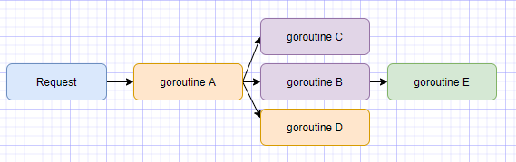

## 一、背景
在golang中，最主要的一个概念就是并发协程 `goroutine`，它只需用一个关键字 `go` 就可以开起一个协程，并运行。

一个单独的 goroutine运行，倒也没什么问题。如果是一个goroutine衍生了多个goroutine，并且它们之间还需要交互-比如传输数据，那彼此怎么传输数据呢？如果一个子goroutine取消了，要取消跟其相关的goroutine，怎么样才可以做到？ 

比如说：在go web服务器中，每个请求request都是在一个单独的goroutine进行，这些
goroutine可能又开启其他的goroutine进行其他操作，那么多个goroutine之间怎么传输数据、遇到了问题怎么取消goroutine？



有时在程序开发中，每个请求用一个goroutine去处理程序，然而，处理程序时往往还需要其他的goroutine去访问后端数据资源，比如数据库、RPC服务等，这些goroutine都在处理同一个请求，所以他们需要访问一些共享资源，如用户身份信息、认证token等，如果请求超时或取消，与此请求相关的所有goroutine都应该退出并释放资源。

由于golang里没有像C语言中线程id类似的goroutine id，所以不能通过id直接关闭goroutine。但是有其他的方法。

解决方法：
- 用时间来表示过期、超时
- 用信号来通知请求该停止了
- 用channel通知请求结束

为此，golang给我们提供了一个简单的操作包：`Context` 包。

## 二、Context是什么
golang中的Context包，是专门用来简化对于处理单个请求衍生出多个goroutine，goroutine之间传输数据、取消goroutine、超时控制等相关操作的一个包。

## 三、Context功能

- **3.1 控制goroutine退出**
   - 及时退出 WithCancel
   - 时间点退出 WithDeadline
   - 时间间隔退出 WithTimeout
```go
func WithCancel(parent Context) (ctx Context, cancel CancelFunc)
```
`WithCancel`，绑定一个parent，返回一个cancelCtx的Context，用返回的 CancelFunc 就可以主动关闭Context。一旦cancel被调用，即取消该创建的Context。

```go
func WithDeadline(parent Context, d time.Time) (Context, CancelFunc)
```
`WithDeadline`，带有效期的cancelCtx的Context，即到达指定时间点调用CancelFunc方法才会执行

```go
func WithTimeout(parent Context, timeout time.Duration) (Context, CancelFunc)
```
`WithTimeout`，带有超时时间的cancelCtx的Context，它是WithDeadline的封装，只不过WithTimeout为时间间隔，Deadline为时间点。
```go
func WithTimeout(parent Context, timeout time.Duration) (Context, CancelFunc) {
    return WithDeadline(parent, time.Now().Add(timeout))
}
```

- **3.2 设置值**

```go
func WithValue(parent Context, key, val interface{})
```

## 四、源码分析
> go version go1.13.9

### 4.1 整体程序分析

>/src/context/context.go

- **重要接口**
  - Context：定义了Context接口的4个方法。
  - canceler：context接口取消，定义了2个方法。
  
- **重要结构体**
  - emptyCtx：实现了Context接口，它是个空的context，它永远不会被取消，没有值，没有deadline。其主要作为`context.Background()`和`context.TODO()`返回这种根context或者不做任何操作的context。如果用父子关系来理解，emptyCtx就是用来创建父context。
  - cancelCtx：可以被取消
  - timerCtx：超时会被取消
  - valueCtx：可以存储k-v键值数据

- 重要函数
  - Backgroud：返回一个空的context，常用作根context
  - TODO：返回一个空的context，常用语重构时期，没有合适的context可用
  - newCancenCtx：创建一个可取消的context
  - parentCancelCtx：找到第一个可取消的父节点
  - WithCancel：基于父contxt，生成一个可取消的context
  - WithDeadline：创建一个带有截止时间的context
  - WithTimeout：创建一个带有过期时间的context
  - WithValue：创建一个存储键值对k-v的context

Background 与 TODO 用法有啥区别呢？
> 看函数其实它们俩没多大区别，只是使用和语义上有点区别：
> 1. Background：是上下文默认值，所有其他上下文都应该从它衍生出来
> 2. TODO：只是在不确定该使用哪种上下文时使用

### 4.2 Context接口
```go
type Context interface {
    // Deadline返回一个到期的timer定时器,以及当前是否以及到期
    Deadline() (deadline time.Time, ok bool)

    // Done 返回一个channel，这个channel在当前工作完成或上下文取消后关闭。多次调用只会返回同一个channel
    // WithCancel:负责在cancel被调用的时候关闭Done
    // WithDeadline: 负责在最后其期限过期时关闭Done
    // WithTimeout:负责超时后关闭done
    Done() <-chan struct{}

    // 如果Done通道没有被关闭则返回nil
    // 否则则会返回一个具体的错误
    // Canceled 被取消
    // DeadlineExceeded 过期
    Err() error
    
    // 返回对应key的value
    Value(key interface{}) interface{}
}
```

- **Done()：** 
返回一个channel，可以表示 context 被取消的信号。
当channel被关闭或者到了deadline时，返回一个被关闭的channel。这是一个只读channel。根据golang里相关知识，读取被关闭的channel会读取相应的零值。并且源码里没有地方会向这个 channel 里面塞入值，因此在子协程里读这个 channel，除非被关闭，否则读不出任何东西。也正是利用这一点，子协程从channel里读出了值（零值）后，就可以做一些清理工作，尽快退出。
- **Deadline()：** 
主要用于设定超时时间的Context上，它的返回值（返回父任务设置的超时时间）用于表示该Context取消的时间点，通过这个时间，就可以判断接下来的操作。比如超时，可以取消操作。
- **Value()：** 
获取前面设置的key对于的value值
- **Err()：** 
返回一个错误，表示channel被关闭的原因。比如是被取消，还是超时

### 4.3 emptyCtx结构体
emptyCtx是一个不会被取消、没有到期时间、没有值、不会返回错误的context的实现，其主要作为`context.Background()`和`context.TODO()`返回这种根context或者不做任何操作的context。如果用父子关系来理解，emptyCtx就是用来创建父context。

```go
type emptyCtx int

func (*emptyCtx) Deadline() (deadline time.Time, ok bool) {
    return
}

func (*emptyCtx) Done() <-chan struct{} {
    return nil
}

func (*emptyCtx) Err() error {
    return nil
}

func (*emptyCtx) Value(key interface{}) interface{} {
    return nil
}

func (e *emptyCtx) String() string {
    switch e {
    case background:
        return "context.Background"
    case todo:
        return "context.TODO"
    }
    return "unknown empty Context"
}

var (
    background = new(emptyCtx)
    todo       = new(emptyCtx)
)
```

### 4.4 cancelCtx结构体
cancelCtx struct：
```go
type cancelCtx struct {
    Context
    mu       sync.Mutex            // protects following fields
    done     chan struct{}         // created lazily, closed by first cancel call
    children map[canceler]struct{} // set to nil by the first cancel call
    err      error                 // set to non-nil by the first cancel call
}
```
- Context：cancelCtx嵌入一个Context接口对象，作为一个匿名字段。这个Context就是父context
- mu：保护之后的字段
- children：内部通过这个children保存所有可以被取消的context的接口，到后面，如果当前context被取消的时候，只需要调用所有canceler接口的context就可以实现当前调用链的取消
- done：取消的信号
- err：错误信息

**Done() 函数**：
```go
func (c *cancelCtx) Done() <-chan struct{} {
    c.mu.Lock()
    if c.done == nil {
        c.done = make(chan struct{})
    }
    d := c.done
    c.mu.Unlock()
    return d
}
```
函数返回一个只读channel，而且没有地方向这个channel里写数据。所以直接调用这个只读channel会被阻塞。一般通过搭配 select 来使用。一旦关闭，就会立即读出零值。

**cancel() 函数**：
```go
func (c *cancelCtx) cancel(removeFromParent bool, err error) {
    if err == nil {// 必须传一个err值，后面判断用
        panic("context: internal error: missing cancel error")
    }
    c.mu.Lock()
    if c.err != nil {
        c.mu.Unlock()
        return // already canceled 已经被其他协程取消了
    }
    c.err = err
    
    // 关闭channel，通知其他协程
    if c.done == nil {
        c.done = closedchan
    } else {
        close(c.done)
    }
    //遍历它是所有子节点
    for child := range c.children {
        // NOTE: acquiring the child's lock while holding parent's lock.
        child.cancel(false, err)// 递归地取消所有子节点
    }
    // 将子节点清空
    c.children = nil
    c.mu.Unlock()
    if removeFromParent {
       // 从父节点中移除自己
        removeChild(c.Context, c)
    }
}
```
这个函数功能就是关闭channel：c.done();
递归取消它的所有子节点；最后从父节点删除自己。
通过关闭channel，将取消信号传递给了它的所有子节点。
goroutine 接收到取消信号的方式就是 select 语句中的 读c.done 被选中

### 4.5 timerCtx 结构体
timerCtx struct：
```go
type timerCtx struct {
    cancelCtx
    timer *time.Timer // Under cancelCtx.mu.
    deadline time.Time
}
```
timerCtx嵌入了cancelCtx结构体，所以cancelCtx的方法也可以使用。
timerCtx主要是用于实现WithDeadline和WithTimeout两个context实现，其继承了cancelCtx结构体，同时还包含一个timer.Timer定时器和一个deadline终止实现。Timer会在deadline到来时，自动取消context。

**cancel()函数**：
```go
func (c *timerCtx) cancel(removeFromParent bool, err error) {
   c.cancelCtx.cancel(false, err) //由于继承了cancelCtx，这里调用了cancelCtx的cancel()方法
    if removeFromParent {
        // Remove this timerCtx from its parent cancelCtx's children.
        removeChild(c.cancelCtx.Context, c)
    }
    c.mu.Lock()
    if c.timer != nil {
        c.timer.Stop()//停止定时器
        c.timer = nil
    }
    c.mu.Unlock()
}
```
这个函数继承了cancelCtx的方法cancel()，然后后面进行自身定时器Stop()的操作，这样就可以实现取消操作了。

### 4.6 valueCtx结构体
```go
type valueCtx struct {
    Context
    key, val interface{}
}
```
通过key-value来进行值保存
```go
func (c *valueCtx) String() string {
    return contextName(c.Context) + ".WithValue(type " +
        reflectlite.TypeOf(c.key).String() +
        ", val " + stringify(c.val) + ")"
}

func (c *valueCtx) Value(key interface{}) interface{} {
    if c.key == key {
        return c.val
    }
    return c.Context.Value(key)
}
```

### 4.7 WithCancel方法

#### WithCancel：

创建一个可取消的context
```go
func WithCancel(parent Context) (ctx Context, cancel CancelFunc) {
    c := newCancelCtx(parent)
    propagateCancel(parent, &c)
    return &c, func() { c.cancel(true, Canceled) }
}
```
传入一个父context（通常是一个background作为根节点），返回新建context。
当 WithCancel 函数返回的 CancelFunc 被调用或者是父节点的 done channel 被关闭（父节点的 CancelFunc 被调用），此 context（子节点） 的 done channel 也会被关闭。

#### newCancelCtx()方法
```go
func newCancelCtx(parent Context) cancelCtx {
    return cancelCtx{Context: parent}
}
```
初始化cancelCtx结构体

#### propagateCancel()方法
这个函数主要作用是当parent context取消时候，进行child context的取消，这有2种模式：
1. parent取消的时候通知child进行cancel取消
2.parent取消的时候调用child的层层递归取消

```go
// propagateCancel arranges for child to be canceled when parent is.
func propagateCancel(parent Context, child canceler) {
   // 父节点是空的，直接返回
    if parent.Done() == nil {
        return // parent is never canceled
    }
    
    if p, ok := parentCancelCtx(parent); ok {
        p.mu.Lock()
        if p.err != nil {
            // parent has already been canceled
            child.cancel(false, p.err)//父节点已经取消，它的子节点也需要取消
        } else {
            //父节点未取消
            if p.children == nil {
                p.children = make(map[canceler]struct{})
            }
            // 把这个child放到父节点上
            p.children[child] = struct{}{}
        }
        p.mu.Unlock()
    } else {
      // 如果没有找到可取消的父 context。新启动一个协程监控父节点或子节点取消信号
        go func() {
            select {          
             // 保证父节点被取消的时候子节点会被取消
            case <-parent.Done():
                child.cancel(false, parent.Err())
            case <-child.Done():
            }
        }()
    }
}
```

#### parentCancelCtx
这个函数识别三种类型的Context：cancelCtx，timerCtx，valueCtx
```go
func parentCancelCtx(parent Context) (*cancelCtx, bool) {
    for {
        switch c := parent.(type) {
        case *cancelCtx:
            return c, true    // 找到最近支持cancel的parent，由parent进行取消操作的调用
        case *timerCtx:
            return &c.cancelCtx, true // 找到最近支持cancel的parent，由parent进行取消操作的调用
        case *valueCtx:
            parent = c.Context // 递归
        default:
            return nil, false
        }
    }
}
```

### 4.8 按时间取消的函数
- WithTimeout
- WithDeadline

WithTimeout是直接调用WithDeadline函数，传入deadline是当前时间+timeout的时间，也就是从现在开始经过timeout时间就算超时。也就是说，WithDeadline用的是绝对时间。

#### WithTimeout():
```go
func WithTimeout(parent Context, timeout time.Duration) (Context, CancelFunc) {
    return WithDeadline(parent, time.Now().Add(timeout))
}
```

#### WithDeadline()
```go
func WithDeadline(parent Context, d time.Time) (Context, CancelFunc) {
    if cur, ok := parent.Deadline(); ok && cur.Before(d) {
        // The current deadline is already sooner than the new one.
        return WithCancel(parent)
    }
    c := &timerCtx{
        cancelCtx: newCancelCtx(parent),
        deadline:  d,
    }
    
// 监听parent的取消，或者向parent注册自身
    propagateCancel(parent, c)
    dur := time.Until(d)
    if dur <= 0 {
       // 已经过期
        c.cancel(true, DeadlineExceeded) // deadline has already passed
        return c, func() { c.cancel(false, Canceled) }
    }
    c.mu.Lock()
    defer c.mu.Unlock()
    if c.err == nil {
        c.timer = time.AfterFunc(dur, func() {
            c.cancel(true, DeadlineExceeded)
        })
    }
    return c, func() { c.cancel(true, Canceled) }
}
```
WithDeadline 方法在创建 timerCtx 的过程中，判断了父上下文的截止日期与当前日期，并通过 time.AfterFunc 创建定时器，当时间超过了截止日期后会调用 timerCtx.cancel 方法同步取消信号。

WithCancel、WithDeadline以及WithTimeout都返回了一个Context以及一个CancelFunc函数，返回的Context也就是我们当前基于parent创建了cancelCtx或则timerCtx，通过CancelFunc我们可以取消当前Context，即使timerCtx还未超时。

### 4.9 WithValue()
>https://www.cnblogs.com/qcrao-2018/p/11007503.html

```go
//创建 valueCtx 的函数
func WithValue(parent Context, key, val interface{}) Context {
    if key == nil {
        panic("nil key")
    }
    if !reflectlite.TypeOf(key).Comparable() {
        panic("key is not comparable")
    }
    return &valueCtx{parent, key, val}
}

func (c *valueCtx) String() string { 
    return fmt.Sprintf("%v.WithValue(%#v, %#v)", c.Context, c.key, c.val)
}
```

对 key 的要求是可比较，因为之后需要通过 key 取出 context 中的值，可比较是必须的。通过层层传递 context，最终形成这样一棵树.

和链表有点像，只是它的方向相反：Context 指向它的父节点，链表则指向下一个节点。通过 WithValue 函数，可以创建层层的 valueCtx，存储 goroutine 间可以共享的变量。取值的过程，实际上是一个递归查找的过程：

```go
func (c *valueCtx) Value(key interface{}) interface{} {
	if c.key == key {
		return c.val
	}
	return c.Context.Value(key)
}
```
它会顺着链路一直往上找，比较当前节点的 key 是否是要找的 key，如果是，则直接返回 value。否则，一直顺着 context 往前，最终找到根节点（一般是 emptyCtx），直接返回一个 nil。所以用 Value 方法的时候要判断结果是否为 nil。因为查找方向是往上走的，所以，父节点没法获取子节点存储的值，子节点却可以获取父节点的值。WithValue 创建 context 节点的过程实际上就是创建链表节点的过程

## 参考
- https://www.cnblogs.com/qcrao-2018/p/11007503.html
- https://blog.golang.org/context
- https://draveness.me/golang/docs/part3-runtime/ch06-concurrency/golang-context/
- https://studygolang.com/articles/13598