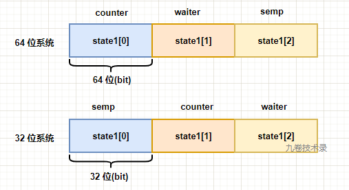
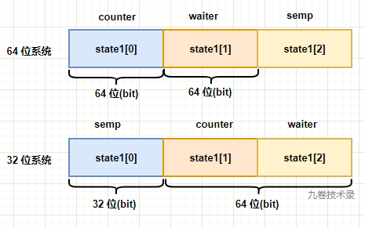

## 一、sync.WaitGroup简介

### 1.1 sync.WaitGroup 解决了什么问题

在编程的时候，有时遇到一个大的任务，为了提高计算速度，会用到并发程序，把一个大的任务拆分成几个小的独立的任务各自执行，因为这几个小任务相互没有关系，可以独立执行，这时候就可以用 Go 协程来处理这种并发任务。

但是这里会有一个问题，协程的调度器调度主 goroutine 和子 goroutine 时，机会是均等的，万一主 goroutine 运行完了，子 goroutine 还没运行完，程序就结束了。子任务没执行完程序结束，这种程序就有 bug，怎么解决这种问题？能不能让所有的子 goroutine 执行完，在让主程序结束从而让程序顺利执行完。这时候，sync.WaitGroup 就出场了。

> sync.WaitGroup() 可以等待一组 goroutine 执行完再让剩下的程序执行完。

waitgroup 就是解决 go 中并发时，多个 goroutine 同步的问题。

### 1.2 用法

一般用法：

> 1. 主 goroutine 通过调用 Add(i) 来设置需要等待的子 goroutine 数量，i 表示子 goroutine 数量。
> 2. 子 goroutine 通过调用 Done() 来表示子 goroutine 执行完毕，goroutine 数量就减一，Add(-1)。
> 3. 主 goroutine 通过调用 Wait() 来等待所有的子 goroutine 执行完毕。

一个小demo：

```go
package main

import (
	"fmt"
	"sync"
)

func main() {
	var wg sync.WaitGroup

	wg.Add(2)

	go func() {
		defer wg.Done()
		fmt.Println("子 goroutine1")
	}()

	go func() {
		defer wg.Done()
		fmt.Println("子 goroutine2")
	}()

	wg.Wait() // 等待所有的子goroutine结束

	fmt.Println("程序运行结束")
}
```

程序运行输出：

> 子 goroutine2
> 子 goroutine1
> 程序运行结束

## 二、waitgroup源码分析

> go1.17.10

### 2.1 数据结构WaitGroup

```go
//https://github.com/golang/go/blob/go1.17.10/src/sync/waitgroup.go
// A WaitGroup waits for a collection of goroutines to finish.
// The main goroutine calls Add to set the number of
// goroutines to wait for. Then each of the goroutines
// runs and calls Done when finished. At the same time,
// Wait can be used to block until all goroutines have finished.
//
// A WaitGroup must not be copied after first use.
type WaitGroup struct {
	noCopy noCopy

	// 64-bit value: high 32 bits are counter, low 32 bits are waiter count.
	// 64-bit atomic operations require 64-bit alignment, but 32-bit
	// compilers do not ensure it. So we allocate 12 bytes and then use
	// the aligned 8 bytes in them as state, and the other 4 as storage
	// for the sema.
	state1 [3]uint32
}
```

- 第一个字段：noCopy

> Go 源码中检测禁止复制的技术。这种写法(noCopy)告诉 go vet 检测工具，如果有复制行为，那么就违反了复制使用的规则。
>
> 进一步解释下，如果在程序中，有对 WaitGroup 赋值的行为，那么 go vet 会检测，发现它并报错违反了复制使用的规则，但是 noCopy 并不会影响程序正常编译和运行。这是 Go 语言中的一个小 trick。

- 第二个字段：state1 数组

>这个字段由 3 个数组组成，每个数组大小占 32 bits。一个字段就包含了 WaitGroup 中使用到的 3 种数据 - counter、waiter、semaphore(信号量)。而且还兼容 64 位系统和 32 位系统中的内存对齐，内存对齐的好处是加快 CPU 对内存的访问。内存对齐在 64 位系统中，变量一般占据 64 位(8 byte)，对齐就是指变量的起始地址是 8 的倍数。在 32 位系统中，变量一般占据 32 位(4 byte)，对齐就是指变量的起始地址是 4 的倍数。
>
>它怎么包含 3 种数据，是怎么做到的？程序注释有解释：
>
>- 64 位系统中：state1[0] 是 counter 计数器，state1[1] 是 waiter 计数器，state1[2] 就是 semaphore。
>- 32 位系统中：state1[0] 是 semaphore，state1[1] 是 counter 计数器，state1[2] 就是 waiter 计数器。
>
>


>counter、waiter、semaphore 说明：
>
>- **counter**：计算协程 goroutine 个数的计数器，表示当前要执行的 goroutine 个数。waitgroup 中的函数 Add(i)，counter = counter + i；函数 Done()，counter - 1。
>
>- **waiter**：等待协程 goroutine 的计数器，表示当前已经调用 Wait() 函数的 goroutine-group 个数，也就是需要结束的goroutine组数。waitgroup 中的 Wait()，waiter + 1，并挂起当前 goroutine。
>
>- **semaphore**：go runtime 内部信号量实现。waitgroup 中会用到 semaphore 的两个相关函数，runtime_Semacquire 和 runtime_Semrelease。
>
> - runtime_Semacquire 表示增加一个信号量，并挂起当前 goroutine。
>
> - runtime_Semrelease 表示减少一个信号量，并唤醒 semaphore 上其中一个正在等待的 goroutine。


**A**. 字段 state1 设计的技巧：

在 32 位系统中，内存对齐时，可以把数组第 1 位 state1[0] 作为对齐的 padding，因为 state1 本身是 uint32 的数组，所以数组第一位也有 32 位。这样就保证了把数组后两位看做统一的 64 位整数时是64位对齐的。

只改变 semaphore 的位置顺序，就既可以保证 counter+waiter 一定会 64 位对齐，也可以保证内存的高效利用。


**B**. 信号量是什么？

前面提到了信号量 semaphore，下面简单了解下：

信号量是unix/linux系统提供的一种保护共享资源的机制，用于防止多个线程同时访问某个资源。它本质上是一个计数器。

信号量包含一个非负整型的变量，有两个原子操作 wait（down） 和 signal（up）。wait 又可以称为 P 或 down 操作，减 1 操作；signal 也被称为 V 或 up 操作，加 1 操作。信号量通过原子操作实现的 `加 1` 或 `减 1` 运算来实现对并发资源的控制。

wait（down） 操作，如果信号量的非负整型变量 S > 0，wait 将其减 1；如果 S = 0，wait 将该线程阻塞。

signal（up） 操作，如果有线程在信号量上阻塞（此时 S = 0），signal 会解除对某个等待线程的阻塞，恢复运行；如果没有线程阻塞在信号量上，signal 将 S 加 1。

S 可以理解为资源的数量，信号量即是通过控制资源数量加减来实现并发的互斥和同步。

内核信号量 struct semaphore ，包含 3 个字段：

count - 存放 atomic_t 类型的值，表示资源的数量。

wait - 存放等待队列链表的地址，当前等待资源的所有睡眠进程都放在这个链表中。如果 count 大于0或等于0，等待队列为空。

sleepers - 存放一个标识，表示是否有一些进程在信号量上睡眠。

更多关于信号量知识，请去查看 linux 内核相关内容。

### 2.2 state()-从state1中取变量：

WaitGroup struct 中的字段 state1 里面包含 3 种数据变量，怎么取出来呢？看下面的函数 state()：

```go
// https://github.com/golang/go/blob/go1.17.10/src/sync/waitgroup.go#L31
// state returns pointers to the state and sema fields stored within wg.state1.
// 得到state的地址和信号量的地址
func (wg *WaitGroup) state() (statep *uint64, semap *uint32) {
	if uintptr(unsafe.Pointer(&wg.state1))%8 == 0 {
        // 如果地址是64bit对齐，数组前两个元素组成state，后一个元素是信号量
		return (*uint64)(unsafe.Pointer(&wg.state1)), &wg.state1[2]
	} else {
     // 如果地址是32bit对齐，数组后两个元素组成state，第一个元素32bit就是信号量
		return (*uint64)(unsafe.Pointer(&wg.state1[1])), &wg.state1[0]
	}
}
```

**第一步**，判断是 32 位 还是 64 位系统：

Golang 中判断当前变量是 32 位对齐还是 64 位对齐：https://go.dev/ref/spec#System_considerations，

```go
uintptr(unsafe.Pointer(&x)) % unsafe.Alignof(x) == 0
```



**第二步**，取出相应的数据

64位对齐：数组 state1 的 state[0] 是 counter 计数，state[2] 是信号量

```go
(*uint64)(unsafe.Pointer(&wg.state1)), &wg.state1[2]
```

32位对齐：数组 state1 的 state[0] 是信号量，state[1] 是 counter 计数

```go
(*uint64)(unsafe.Pointer(&wg.state1[1])), &wg.state1[0]
```

### 2.3 Add()-计数器

Add(delta int) 函数用来增加计数器的值，要运行的协程数量，它把 delta 值累加到 counter 中。二就是释放信号量。

在程序中，delta 可以为负值，也就是 counter 值可能变成 0 或者 负值，当 counter = 0，waiter 就释放相等数量的信号量，把等待的 goroutine 全部唤醒。如果 counter < 0 负值了， 就 panic 报错。

下面看看代码，去掉 go runtime 里相关竞态代码，

```go
// https://github.com/golang/go/blob/go1.17.10/src/sync/waitgroup.go#L53
func (wg *WaitGroup) Add(delta int) {
    statep, semap := wg.state() // 获取state(counter+waiter)和semaphore信号量的指针
    
	... ...
    // uint64(delta)<<32 把 delta 左移32位，因为counter在statep的高32位
    // 然后把delta原子的增加到counter中
	state := atomic.AddUint64(statep, uint64(delta)<<32)
    // v => counter, w => waiter
	v := int32(state >> 32)//获取counter值
	w := uint32(state)     //获取waiter值
    
	... ...
    //counter变为负值了，panic报错
	if v < 0 {
		panic("sync: negative WaitGroup counter")
	}
    //waiter不等于0，说明已经执行了waiter，这时你又调用Add()，是不允许的
	if w != 0 && delta > 0 && v == int32(delta) {
		panic("sync: WaitGroup misuse: Add called concurrently with Wait")
	}
    //v->counter，counter>0，说明还有goroutine没执行完，不需要释放信号量，直接返回
    //w->waiter, waiter=0，没有等待的goroutine，不需要释放信号量，直接返回
	if v > 0 || w == 0 {
		return
	}
    
    // This goroutine has set counter to 0 when waiters > 0.
	// Now there can't be concurrent mutations of state:
	// - Adds must not happen concurrently with Wait,
	// - Wait does not increment waiters if it sees counter == 0.
	// Still do a cheap sanity check to detect WaitGroup misuse.
    // Add()和Wait()不能并行操作
    // counter==0，也不能执行Wait()操作
	if *statep != state {
		panic("sync: WaitGroup misuse: Add called concurrently with Wait")
	}
	
	*statep = 0 // 结束了将counter清零，下面在释放waiter数的信号量
	for ; w != 0; w-- {// 循环释放waiter个数的信号量
		runtime_Semrelease(semap, false, 0)// 一次释放一个信号量，唤醒一个等待者
	}
}
```

### 2.4 Done()

```go
// https://github.com/golang/go/blob/go1.17.10/src/sync/waitgroup.go#L97
// Done decrements the WaitGroup counter by one.
func (wg *WaitGroup) Done() {
	wg.Add(-1)
}
```

Done() 函数直接调用Add()，然后传入 -1 参数，将计数器减 1。

### 2.5 Wait()

Wait() 函数代码，累加waiter数，增加信号量然后等待唤醒，

```go
// https://github.com/golang/go/blob/go1.17.10/src/sync/waitgroup.go#L103
func (wg *WaitGroup) Wait() {
    statep, semap := wg.state() //获取state(counter+waiter)和semaphore信号量的指针
	... ...
	for {// 死循环
		state := atomic.LoadUint64(statep) //原子的获取state值
		v := int32(state >> 32) // 获取counter值
		w := uint32(state)      //获取waiter值
        if v == 0 {// counter=0，不需要wait直接返回
			// Counter is 0, no need to wait.
			if race.Enabled {
				race.Enable()
				race.Acquire(unsafe.Pointer(wg))
			}
			return
		}
		... ...
		// Increment waiters count.
		if atomic.CompareAndSwapUint64(statep, state, state+1) {// 使用CAS累加wiater
			... ...
			runtime_Semacquire(semap) //增加信号量，等待信号量唤醒
            // 这时 *statep 还不等于 0，那么使用过程肯定有误，直接 panic
			if *statep != 0 {
				panic("sync: WaitGroup is reused before previous Wait has returned")
			}
			... ...
			return
		}
	}
}
```

### 2.6 小结

源码分析完了，代码量虽然很少，但是在 WaitGroup 包中的代码做了很多异常情况判断，对它的使用做了限制和规范。看看使用WaitGroup 时注意事项：

- Add() 操作需要早于 Wait() 操作
- 调用 Done() 次数要与 Add() 计数器值相等
- 计数器 (counter) 的值小于 0，会 panic
- Add() 和 Wait() 不能并行调用，比如在 2 个不同 goroutine 里调用，会 panic

- 要重复调用 WaitGroup，必须等 Wait() 执行完才能进行下一轮调用

## 三、参考

- https://zhuanlan.zhihu.com/p/344973865 Golang WaitGroup 深度剖析 作者：cyhone
- https://golang.design/under-the-hood/zh-cn/part1basic/ch05sync/waitgroup/ 作者：欧长坤
- https://github.com/golang/go/blob/go1.17.10/src/sync/waitgroup.go