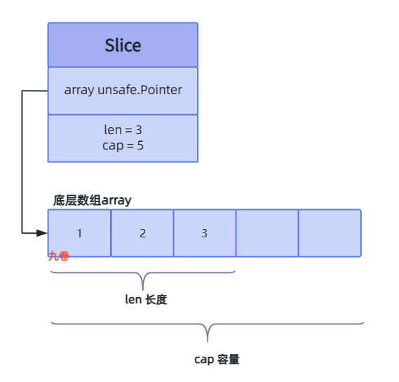

## Slice 介绍

在Go语言中，array数组是一种固定长度、值类型的连续内存序列，定义后不可变的数据结构。数组里的元素必须全部为同一类型。

> 声明数组时需要指明大小，切片不需要。
>
> 声明一个长度为10，数据类型为 int 的数组：var arr  [10]int。

切片Slice是一个基于数组构建的具有动态长度和容量、引用类型的数据结构。它有一个指向底层数组的指针。

> 声明一个数据类型为 int 的切片： var sliceint []int

切片在运行时动态分配内存，支持动态扩容。如果我们向切片中追加数据元素，它会在容量不足时自动扩容。

切片的容量（capacity）指的是该切片所指向的底层数组的长度（length)，也是该切片其本身所能达到的最大长度。


Slice初始化：

Slice在初始化时需要初始化长度和容量，容量未指定大小时将自动初始化为长度的大小。

可以直接通过数组的引用初始化，或通过数组的切片初始化，或通过make函数初始化。

下面给出一些slice初始化的方式示例：

```go
sli := []int{1,2,3,4}	//通过数组的引用初始化，值为[1,2,3,4],长度和容量为4

arr := [5]int{1,2,3,4,5}
sli := arr[0:3]	//通过数组的切片初始化，值为[1,2,3]，长度为3，容量为5

sli := make([]int, 4)	//通过make函数初始化，值为[0,0,0,0]，长度和容量为4

sli := make([]int, 3, 5)	//通过make函数初始化，值为[0,0,0]，长度为3，容量为5

```


在Go开发中，切片 Slice 的使用比数组 array 更频繁。

下面是一个简单例子：

```go
package main

import "fmt"

func main() {
    // 数组：长度固定
    arr := [3]int{1, 2, 3}
    
    // 切片：基于数组。
    // 当然切片声明定义有多种方法
    sliceint := arr[0:2] // 引用数组前两个元素 [1, 2]
    
    // 修改切片会影响底层数组
    sliceint[0] = 99
    fmt.Println(arr)   // 输出: [99 2 3]
    fmt.Println(sliceint) // 输出: [99 2]
    
    // 切片扩容
    sliceint = append(sliceint, 4, 5)
    fmt.Println(sliceint) // 输出: [99 2 4 5]
}
```

## Slice底层数据结构

slice 底层数据结构代码如下，它用一个结构体来表示

> go1.19 版本分析

```go
// runtime/slice.go
type slice struct {
	array unsafe.Pointer // 指针指向底层数组
	len   int // 当前长度
	cap   int // 总容量
}
```

slice 的内存布局图：
```shell
栈内存或堆内存中的slice结构体:
+---------------------------------+
| array指针 (8字节)               | -> 指向堆内存中的数组
+---------------------------------+
| len (8字节)                     | -> 例如当前元素个数 = 3
+---------------------------------+
| cap (8字节)                     | -> 例如总容量 = 5
+---------------------------------+

指向的堆内存数组:
+---+---+---+---+---+
| 0 | 1 | 2 |   |   |   // 前3个位置有数据，后2个为预留空间
+---+---+---+---+---+
  ↑    ↑    ↑
 元素  元素  元素
```


用make来初始化一个切片：

```go
sli := make([]int, 3, 5)
```

slice切片底层数据结构，如下图：



## 扩容函数原理简要分析

###  底层growslice()函数说明

slice的扩容机制，append() 操作时，底层涉及的函数主要是 `runtime/slice.go/growslice()` 函数，

> go1.19 版本分析

growslice 函数签名:

```go
//https://github.com/golang/go/blob/release-branch.go1.19/src/runtime/slice.go#L178

// growslice handles slice growth during append.
// It is passed the slice element type, the old slice, and the desired new minimum capacity,
// and it returns a new slice with at least that capacity, with the old data
// copied into it.
// The new slice's length is set to the old slice's length,
// NOT to the new requested capacity.
// This is for codegen convenience. The old slice's length is used immediately
// to calculate where to write new values during an append.
// TODO: When the old backend is gone, reconsider this decision.
// The SSA backend might prefer the new length or to return only ptr/cap and save stack space.

func growslice(et *_type, old slice, cap int) slice
```

参数说明：

- `et *_type`: 切片元素类型信息
- `old slice`: 旧的切片结构体（包含ptr, len, cap）
- `cap int`: 新切片的最小容量（通常是`old.len + numNewElements`）

返回值：新的切片（长度不变，容量至少为cap）

growslice() 函数比较长，分几段把重要代码分析下。

### 边界检查和特殊情况检查

```go
// 检查1: 确保新容量大于旧容量，否则直接报错panic
if cap < old.cap {
    panic(errorString("growslice: cap out of range"))
}

// 检查2: 零大小元素的特殊情况
if et.size == 0 {
    // append不应创建零大小的切片，但如果发生，不分配内存
    return slice{unsafe.Pointer(&zerobase), old.len, cap}
}
```

### 扩容的容量计算

这个是 slice 切片扩容代码核心部分。

```go
newcap := old.cap
doublecap := newcap + newcap

// 情况1: 所需容量超过2倍旧容量，直接使用所需容量
if cap > doublecap {
    newcap = cap
} else {
    // 情况2: 旧容量小于阈值256，把旧容量翻倍
    const threshold = 256
    if old.cap < threshold {
        newcap = doublecap
    } else {
        // 情况3: 旧容量≥256，逐步增长，循环计算直到满足需求
        // 0 < newcap 防止溢出，防止无限循环
        for 0 < newcap && newcap < cap {
            // 小切片，2倍扩容
            // 大切片，1.25倍扩容
            // 这个公式给出了两者之间较为平滑的过渡
            
            // 从 newcap 转换到 newcap + (newcap+3*threshold)/4
            // 避免溢出并保持线性增长
            newcap += (newcap + 3*threshold) / 4
        }
        // 当 newcap 计算溢出时，将 newcap 直接设置为请求的容量
        if newcap <= 0 {
            newcap = cap
        }
    }
}
```

说明：

> 在golang1.18版本更新之前大多数的文章都是这样描述slice的扩容策略的：
>
> > 当原 slice 容量小于 `1024` 的时候，新 slice 容量变成原来的 `2` 倍；原 slice 容量超过 `1024`，新 slice 容量变成原来的`1.25`倍。
>
> 在1.18版本更新之后，slice的扩容策略变为了：
>
> threshold = 256
>
> > 当原slice容量(oldcap)小于 256 的时候，新 slice(newcap)容量为原来的2倍；原slice容量超过256，新slice容量newcap = oldcap+(oldcap+3*256)/4


### 内存对齐处理

截取重要代码分析

```go
var overflow bool
var lenmem, newlenmem, capmem uintptr

// 根据元素大小采用不同的对齐策略
switch {
case et.size == 1:
    // 1字节元素：无需复杂对齐
    lenmem = uintptr(old.len)
    newlenmem = uintptr(cap)
    capmem = roundupsize(uintptr(newcap))
    newcap = int(capmem)
    
case et.size == sys.PtrSize:
    // 指针大小元素：按指针大小对齐
    lenmem = uintptr(old.len) * sys.PtrSize
    newlenmem = uintptr(cap) * sys.PtrSize
    capmem = roundupsize(uintptr(newcap) * sys.PtrSize)
    newcap = int(capmem / sys.PtrSize)
    
case isPowerOfTwo(et.size):
    // 元素大小是2的幂：使用位移操作优化
    var shift uintptr
    if sys.PtrSize == 8 {
        // 64位系统
        shift = uintptr(sys.Ctz64(uint64(et.size))) & 63
    } else {
        // 32位系统
        shift = uintptr(sys.Ctz32(uint32(et.size))) & 31
    }
    lenmem = uintptr(old.len) << shift
    newlenmem = uintptr(cap) << shift
    capmem = roundupsize(uintptr(newcap) << shift)
    newcap = int(capmem >> shift)
    
default:
    // 其他情况：直接乘法
    lenmem = uintptr(old.len) * et.size
    newlenmem = uintptr(cap) * et.size
    capmem, overflow = math.MulUintptr(et.size, uintptr(newcap))
    capmem = roundupsize(capmem)
    newcap = int(capmem / et.size)
}
```

### roundupsize() 函数分析

`roundupsize` 将需要的内存大小向上取整到内存分配器的大小类

```go
// src/runtime/msize.go

// 这是为了匹配内存分配器的块大小，减少内存碎片
func roundupsize(size uintptr) uintptr {
    if size < _MaxSmallSize {
        // 小对象：使用大小类
        if size <= smallSizeMax-8 {
            // 使用 size_to_class8 表
            return uintptr(class_to_size[size_to_class8[(size+smallSizeDiv-1)/smallSizeDiv]])
        } else {
            // 使用 size_to_class128 表
            return uintptr(class_to_size[size_to_class128[(size-smallSizeMax+largeSizeDiv-1)/largeSizeDiv]])
        }
    }
    // 大对象：按页面对齐
    if size+_PageSize < size { // 溢出检查
        return size
    }
    return alignUp(size, _PageSize)
}

const _MaxSmallSize = 32768
const smallSizeMax = 1024
const smallSizeDiv = 8
```

这个式子：

```go
class_to_size[size_to_class8[(size+smallSizeDiv-1)/smallSizeDiv]]
```

这是 `Go` 源码中有关内存分配的两个 `slice`。`class_to_size`通过 `spanClass`获取 `span`划分的 `object`大小。而 `size_to_class8` 表示通过 `size` 获取它的 `spanClass`。

```go
var size_to_class8 = [smallSizeMax/smallSizeDiv + 1]uint8{0, 1, 2, 3, 4, 5, 5, 6, 6, 7, 7, 8, 8, 9, 9, 10, 10, 11, 11, 12, 12, 13, 13, 14, 14, 15, 15, 16, 16, 17, 17, 18, 18, 19, 19, 19, 19, 20, 20, 20, 20, 21, 21, 21, 21, 22, 22, 22, 22, 23, 23, 23, 23, 24, 24, 24, 24, 25, 25, 25, 25, 26, 26, 26, 26, 27, 27, 27, 27, 27, 27, 27, 27, 28, 28, 28, 28, 28, 28, 28, 28, 29, 29, 29, 29, 29, 29, 29, 29, 30, 30, 30, 30, 30, 30, 30, 30, 31, 31, 31, 31, 31, 31, 31, 31, 31, 31, 31, 31, 31, 31, 31, 31, 32, 32, 32, 32, 32, 32, 32, 32, 32, 32, 32, 32, 32, 32, 32, 32}
```

```go
var class_to_size = [_NumSizeClasses]uint16{0, 8, 16, 24, 32, 48, 64, 80, 96, 112, 128, 144, 160, 176, 192, 208, 224, 240, 256, 288, 320, 352, 384, 416, 448, 480, 512, 576, 640, 704, 768, 896, 1024, 1152, 1280, 1408, 1536, 1792, 2048, 2304, 2688, 3072, 3200, 3456, 4096, 4864, 5376, 6144, 6528, 6784, 6912, 8192, 9472, 9728, 10240, 10880, 12288, 13568, 14336, 16384, 18432, 19072, 20480, 21760, 24576, 27264, 28672, 32768}
```

### 内存分配

```go
var p unsafe.Pointer
if et.ptrdata == 0 {
    // 元素不包含指针：使用非GC内存分配
    p = mallocgc(capmem, nil, false)
    // 将超出旧长度的新分配内存清零
    memclrNoHeapPointers(add(p, newlenmem), capmem-newlenmem)
} else {
    // 元素包含指针：需要GC跟踪
    p = mallocgc(capmem, et, true)
    if lenmem > 0 && writeBarrier.enabled {
        // 只对 old.array 中的指针进行标记，因为我们知道目标切片 p
        // 只包含 nil 指针，因为它在分配期间已被清空。
        // 批量写屏障：标记旧指针的复制
        bulkBarrierPreWriteSrcOnly(uintptr(p), uintptr(old.array), lenmem-et.size+et.ptrdata)
    }
}
```

### 数据复制和返回新切片

```go
// 复制旧数据到新内存
memmove(p, old.array, lenmem)

// 返回新切片（长度不变，容量为newcap）
return slice{p, old.len, newcap}
```

## 扩容简单示例

图解一个扩容的简单例子

```shell
原始 slice: len=4, cap=4
┌───┬───┬───┬───┐
│ 1 │ 2 │ 3 │ 4 │
└───┴───┴───┴───┘

append 元素 5 后扩容:

步骤1: 计算新容量
  old.cap = 4 < 256
  newcap = 4 * 2 = 8

步骤2: 分配新内存
┌───┬───┬───┬───┬───┬───┬───┬───┐
│   │   │   │   │   │   │   │   │
└───┴───┴───┴───┴───┴───┴───┴───┘

步骤3: 复制数据
┌───┬───┬───┬───┬───┬───┬───┬───┐
│ 1 │ 2 │ 3 │ 4 │ 5 │   │   │   │
└───┴───┴───┴───┴───┴───┴───┴───┘
 len=5, cap=8
```


## 扩容流程总结

流程图

```shell
开始扩容
   │
   ├─> 判断所需容量 cap
   │
   ├─> old.cap < 256?
   │     │
   │     ├─Yes─> newcap = old.cap * 2 (直接翻倍)
   │     │
   │     └─No──> newcap = old.cap + (old.cap + 768) / 4
   │             (每次增长约25%)
   │
   ├─> 内存对齐
   │     │
   │     └─> 根据元素大小调整 newcap
   │          (对齐到内存分配类)
   │
   ├─> 分配新内存空间
   │     │
   │     └─> mallocgc(capmem, ...)
   │
   ├─> 复制旧数据到新空间
   │     │
   │     └─> memmove(new, old, lenmem)
   │
   └─> 返回新slice
```

## 扩容函数优化的点

- 内存对齐优化

```
实际内存分配 vs 理论内存需求示例:
理论: 需要100字节
分配器大小类: 96, 112, 128, ...
roundupsize(100) = 112  ← 选择最接近的大小类
实际分配112字节，提高了内存利用率
```

- 避免频繁扩容

```
小切片: 2x 翻倍增长，快速增加容量
大切片: 1.25倍扩容 newcap += (newcap + 3*threshold) / 4，避免浪费过多内存
内存对齐: 匹配分配器，减少碎片
```

## 参考

- https://golang.design/go-questions/slice/grow/
- https://www.cnblogs.com/yinbiao/p/15802792.html
- https://draven.co/golang/docs/part2-foundation/ch03-datastructure/golang-array-and-slice/
- https://blog.csdn.net/pbrlovejava/article/details/128175941

