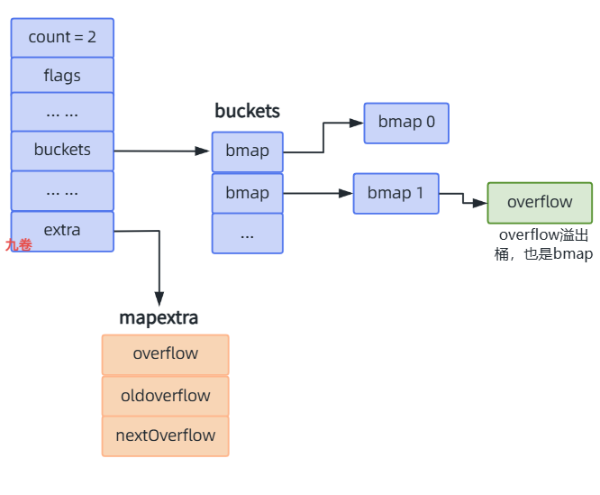
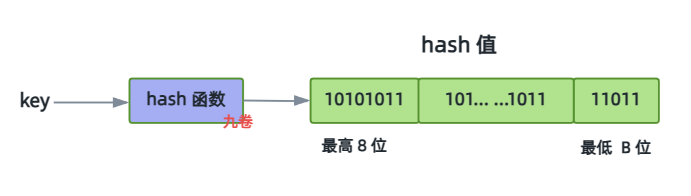

## map介绍

Go 语言中 map 是一种内置的无序键值对（key-value）结构，它的底层实现是一个哈希表。map属于引用类型。

它有着 O(1) 的查找、删除和插入速度，所以是一种常见的数据结构。

使用方法简单介绍：

- 创建与初始化：`m := make(map[string]int)` 或 `m := map[string]int{"a": 1`
- 增加、修改改：`m["key"] = 10`。
- 查找：`val, ok := m["key"]` (如果键不存在，`ok` 为 `false`，`val` 为零值)。
- 删除：`delete(m, "key")`。
- 遍历：`for k, v := range m { ... }`，它是无序的

## 核心数据结构

> go1.19版本

### hmap 数据结构

**hmap** struct 源码简析：

hmap 是 map 的哈希表数据结构，存储元数据，

```go
// go1.19/src/runtime/map.go
type hmap struct {
    count     int    // 当前map中元素的数量，len(map)返回此值
	flags     uint8  // map状态标记（是否处于扩容、是否有协程访问、是否正在写入等）
	B         uint8  // 桶数量的对数，桶数量 = 2^B
	noverflow uint16 // 溢出桶数量（B<16时精确，B≥16时估算），用于监控负载
	hash0     uint32 // 哈希种子，计算 key 的哈希值的时候会传入哈希函数，用于防止哈希随机碰撞攻击

	buckets    unsafe.Pointer // 指向主桶数组的指针（长度为 2^B），指向桶数组，一个[]bmap类型的数组
	oldbuckets unsafe.Pointer // 在扩容过程中指向旧桶数组的指针，用于渐进式迁移
	nevacuate  uintptr        // 扩容迁移的进度计数器，小于此值的桶已经迁移（已迁移的桶数）

	extra *mapextra  // 可选字段，存储溢出桶信息（避免GC扫描压力）
}

// 溢出桶结构
type mapextra struct {
    overflow    *[]*bmap  // 当前使用的溢出桶列表，指向溢出桶的指针数组
    oldoverflow *[]*bmap  // 旧桶的溢出桶（扩容时用），扩容时指向旧溢出桶
    nextOverflow *bmap    // 下一个空闲溢出桶
}
```

### bmap 数据结构

bmap就是哈希表里的桶 bucket，用来存储数据的地方。

bmap(桶，b-bucket)源码中只定义了 `tophash` 字段，但编译器会动态生成完整结构。

```go
// 源码定义（仅包含 tophash）
type bmap struct {
    tophash [bucketCnt]uint8  // 一个长度为8的uint8数组，存储每个槽位的哈希值的高8位（top hash），用于快速比较和查找
}

const (
	// 一个桶(bucket)内 可容纳kv键值对 的最大数量
	bucketCntBits = 3
	bucketCnt     = 1 << bucketCntBits
)
```


编译器生成的实际布局（伪代码）

```go
// 编译器生成的实际布局（伪代码）
type bmap struct {
    tophash  [8]uint8    // 存储每个key的哈希值的高8位，可用于快速比较
    keys     [8]KeyType  // 8个键（紧凑排列），k[0..7]
    values   [8]ValueType// 8个值（紧凑排列），v[0..7]
    pad      uintptr     // 内存对齐填充
    overflow *bmap       // 溢出桶指针（链地址法），最后是指向溢出桶的指针
}
```
bmap 中存储数据的方式， tophash 存储每个key的哈希值的高8位。一个 tophash 的大小为 1 个字节，每一个 tophash 记录的是 bmap 中每一个元素key的哈希值的最高位的 8 bit。

接下来 bmap 存储的 8 个元素的 key，在 8 个 key 之后是 8 个 bmap 存储的值 value。 key 和 value 的存储是分开的，而不是 `{key/value}`、`{key/value}` 这种方式，分开存储的方式有一个好处是可以减少内存对齐的开销，从而更省内存。

最后 overflow（溢出桶），如果 bmap 存满了，那就会新建一个溢出桶来保存新的数据，通过在旧的 bmap 上记录指针来记录溢出桶。

### hmap 图解

一张图简要分析它们之间关系，hamp 、bmap、overflow



Go 的 map 底层源码中 **bmap 结构体就是表示 bucket 桶，溢出桶也是用 bmap 表示**。

### bmap 图解

```
// 内存布局示意图：
+----------------+
| tophash[0..7]  |  // 8字节，8个tophash数组
+----------------+
| key0           |  // key数组，8个键
| key1           |
| ...            |
| key7           |
+----------------+
| value0         |  // value数组  ，8个值
| value1         |
| ...            |
| value7         |
+----------------+
| overflow ptr   |  // 溢出桶指针，指向溢出桶
+----------------+
```

图说明：

- 每个桶最多存储 8 个键值对

- keys 和 values 分离存储，提高内存访问效率（避免内存对齐浪费）

- tophash 用于快速过滤查找，减少 key 比较次数

- 当桶满了之后，使用溢出桶，链式存储

```shell
bmap (bucket) -> bmap (overflow) -> bmap (overflow)
```

## key怎么定位

查找key，首先要找出它位于哪个桶中，key 的计算，map 中的 key 是经过hash函数计算，然后在存储。

**第一步：**通过 hash 函数计算 key 的hash值

```go
// 计算key的哈希值hash

hash := t.hasher(key, uintptr(h.hash0)) // 计算哈希值,使用 hash0 作为随机种子防HashDoS攻击
```


**第二步**：计算桶索引

一般情况下计算桶索引就是hash值对 buckets 桶长度取模，`hash % len(buckets)）`，这里用位运算优化了算法，而不是取模，位运算速度极快，如下

```go
// 低B位决定桶位置。
// 取hash哈希值的低B位（即hmap.B）作为桶的索引

m := uintptr(1)<<h.B - 1
b := (*bmap)(add(h.buckets, (hash&m)*uintptr(t.bucketsize)))

// 等价逻辑：
bucketIndex = hash & ((1<<B) - 1)
```
例如 B = 5，桶数 = 32，取 hash 低5位。

由hash哈希值的最低 `B` 位来决定 `key` 最终属于哪一个桶。

取哈希值的高 8 位，存储在 tophash 数组中，用于在桶内快速比较。


**第三步**：桶内定位(tophash)

通过 hash 函数计算 key 的哈希值示意图：



从最上面图解 bmap 中可以看到，每个bmap（实际也叫桶bucket）有 8 个 {key,...}和 8 个{value...}，比较hash值的最高 8 位是否相等，也就是 tophash 的最高 b bit，如果相等，则获取存储在 bmap 里 key 值，然后跟需要定位的 key 比较，如果相等，则找到了 key；如果不相等，则遍历下一个bmap，直到所有的bmap遍历完。

溢出桶里查找：

如果 8 个都遍历完了，还没找到 key，那么就会去**溢出桶继续查找**。跟上面查找过程一样。


tophash设计：

- 取哈希值的 **高8位** 存入 `tophash[i]`
- 查找时先比较 `tophash`（1字节比较），不等则跳过，相等再比较完整 key

tophash这样设计极大减少内存访问和字符串比较开销。

```go
// tophash值的特殊含义
const (
    emptyRest      = 0  // 当前位置及后续位置都为空
    emptyOne       = 1  // 当前位置为空
    evacuatedX     = 2  // 键值对已迁移到新桶的前半部分
    evacuatedY     = 3  // 键值对已迁移到新桶的后半部分
    evacuatedEmpty = 4  // 桶已迁移且为空
    minTopHash     = 5  // 最小的有效tophash值
)
```

**第四步**：定位桶具体位置代码

```go
b := (*bmap)(add(h.buckets, bucketIndex*uintptr(t.BucketSize)))
```

## 哈希冲突解决

Go 采用了 **开放寻址法** + **链地址法**   结合的方法来解决哈希冲突。

为什么会采用两种？

其实从上面 key 的查找就知道，为啥有2种，

- 每个桶 bmap 最多可以存储 8 个键值对。
- 当桶已满（即 8 个位置都满了），则创建一个溢出桶（也是 bmap 结构），并通过链表（指针）方式连接到原桶。
- 在查找时，如果在最开始桶的 8 个位置中没有找到，并且有溢出桶，则继续在溢出桶中查找。

```shell
bmap
 ├── 8 个{k...}{V...}（满了）
 └── overflow溢出桶 → bmap → bmap → ...
```

总结下：

- 在 bmap 桶内：采用开放寻址，key 比较方式
- 溢出桶：采用链地址方法

桶内开放寻址法代码简要分析：

> go1.19

```go
// 桶内使用开放寻址法
func mapaccess1(t *maptype, h *hmap, key unsafe.Pointer) unsafe.Pointer {
    
    ... ...
    
    // 1. 计算哈希值
    hash := t.hasher(key, uintptr(h.hash0))
    m := bucketMask(h.B)
    b := (*bmap)(add(h.buckets, (hash&m)*uintptr(t.bucketsize)))
    
    ... ...
    
    // 2. 计算tophash
    top := tophash(hash)
    
bucketloop:
    // 3. 在桶内线性搜索
    for ; b != nil; b = b.overflow(t) {
        for i := uintptr(0); i < bucketCnt; i++ {
            if b.tophash[i] != top {
                if b.tophash[i] == emptyRest {
                    break bucketloop
                }
                continue
            }
            
            // 4. 找到匹配的tophash，比较key
            k := add(unsafe.Pointer(b), dataOffset+i*uintptr(t.keysize))
            if t.indirectkey() {
				k = *((*unsafe.Pointer)(k))
			}
            if t.key.equal(key, k) {
                // 找到key，返回对应的value
                e := add(unsafe.Pointer(b), dataOffset+bucketCnt*uintptr(t.keysize)+i*uintptr(t.elemsize))
				if t.indirectelem() {
					e = *((*unsafe.Pointer)(e))
				}
				return e
            }
        }
    }
    
    // 5. 没找到，返回零值
    return unsafe.Pointer(&zeroVal[0])
}
```

桶溢出处理代码简要分析：

```go
// 创建溢出桶
func (h *hmap) newoverflow(t *maptype, b *bmap) *bmap {
    var ovf *bmap
    
    // 1. 尝试从预分配的溢出桶中获取
    if h.extra != nil && h.extra.nextOverflow != nil {
        ovf = h.extra.nextOverflow // 使用预分配的溢出桶
        if ovf.overflow(t) == nil {
            // 更新nextOverflow指针
            h.extra.nextOverflow = (*bmap)(add(unsafe.Pointer(ovf), uintptr(t.bucketsize)))
        } else {
            // 已经是最后一个溢出桶
            ovf.setoverflow(t, nil)
            h.extra.nextOverflow = nil
        }
    } else {
        // 2. 分配新的溢出桶，动态分配新溢出桶
        ovf = (*bmap)(newobject(t.bucket))
    }
    
    // 3. 更新溢出桶计数
    h.incrnoverflow()
    
    ... ...
    
    // 4. 链接到桶的溢出链
    b.setoverflow(t, ovf)
    return ovf
}
```

## 扩容机制分析

### 扩容触发条件

1. **负载因子过高**

```
负载因子 = 元素数量 / 桶数量，
默认负载因子阈值为 6.5

loadFactor ≈ 6.5（loadFactorNum=13, loadFactorDen=2）
```

触发条件：count > 2^B * 6.5。

负载因子 = 6.5 ，为啥子是 6.5？是实验得出的平衡值，兼顾查询效率和内存占用。

计算是否超过负载因子的函数：

```go
func overLoadFactor(count int, B uint8) bool {
	return count > bucketCnt && uintptr(count) > loadFactorNum*(bucketShift(B)/loadFactorDen)
}
```


2. **溢出桶过多**

bmap 桶里的 overflow 过多。当溢出桶数量 `>= 2^B` 时触发

```go
// 判断是否有太多溢出桶了
// 判断多的标准是：
// B <= 15 的时候，溢出桶数量 2^B 的时候
// B > 15 的时候，溢出桶的数量 2^B 的时候
func tooManyOverflowBuckets(noverflow uint16, B uint8) bool {
	if B > 15 {
		B = 15
	}
	return noverflow >= uint16(1)<<(B&15)
}
```


判断条件：

```go
// 1. 没有在扩容
// 2. 超过负载因子
// 3. 太多溢出桶
if !h.growing() && (overLoadFactor(h.count+1, h.B) || tooManyOverflowBuckets(h.noverflow, h.B)) {
    hashGrow(t, h)
}
```


### 扩容类型：翻倍和等量扩容

1.  负载因子过高，**翻倍扩容**（元素过多）

- 触发条件：count > 2^B * 6.5。

桶数量翻倍扩容，扩容之后的容量为原来容量的 2 倍，新B = 旧B + 1，桶数从 2^B  变为 2^(B+1)，目的是降低负载因子。


2. 溢出桶过多，**等量扩容**
- 触发条件：溢出桶数量noverflow ≥ 2^B

B 不变，重新分配数据。

桶数量不变，仅整理数据。如果溢出桶过多但负载不高，可能是哈希分布不均。Go 会分配相同大小的新桶数组，但使用新哈希种子重新分布。

删除过多的溢出桶，将分散在溢出桶的数据压缩回主桶，数据分布更加紧凑。


扩容期间的读写怎么办？

- **读**：先查新桶，查不到再查旧桶

- **写**：直接写新桶


### 扩容方式：渐进式迁移

map 的扩容方式是渐进式（incremental rehash），不是一次性迁移所有数据，而是会分步来迁移数据，每次 map 操作时顺便搬几个 bucket桶。这避免了长时间的 GC 停顿或性能抖动，尤其在高并发场景。

过程简要分析：

```shell
1. 分配新桶：
  - 创建新 buckets 数组，大小为原 2 倍（或相同，如果是等量扩容）。
  - oldbuckets 指向旧桶，buckets 指向新桶。
  - nevacuate = 0，表示迁移起点。

2. 渐进式迁移（evacuation）：
  - 迁移不是立即完成的，而是在后续的读/写/删除操作中逐步进行。
  - 每次操作（如查找、插入、删除）时，会检查是否在扩容中。如果是，会迁移一小部分旧桶数据（通常 1-2 个桶）。
  
迁移逻辑：在 evacuate 函数中，对于旧桶 i：
  - 计算新桶位置：由于桶数翻倍，旧桶 i 的元素会根据哈希值的额外位（第 B 位）分裂到新桶 i 或 i + 2^B。
  - 遍历旧桶和其 overflow 链表，将元素重新哈希到新桶。
  - 迁移后，标记旧桶为已迁移（设置 tophash 为 evacuated 值）。

进度通过 nevacuate 跟踪，当所有旧桶迁移完，oldbuckets 被置空，扩容结束
```

### 迁移过程代码分析

Go Map 迁移过程（evacuation）是 map 扩容（growth）的一部分，发生在负载因子超过阈值或溢出桶过多时。

核心文件是 src/runtime/map.go，迁移逻辑主要在 hashGrow、growWork 和 evacuate 函数中实现。

> go1.19

- **hashGrow** 函数，扩容触发与准备。

hashGrow 负责初始化扩容，分配新桶数组，设置 oldbuckets，并决定是翻倍扩容还是等量扩容。

此函数还没做迁移操作，只是做准备工作。

```go
// https://github.com/golang/go/blob/release-branch.go1.19/src/runtime/map.go#L1041

// h：实际保存键值对的结构体， t：map 类型元信息
func hashGrow(t *maptype, h *hmap) {
    
    bigger := uint8(1)
    // 未超过负载因子，进行等量扩容
    if !overLoadFactor(h.count+1, h.B) {
        bigger = 0    // 等量扩容，仅重新分布以改善哈希碰撞
		h.flags |= sameSizeGrow 
    }
    // 记录旧的 buckets
    oldbuckets := h.buckets
    // 分配新桶数组，旧桶oldbuckets会迁移到新桶newbuckets
    newbuckets, nextOverflow := makeBucketArray(t, h.B+bigger, nil)

    //更新flags以标记扩容状态（iterator和oldIterator用于处理迭代器兼容）
    flags := h.flags &^ (iterator | oldIterator)
    if h.flags&iterator != 0 {
        flags |= oldIterator
    }
    // commit the grow (atomic wrt gc)
    // 提交扩容操作 
    h.B += bigger // 加上扩容的数量
    h.flags = flags
    h.oldbuckets = oldbuckets
    h.buckets = newbuckets // 指向新桶数组
    h.nevacuate = 0 // 0 初始化迁移桶数量
    h.noverflow = 0

    // 处理结构（extra）中的溢出桶，避免立即 GC 旧桶
    if h.extra != nil && h.extra.overflow != nil {
       
        if h.extra.oldoverflow != nil {
			throw("oldoverflow is not nil")
		}
		h.extra.oldoverflow = h.extra.overflow
		h.extra.overflow = nil
    }
    
    // 扩容之后，h.B+bigger >= 4 了，预分配了溢出桶
    // 所以这里要记录溢出桶
    if nextOverflow != nil {
		if h.extra == nil {
			h.extra = new(mapextra)
		}
		h.extra.nextOverflow = nextOverflow
	}
}
```

- **growWork** 函数，渐进式迁移函数

growWork 是迁移的入口点，在每个 map 操作（assign、access、delete）时调用，确保迁移逐步进行而非一次性完成。这避免了长时间停顿（stop-the-world）。

```go
func growWork(t *maptype, h *hmap, bucket uintptr) {
    // 1. 迁移指定的桶
    evacuate(t, h, bucket&h.oldbucketmask())
    
    // 2. 再迁移一个桶（加速迁移）
    if h.growing() {
        evacuate(t, h, h.nevacuate)
    }
}
```

- **evacuate** 函数，核心迁移逻辑实现

```go
// 迁移目标桶数据结构（旧桶 -> 目标桶）
// evacuate 函数中会定义两个这个 evacDst 变量，
// 一个指向 h.buckets 的前半部分，一个指向后半部分。（对应前一个的 x，y）
// 迁移的时候，会根据 key 的哈希值的倒数第 4 位来决定迁移到哪个 evacDst 中。
type evacDst struct {
   b *bmap          // 迁移目的桶
   i int            // key/elem 在迁移目标桶里面对应的下标
   k unsafe.Pointer // 目标桶一个保存 key 的地址指针
   e unsafe.Pointer // 目标桶一个保存 elem 的地址指针
}

// 迁移桶的具体实现
// 参数 oldbucket 需要迁移的旧桶
func evacuate(t *maptype, h *hmap, oldbucket uintptr) {
    // 计算旧桶地址
    b := (*bmap)(add(h.oldbuckets, oldbucket*uintptr(t.bucketsize)))
    // 扩容之前的桶的数量
    // oldbucket+newbit 对应 y，oldbucket 对应 x
    newbit := h.noldbuckets()
    
    // 如果 b 没有迁移，则进行迁移
    if !evacuated(b) {
        // 迁移的时候，在 h.buckets 中，前 noldbuckets 桶就是 x，后 noldbuckets 桶就是代表 y。
        var xy [2]evacDst
        x := &xy[0] // x 存储了新桶的地址
        x.b = (*bmap)(add(h.buckets, oldbucket*uintptr(t.bucketsize)))
        x.k = add(unsafe.Pointer(x.b), dataOffset)
        x.v = add(x.k, bucketCnt*uintptr(t.keysize))

        if !h.sameSizeGrow() {
            // 翻倍扩容时，桶迁移到两个位置
            y := &xy[1]
            y.b = (*bmap)(add(h.buckets, (oldbucket+newbit)*uintptr(t.bucketsize)))
            y.k = add(unsafe.Pointer(y.b), dataOffset)
            y.v = add(y.k, bucketCnt*uintptr(t.keysize))
        }

        // 遍历桶及其溢出桶，开始迁桶
        for ; b != nil; b = b.overflow(t) {
            k := add(unsafe.Pointer(b), dataOffset) // 旧桶上第一个 key
            v := add(k, bucketCnt*uintptr(t.keysize))// 旧桶上第一个 value

            // 迁移当前桶的所有key，value
            for i := 0; i < bucketCnt; i, k, e = i+1, add(k, uintptr(t.keysize)), add(e, uintptr(t.elemsize)) {
                top := b.tophash[i] // 获取旧tophash值
                if isEmpty(top) { // tophash没有值，说明这个桶迁移完了
                    b.tophash[i] = evacuatedEmpty
                    continue // 跳出，处理下一个桶数据
                }
                
                if top < minTopHash {
					throw("bad map state")
				}
				k2 := k
				if t.indirectkey() {
					k2 = *((*unsafe.Pointer)(k2))
				}

                // 决定迁移到哪个新桶，useY 决定了是迁移到 x 还是 y，如果是等量扩容，那么就是迁移到 x
                var useY uint8
                // 如果不是等量扩容
                if !h.sameSizeGrow() {
                    // 计算哈希值
                    hash := t.hasher(k2, uintptr(h.hash0))
                   if h.flags&iterator != 0 && !t.reflexivekey() && !t.key.equal(k2, k2) {
                      
                      useY = top & 1
                      top = tophash(hash)
                   } else {
                     
                      if hash&newbit != 0 { // 取决于 oldB + 1 位是 0 还是 1
                         useY = 1
                      }
                   }
                }

                if evacuatedX+1 != evacuatedY || evacuatedX^1 != evacuatedY {
                   throw("bad evacuatedN")
                }

                // 记录旧桶的迁移状态
                b.tophash[i] = evacuatedX + useY // evacuatedX + 1 == evacuatedY
                // dst 是迁移的目标桶
                dst := &xy[useY]

                // 目标桶装不下了，使用溢出桶
                if dst.i == bucketCnt {
                   // 创建溢出桶
                   dst.b = h.newoverflow(t, dst.b)
                   dst.i = 0
                   // dst.k 指向溢出桶的第一个 key 的地址
                   dst.k = add(unsafe.Pointer(dst.b), dataOffset) 
                   // dst.e 指向溢出桶的第一个 elem 的地址
                   dst.e = add(dst.k, bucketCnt*uintptr(t.keysize))
                }
                // dst.i使用&运算优化，避免边界检查
                // 记录 tophash
                dst.b.tophash[dst.i&(bucketCnt-1)] = top // mask dst.i as an optimization, to avoid a bounds check
                ... ...
                
                
                // dst 指向下一个空的槽（slot/cell）
                dst.i++
                
                dst.k = add(dst.k, uintptr(t.keysize))
                dst.e = add(dst.e, uintptr(t.elemsize))
                // 上面有判断 dst.i == bucketCnt，所以这里不会溢出
             }
          }
          // 取消溢出桶并清除 key/elem 以帮助 GC。（清除旧桶的内存）
          if h.flags&oldIterator == 0 && t.bucket.ptrdata != 0 {
             b := add(h.oldbuckets, oldbucket*uintptr(t.bucketsize))
             // tophash 状态不能清除, 因为迁移状态保存在这里
             // key/elem 都可以清除。
             ptr := add(b, dataOffset)
             n := uintptr(t.bucketsize) - dataOffset
             memclrHasPointers(ptr, n)
          }
       }

       // 刚刚迁移了桶，需要迁移下一个桶，
       // 则需要更新 nevacuate 字段，表示已经迁移了多少个桶
       if oldbucket == h.nevacuate {
          advanceEvacuationMark(h, t, newbit)
       }
}
```


## 参考

- https://go.dev/blog/maps map分析与使用
- https://golang.design/go-questions/map/principal/ Go程序员面试宝典 作者: 饶全成, 欧长坤, 楚秦 等编著
- https://github.com/golang/go/blob/release-branch.go1.19/src/runtime/map.go go map源码
- https://juejin.cn/post/7177582930313609273 Go map设计与实现 eleven26

