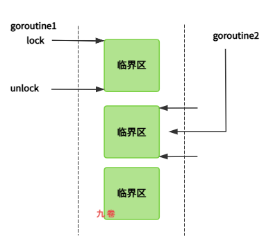
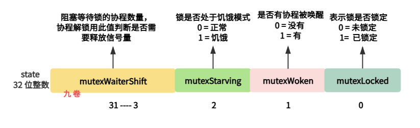
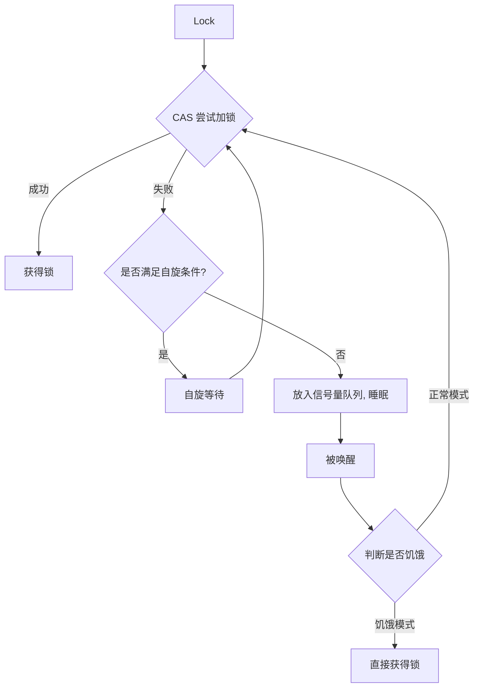
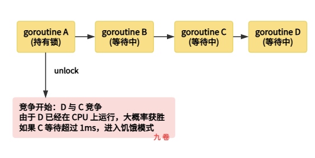
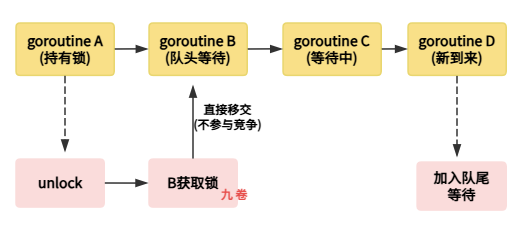

## 一、sync.Mutex概述

sync.Mutex 是 Go 语言标准库 sync 包中提供的互斥锁实现，是 Go 并发编程中最基本的同步原语之一。

作为一种排他锁，Mutex 确保同一时间只有一个 goroutine 能够访问被保护的临界区资源，从而有效防止数据竞争（Data Race）和不一致性问题。Mutex 的零值即为未锁定状态，这使得开发者可以声明后直接使用，无需显式初始化，这一设计体现了 Go 语言简单的设计哲学。



从架构演进的角度来看，Go 的Mutex 经历了多个阶段的优化。

- 最初版本使用简单的 flag 表示锁是否被持有；

- 后来为了提升性能，引入了自旋机制和竞争优化；

- 在 1.19 版本后，为了解决饥饿问题，又加入了饥饿模式以保证公平性。


现阶段的 Mutex 在正常模式下具有优秀的性能表现，而在高竞争场景下能够自动切换到饥饿模式以保证公平性，这种双模式设计是 Go Mutex 的核心特色。

Mutex 与 Go 的 goroutine 机制紧密协作。goroutine 是轻量级的执行单元，调度器会将它们分配到可用的P（处理器）上运行。当一个goroutine 尝试获取已经被持有的 Mutex 时，它会被阻塞并放入等待队列；当锁被释放时，等待队列中的 goroutine 会被唤醒继续执行。这种协作机制使得 Go 能够高效处理大量并发任务，同时保证数据访问的线程安全性。

## 二、主要数据结构

### Mutex结构体定义

Go语言中 sync.Mutex 的数据结构设计极为简洁高效，整个结构体仅包含两个字段，总共占用8个字节的内存空间：

```go
type Mutex struct {
    state int32    // 状态：是否锁定/未锁定, 是否协程被唤醒/未被唤醒，是否饥饿中/正常
    sema  uint32   // 信号量，用于阻塞/唤醒 goroutine
}
```

**字段说明：**

- **state字段**：一个 32 位整数，用于表示当前互斥锁的状态。这个字段采用位运算的方式，将不同意义的状态信息编码在同一个整数中，实现了空间利用的最大化
- **sema字段**：一个无符号 32 位整数，用作信号量。信号量是操作系统提供的同步机制，能够原子性地进行 PV 操作，用于控制goroutine 的阻塞和唤醒

通过巧妙的状态位设计，Mutex 能够在极小的内存开销下实现复杂的锁逻辑，这是 Go 标准库中经典的设计范式之一。

### state状态位定义

Mutex 的状态字段被划分为多个位域，每个位代表不同的状态信息。Go 源码中定义了相关的常量来表示这些状态位：

```go
const (
    mutexLocked      = 1 << iota  // 0001, 表示锁已被持有
    mutexWoken                   // 0010, 表示有goroutine被唤醒
    mutexStarving                // 0100, 表示处于饥饿模式
    mutexWaiterShift = iota      // 003, 等待者数量的移位值
    starvationThresholdNs = 1e6  // 进入饥饿模式的阈值：1毫秒
)
```

state字段状态位布局图示：



state字段各状态位含义详解：

- mutexLocked（第0位，1bit）：表示 Mutex 是否处于锁定状态。值为 0 时表示锁空闲没被锁定，值为 1 时表示锁已被某个 goroutine 持有
- mutexWoken（第1位，1bit）：表示是否有 goroutine 被唤醒它正在尝试获取锁。这个标志用于避免重复唤醒，提高效率
- mutexStarving（第2位，1bit）：表示 Mutex 当前处于哪种模式。0 表示正常模式，1 表示饥饿模式
- 高 29 位：表示当前等待队列中阻塞的 goroutine 数量。通过右移 3 位（mutexWaiterShift）可以获取等待者数量

这种位域设计使得状态信息可以紧凑地存储，同时支持原子操作来修改和读取状态，确保了锁操作的高效性和线程安全性。

### sema信号量机制

sema 字段作为信号量，承载着 goroutine 阻塞和唤醒的协调功能。信号量（Semaphore）是一个经典的同步原语，它维护一个计数器，支持 P（等待）和 V（信号）两种原子操作。

**信号量的工作原理：**

- 当 goroutine 无法获取锁时，会调用 runtime_SemacquireMutex 减少 sema 值，使自己进入阻塞等待状态
- 当锁被释放时，会调用 runtime_Semrelease 增加sema值，唤醒等待队列中的一个 goroutine
- 这种机制使得 goroutine 能够在用户态和内核态之间高效切换，避免了不必要的系统开销

信号量的引入使得 Mutex 能够在不阻塞整个调度器的情况下，协调多个 goroutine 对锁的竞争，这是 Go 实现高效并发的重要基础。

## 三、实现原理详解

### Lock方法实现原理

Lock 方法是获取互斥锁的核心入口，其实现分为快速路径和慢速路径两个阶段：

**快速路径（Fast Path）：**

当锁处于完全空闲状态（state 为 0）时，Lock 方法会尝试通过 CAS（Compare-And-Swap）原子操作直接获取锁。如果成功，goroutine可以直接进入临界区执行，整个过程不需要任何阻塞：

```go
func (m *Mutex) Lock() {
    // 快速路径：尝试CAS操作直接获取锁
    if atomic.CompareAndSwapInt32(&m.state, 0, mutexLocked) {
        return  // 获取成功，直接返回
    }
    // 快速路径失败，进入慢速路径
    m.lockSlow()
}
```

**慢速路径（Slow Path）：**

当快速路径失败时，说明锁已被其他 goroutine 持有，此时会进入复杂的锁竞争逻辑：

1. 自旋检测：首先判断是否可以进行自旋。如果满足以下条件，则开始自旋等待：
   - 当前不是在饥饿模式
   - 运行时允许自旋且自旋次数未超过上限
   - 单个 P 上有运行的 goroutine

2. 自旋过程：自旋期间，goroutine 会循环检查锁状态，不会让出CPU。自旋最多进行 4 次，每次自旋会调用 procyield 让出 CPU 时间片

3. 信号量等待：如果自旋后仍未获取到锁，goroutine会：
   - 增加等待者计数器
   - 根据是否之前等待过决定在队列中的位置（新来的放队尾，等待过的放队头）
   - 调用 runtime_SemacquireMutex 进入阻塞等待状态

4. 唤醒后处理：被唤醒后，会检查是否应该切换到饥饿模式。如果等待时间超过1毫秒，或者之前已处于饥饿状态，则保持饥饿标记

### Lock加锁过程图解




### Unlock方法实现原理

Unlock 方法负责释放锁，其实现相对简洁，但同样包含重要的细节处理：

**解锁流程：**

1. 状态重置：首先通过原子操作将 state 减去 mutexLocked 位，尝试将锁标记为未锁定

2. 唤醒等待者：如果还有等待者（waitersCount > 0），则通过 runtime_Semrelease 唤醒其中一个等待者

3. 模式切换检查：在饥饿模式下，释放锁时会直接将锁移交给等待队列队头的 goroutine；在正常模式下，新来的 goroutine 可能与被唤醒的 goroutine 竞争

```go
func (m *Mutex) Unlock() {
    // 快速路径：直接解锁
    newState := atomic.AddInt32(&m.state, -mutexLocked)
    
    // 如果还有等待者，唤醒其中一个
    if newState&mutexStarving == 0 {
        // 正常模式
        if old := newState >> mutexWaiterShift; old != 0 {
            runtime_Semrelease(&m.sema, false, 0)
        }
    } else {
        // 饥饿模式：直接交给等待队列队头
        runtime_Semrelease(&m.sema, true, 0)
    }
}
```


### TryLock方法（Go 1.18+）

Go 1.18 版本引入了 TryLock 方法，这是对 Mutex 功能的重要补充：

TryLock特点：

- 尝试获取锁，如果锁已被其他 goroutine 持有则立即返回 false
- 不会阻塞当前 goroutine，调用者可以根据返回值灵活处理
- 如果获取成功，返回 true，goroutine 可以进入临界区

```go
func (m *Mutex) TryLock() bool {
    // 快速路径：尝试CAS获取锁
    if atomic.CompareAndSwapInt32(&m.state, 0, mutexLocked) {
        return true  // 获取成功
    }
    // 如果锁已被持有，返回false
    return false
}
```

使用场景：

TryLock 适用于需要非阻塞获取锁的场景，比如在循环中尝试获取锁、执行超时逻辑，或者需要执行"如果获取不到锁就做其他事"的业务逻辑。

## 四、正常模式与饥饿模式

### 正常模式（Normal Mode）

正常模式是 Mutex 的默认运行模式，也称为非公平模式。在这种模式下，Mutex 追求的是高性能而非严格的公平性。

正常模式的特征：

1. FIFO队列：等待锁的 goroutine 会按照先来先服务的顺序加入等待队列

2. 竞争公平性：当锁被释放时，被唤醒的 goroutine 需要与新来的 goroutine 竞争。由于新来的 goroutine 可能已经在 CPU 上执行，并且数量可能较多，被唤醒的 goroutine 在竞争中往往处于劣势

3. 性能优势：正常模式下，新来的 goroutine 可以通过几次竞争直接获取到锁，即使当前仍有等待的 goroutine。这在高并发场景下能够提供更好的吞吐量

4. 饥饿风险：如果一个goroutine 在等待队列中等待超过 1 毫秒仍无法获取锁，就会处于"饥饿"状态

**正常模式工作流程：**



### 饥饿模式（Starvation Mode）

饥饿模式是 Go 1.19 引入的公平模式，旨在解决正常模式下可能出现的"长尾延迟"问题。当等待队列中的goroutine长时间无法获取锁时，Mutex 会自动切换到饥饿模式。

**饥饿模式的触发条件：**

1. 某个 goroutine 等待锁的时间超过1毫秒（starvationThresholdNs = 1e6纳秒）
2. 当前等待队列只剩最后一个 goroutine

**饥饿模式的特征：**

1. 直接移交：锁的拥有者在释放锁时，会直接将锁移交给等待队列队头的 goroutine，而不是让新来的 goroutine 参与竞争

2. 禁止自旋：新来的 goroutine 不会尝试自旋获取锁，也不会与被唤醒的 goroutine 竞争，它们会直接加入等待队列尾部

3. 公平保障：这种模式下，等待时间最长的goroutine会优先获得锁，彻底解决了饥饿问题

4. 自动恢复：当满足以下条件之一时，Mutex 会切换回正常模式：
   - 当前 goroutine 是队列中最后一个等待者
   - 当前 goroutine 的等待时间小于1毫秒

**饥饿模式工作流程：**



### 双模式设计的权衡

正常模式和饥饿模式的选择体现了 Go 在性能和公平性之间的精妙平衡：

- 正常模式：性能优先。新来的 goroutine 能够快速获取锁，系统吞吐量高，但可能导致等待队列中的 goroutine 饿死
- 饥饿模式：公平优先。等待时间最长的 goroutine 一定能够获取锁，但可能降低整体吞吐量

Go 运行时会在两者之间自动切换：正常情况下使用正常模式以获得最佳性能；当检测到某个 goroutine 等待过久时，自动切换到饥饿模式以保证公平性；随后又会根据条件恢复回正常模式。

这种自适应设计使得 Mutex 能够在各种场景下都表现出色，无论是高并发还是高延迟场景，都能提供稳定可靠的性能。

## 五、总结

Go 语言的 sync.Mutex 是一个精心设计的互斥锁实现，通过简洁的数据结构（仅8字节）实现了高效的并发控制。其核心设计包括：基于位域的状态字段设计、信号量协调机制、正常模式与饥饿模式的自适应切换。

在正常模式下，Mutex 追求高性能，新来的 goroutine 可以与等待队列中的 goroutine 竞争锁；而在饥饿模式下，Mutex 保证公平性，等待时间最长的 goroutine 优先获取锁。这种双模式设计使得 Mutex 能够在各种场景下都表现出色。
