## 一、前言

Go 语言程序的真正入口程序，其实不是我们写的 main.go 里的 `main.main`，而是 runtime 里的汇编函数，在 Linux amd64 平台下，Go 1.19 的入口文件是：`src/runtime/rt0_linux_amd64.s`，入口符号是 `_rt0_amd64_linux`，下面我们就分析下入口程序怎么启动的？有啥用？

> Go 1.19


## 二、入口文件是哪个？
> Linux amd64 系统下

### 可执行文件的真正入口

当你用 `go build` 生成一个 Linux amd64 的可执行文件时，操作系统（ELF 加载器）并不会直接跳到你的 `main.main`。 它跳到的是 Go 运行时定义好的入口函数，这个入口函数会负责：

> Linux 的 ELF（Executable and Linkable Format，可执行与可链接格式）是用于二进制文件、可执行程序、目标代码、共享库（.so）和核心转储（core dump）的标准化文件格式。【附录1】

- 拿到命令行参数 `argc/argv`
- 初始化 Go 运行时（调度器、内存分配器、GC 等）
- 创建主 goroutine（main goroutine）
- 最后才调用用户的 `main.main`

这些工作都是由 runtime 里的汇编代码完成的。

### Linux amd64 对应的源文件

在 Go 1.19 的源码里,平台相关的入口文件**： `src/runtime/rt0_linux_amd64.s`**。

amd64 通用启动代码：  `src/runtime/asm_amd64.s`。

`rt0_linux_amd64.s` 中定义了符号 `_rt0_amd64_linux`，这就是链接器和操作系统看到的程序入口之一。


## 三、入口文件代码

在 Go 1.19 中，`src/runtime/rt0_linux_amd64.s` 的内容非常短，核心部分如下：

- 源代码地址：https://github.com/golang/go/blob/release-branch.go1.19/src/runtime/rt0_linux_amd64.s

```asm
// src/runtime/rt0_linux_amd64.s

#include "textflag.h"
TEXT _rt0_amd64_linux(SB),NOSPLIT,$-8
    JMP  _rt0_amd64(SB)

TEXT _rt0_amd64_linux_lib(SB),NOSPLIT,$0
    JMP  _rt0_amd64_lib(SB)
```
代码分析：
- `_rt0_amd64_linux`：普通的 `-buildmode = exe` 程序的入口，被 ELF 入口点指向。

- `_rt0_amd64_linux_lib`：用于 `-buildmode = c-archive` 或 `-buildmode = c-shared` 的情况（库模式入口），普通的程序，所以主要看前一个。


`_rt0_amd64_linux` 一上来就 `JMP _rt0_amd64(SB)`，跳到了 `src/runtime/asm_amd64.s` 里的 `_rt0_amd64`。

## 四、入口文件代码分析

为了方便理解整个启动链，先用一个简化流程图把从内核执行 `_rt0_amd64_linux`到运行你的 `main.main`串起来：

```mermaid
flowchart LR
  A[Linux/amd64 kernel execve] --> B[_rt0_amd64_linux in rt0_linux_amd64.s]
  B --> C[_rt0_amd64 in asm_amd64.s]
  C --> D[runtime.rt0_go in asm_amd64.s]
  D --> E[runtime.args and runtime.osinit]
  E --> F[runtime.schedinit]
  F --> G[runtime.newproc - create main goroutine]
  G --> H[runtime.mstart - start M scheduler loop]
  H --> I[runtime.main in proc.go]
  I --> J[run init tasks]
  J --> K[main.main - your code]
```



下面逐层解释这个入口文件`rt0_linux_amd64.s`里的代码作用。

###  1、`_rt0_amd64_linux`：Linux 平台入口包装

`rt0_linux_amd64.s` 的作用可以概括为：

1. 定义 Linux amd64 特定的入口符号 `_rt0_amd64_linux`
   - 链接器在生成可执行文件时，会把 ELF 的入口地址指向这个符号。 
   - 不同操作系统有不同的 `rt0_<os>_<arch>.s`，比如 macOS 的 `rt0_darwin_amd64.s` 等。

2. 立即跳到 amd64 通用启动代码 `_rt0_amd64`
   - Linux 特定的差异（比如如何从内核拿到参数）在后面由更底层的代码处理； 
   - `rt0_linux_amd64.s` 只是一个平台适配层，尽量保持简单。

所以，这个文件本身的作用就是：提供 Linux amd64 的入口符号，并转发到操作系统架构通用的启动代码。

### 2、`_rt0_amd64`：拿到参数argc argv

在 `src/runtime/asm_amd64.s` 中，`_rt0_amd64` 的代码是：

```asm
// _rt0_amd64 is common startup code for most amd64 systems when using
// internal linking. This is the entry point for the program from the
// kernel for an ordinary -buildmode=exe program. The stack holds the
// number of arguments and the C-style argv.
TEXT _rt0_amd64(SB),NOSPLIT,$-8
    MOVQ    0(SP), DI    // argc
    LEAQ    8(SP), SI    // argv
    JMP    runtime·rt0_go(SB)
```

代码分析：

1. 从栈中拿到 C 风格的参数 `argc` 和 `argv`
   - Linux 加载 ELF 时，会把 `argc` 和 `argv` 放在主线程栈顶，这是 C/Unix 的惯例。  
   - `MOVQ 0(SP), DI`：把参数放入 `DI`。  
   - `LEAQ 8(SP), SI`：让 `SI` 指向 `argv[0]` 的地址。

2. 设置好 Go 的 ABI 入参寄存器（DI、SI） ：Go 的 ABI 要求入口参数通过寄存器传递，这里把 `argc/argv` 放到 `DI/SI`，为后续 Go 函数调用做准备。

3. 跳转到 `runtime·rt0_go` ：这才是 Go 运行时真正的通用启动函数。

**`runtime·rt0_go` 才是 Go 运行时真正的通用启动函数**。

   `_rt0_amd64` 的职责就是：把操作系统传入的参数准备好，然后进入 Go 的运行时初始化流程。

### 3、`runtime·rt0_go`：Go 运行时的启动核心

`rt0_go` 同样在 `src/runtime/asm_amd64.s` 中，虽然代码较长，但关键部分（简化后）如下：

```asm
TEXT runtime·rt0_go(SB),NOSPLIT,$0
    // copy arguments forward on an even stack
    MOVQ    DI, AX        // argc
    MOVQ    SI, BX        // argv
    SUBQ    $(4*8+7), SP  // 调整栈
    ANDQ    $~15, SP
    MOVQ    AX, 16(SP)
    MOVQ    BX, 24(SP)
    // ... 省略一些平台相关检查 ...
    CALL    runtime·args(SB)         // 命令行参数整理成 Go 能访问的形式
    CALL    runtime·osinit(SB)       // 初始化一些 OS 相关参数
    CALL    runtime·schedinit(SB)      // 调度器初始化
    // create a new goroutine to start program
    MOVQ    $runtime·mainPC(SB), AX    // entry
    PUSHQ    AX
    PUSHQ    $0                        // arg size
    CALL    runtime·newproc(SB)        // 创建 main goroutine
    // start this M
    CALL    runtime·mstart(SB)         // 启动 M 的调度循环
    ...
```

它的主要职责可以分成几个阶段：

#### 栈和参数整理

- 调整栈指针，让栈 16 字节对齐（某些平台要求）。
- 把 `argc/argv` 保存到栈上的特定位置，为 Go 准备好参数区域。

#### 基本系统信息初始化

- `CALL runtime·args(SB)`： 把命令行参数整理成 Go 能访问的形式（比如 `os.Args`）。
- `CALL runtime·osinit(SB)`： 获取 CPU 核心数、内存页大小、初始化一些 OS 相关参数等。
#### 运行时核心初始化：`schedinit`

- `CALL runtime·schedinit(SB)` 在 `src/runtime/proc.go` 中定义，主要做：
  - 栈管理初始化（`stackinit`）
  - 内存分配器初始化（`mallocinit`）
  - 当前 M（系统线程）初始化（`mcommoninit`）
  - 垃圾回收器初始化（`gcinit`）
  - 根据 `ncpu` 和 `GOMAXPROCS` 创建 P（`procresize`）等
  这一步是 **整个 Go 运行时的初始化核心**。
  
#### 创建主 goroutine（main goroutine）

- `runtime·mainPC` 是链接器生成的符号，指向 `runtime.main` 函数。
- `CALL runtime·newproc(SB)`： 创建一个新的 goroutine，入口函数是 `runtime.main`，这就是所谓的 **main goroutine**。
  
#### 启动调度循环：`mstart`

- `CALL runtime·mstart(SB)`： 
  让当前 M（主线程）进入调度循环，开始执行 goroutine。 
  在调度循环中，最终会选中刚才创建的 main goroutine，执行 `runtime.main`。
  

所以，`rt0_go` 的作用就是： 
  “把进程从裸机状态带到有完整 Go runtime 的状态，并启动第一个 goroutine（runtime.main）。

### `runtime.main`：从 runtime 到你的 `main.main`

`runtime.main` 在 `src/runtime/proc.go` 中，大致做了这些事情：
1. 设置最大栈大小（64 位上为 1GB，32 位上为 250MB）。

2. 标记主 M 已启动（`mainStarted = true`）。

3. 启动后台监控线程（sysmon），用于抢占调度、时间片管理等。

4. 执行 `init` 任务：  
   - 运行 runtime 包自身的初始化；
   - 再按依赖顺序执行用户包的 `init` 函数。

5. 调用 `main_main`，即用户写的 `main.main`： 通过 `//go:linkname main_main main.main` 声明，`main_main` 实际上就是用户的 `main.main`。

6. 在 `main.main` 返回后处理退出：调用 `exit(0)` 等退出逻辑，保证 `os.Exit`、`log.Fatal` 等能正常工作。

   

因此，你写的 `main.main` 只是“主 goroutine 的入口函数”，而不是整个程序的真正入口。

## 4. 总结

Go 语言程序的入口文件是哪个以及代码分析：

1. 入口文件（Linux amd64）：

   - 源文件：`src/runtime/rt0_linux_amd64.s` 

   - 入口符号：`_rt0_amd64_linux` 

这个文件非常短，只是一个平台适配层，定义 Linux 特定的入口，然后跳到架构通用的 `_rt0_amd64`。

2. 这个文件代码的具体作用：

   - 定义 Linux amd64 平台的程序入口 `_rt0_amd64_linux`，供 ELF 入口点指向。
   - 立即跳转到 `_rt0_amd64`，后者负责：
     - 从栈中取出 `argc/argv`；
     - 设置 Go ABI 寄存器参数；
     - 跳转到 `runtime·rt0_go`。
   - `rt0_go` 再完成：
     - 栈整理、参数保存；
     - `runtime.args` 命令行参数整理成 Go 能访问的形式，比如 `os.Args`/ `runtime.osinit` 初始化一些 OS 相关参；
     - `runtime.schedinit`：初始化调度器、内存分配器、GC 等；
     - `runtime.newproc`：创建以 `runtime.main` 为入口的主 goroutine；
     - `runtime.mstart`：启动调度循环。

最终由 `runtime.main` 执行 `init` 任务，再调用 `main_main`（即你的程序 `main.main`）。

3. Go 1.19 的变化：
   

    Go 1.19 在 runtime 层主要引入了软内存限制（`runtime/debug.SetMemoryLimit` / `GOMEMLIMIT`）等； 

    Linux amd64 的启动路径仍然和之前版本一致，入口文件仍然是 `rt0_linux_amd64.s`，流程没有本质改变。

## 五、参考

- https://golang.design/go-questions/sched/init/ Go scheduler初始化 《Go 程序员面试笔试宝典》 *作者*: 饶全成, 欧长坤, 楚秦 等编著
- https://github.com/golang/go/blob/release-branch.go1.19/src/runtime/proc.go go proc.go
- https://github.com/yifengyou/parser-elf  ELF解释器及相关学习笔记
- https://cloud.tencent.com/developer/article/2187999  深入了解 Go ELF 信息

## 六、附录1：ELF解释

Linux 的 ELF（Executable and Linkable Format，可执行与可链接格式）是用于二进制文件、可执行程序、目标代码、共享库（.so）和核心转储（core dump）的标准化文件格式。它定义了程序如何在磁盘上存储并在内存中加载、链接和执行，是 Linux 系统实现程序运行、模块化开发、动态链接和调试的基础。 

**ELF 的主要作用与核心功能：**

- 程序执行 (Execution): 操作系统通过解析ELF文件头和程序头表（Program Header Table），将代码和数据加载到内存中，并找到程序入口点来执行程序。

- 链接与程序创建 (Linking):  作为可重定位文件（.o），ELF 包含编译器生成的代码和数据，链接器利用这些信息将多个目标文件组合成最终的可执行文件或共享库。

- 动态链接 (Dynamic Linking): ELF 文件结构支持动态链接器在程序启动或运行时将程序与共享库（.so）组合在一起，这减少了磁盘空间和内存占用。

- 存储结构信息: ELF 清晰地定义了段（Segment）和节（Section），如执行段（`.text`）、数据段（`.data`）、未初始化数据段（`.bss`），帮助操作系统管理内存映射。

- 调试与符号解析: 包含符号表（Symbol Table）和调试信息，允许调试器（如 gdb）将内存地址映射回源代码。

   

总之，ELF 统一了 Linux 下的二进制文件格式，提供了极高的兼容性和灵活性，适用于不同体系结构（32位/64位）。