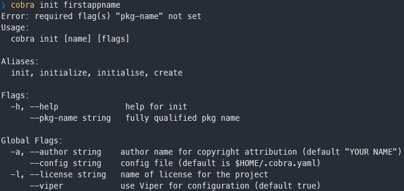
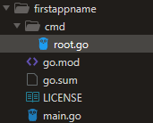
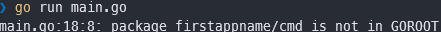
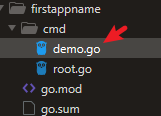
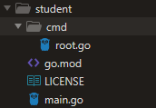
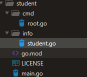
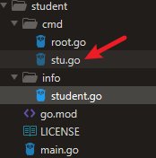

golang常用库：cli命令行/应用程序生成工具-cobra使用

## 一、Cobra 介绍

我前面有一篇文章介绍了配置文件解析库 [Viper](https://www.cnblogs.com/jiujuan/p/13799976.html) 的使用，这篇介绍 [Cobra](https://github.com/spf13/cobra) 的使用，你猜的没错，这 2 个库都是同一个作者 [spf13](https://github.com/spf13)，他开发了很多与 golang 相关的库，他目前在 google 领导着 golang 产品相关开发工作。

[Cobra](https://github.com/spf13/cobra) 是关于 golang 的一个命令行解析库，用它能够快速创建功能强大的 cli 应用程序和命令行工具。

它被很多知名的项目使用，比如 [Kubernetes](http://kubernetes.io/)，[Github CLI](https://github.com/cli/cli)，[Etcd](https://etcd.io/) 等。更多应用此库的[项目列表](https://github.com/spf13/cobra/blob/master/projects_using_cobra.md)。


我们平常用到命令：git commit -m "message"，docker containter start 等都可以用 cobra 来实现。


Cobra 相关文档地址：

- [github地址](https://github.com/spf13/cobra)，https://github.com/spf13/cobra
- [site地址](https://cobra.dev/)，https://cobra.dev/

Cobra 的 logo：


（from：https://github.com/spf13/cobra）

## 二、功能特性介绍

- 很多子命令的CLIS: 比如 app server、app fetch 等
- 支持嵌套子命令（sub-command)
- 轻松完成应用程序和命令的创建：cobra init appname 和 cobra add cmdname
- 为应用程序生成 man 手册
- 全局、本地和级联 flag
- 为 shell 程序完成自动提示（bash，zsh，fish, powershell etc.)
- 支持命令行别名，可以帮助你更容易更改内容而不破坏他们
- 灵活定义自己的help、usage信息
- 可选集成 viper 配置管理工具库

更多功能特性请查看: [cobra文档介绍](https://github.com/spf13/cobra#overview)

## 三、Cobra cli 命令结构说明


Cobra 命令结构由3部分组成：

> commands、arguments 和 flags

- commands：

  命令行，代表行为动作，要执行的一个动作。每个命令还可以包含子命令。分为：rootCmd 和 subCmd。程序中具体对象是 cobra.Command{}，这个是根命令；子命令(subCmd)用 rootCmd.AddCommand() 添加，子命令通常也会单独存一个文件，

  并通过一个全局变量让 rootCmd 可以 add 它。

- arguments：

  命令行参数，通常是 []string 表示

- flags：

  命令行选项。对 command 进一步的控制。通常用一短横 `-` 或者两短横 `--` 标识。程序中读取存储在变量中。

cobra 命令行格式：

```shell
APPNAME VERB NOUN --ADJECTIVE

APPNEM COMMAND ARG --FLAG
```

例子说明: 

```shell
hugo server --port=1313 #server 代表 command， port 代表 flag。

git clone URL --bare   #clone 代表 command，URL 代表操作的物-argument，bare 代表 flag。
```

## 四、Cobra 基本使用方法

> golang v1.15, cobra v1.2.1

安装 cobra：

```shel
go get -u github.com/spf13/cobra
```

可以用 `cobra -h` 来查看 cobra 命令的一些用法。

```shell
Usage:
  cobra [command]

Available Commands:
  add         Add a command to a Cobra Application
  completion  generate the autocompletion script for the specified shell
  help        Help about any command
  init        Initialize a Cobra Application
```

### init 命令初始化应用程序

安装 cobra generator：`go get -u github.com/spf13/cobra/cobra`

使用命令 cobra init 来创建第一个应用程序，这个命令也是初始化一个应用程序的项目框架：

```shel
cobra init firstappname
Error: required flag(s) "pkg-name" not set
```
报错了，错误信息截图如下：



错误信息：需要设置 --pkg-name 参数。 

因为我们项目不存在。先创建名为 firstappname 文件夹，然后进入目录 firstappname，在命令行下运行：`cobra init --pkg-name firstappname`。

自动生成了如下目录和程序：




下面程序我去掉了英文注释部分。

main.go

```go
package main

import "firstappname/cmd"

func main() {
	cmd.Execute()
}
```

cmd/root.go

```go
package cmd

import (
	"fmt"
	"os"
	"github.com/spf13/cobra"
	"github.com/spf13/viper"
)

var cfgFile string

// 构建根 command 命令。前面我们介绍它还可以有子命令，这个command里没有构建子命令
var rootCmd = &cobra.Command{
	Use:   "firstappname",
	Short: "A brief description of your application",
	Long: `A longer description that spans multiple lines and likely contains
examples and usage of using your application. For example:

Cobra is a CLI library for Go that empowers applications.
This application is a tool to generate the needed files
to quickly create a Cobra application.`
}

// 执行 rootCmd 命令并检测错误
func Execute() {
	cobra.CheckErr(rootCmd.Execute())
}

func init() {
    // 加载运行初始化配置
	cobra.OnInitialize(initConfig)
    // rootCmd，命令行下读取配置文件，持久化的 flag，全局的配置文件
	rootCmd.PersistentFlags().StringVar(&cfgFile, "config", "", "config file (default is $HOME/.firstappname.yaml)")
	// local flag，本地化的配置
	rootCmd.Flags().BoolP("toggle", "t", false, "Help message for toggle")
}

// 初始化配置的一些设置
func initConfig() {
	if cfgFile != "" {
		viper.SetConfigFile(cfgFile) // viper 设置配置文件
	} else {// 上面没有指定配置文件，下面就读取 home 下的 .firstappname.yaml文件
        // 配置文件参数设置
		home, err := os.UserHomeDir()
		cobra.CheckErr(err)

		viper.AddConfigPath(home)
		viper.SetConfigType("yaml")
		viper.SetConfigName(".firstappname")
	}

	viper.AutomaticEnv() 

	if err := viper.ReadInConfig(); err == nil {// 读取配置文件
		fmt.Fprintln(os.Stderr, "Using config file:", viper.ConfigFileUsed())
	}
}
```


其实上面的错误在 [cobra generator 文档](https://github.com/spf13/cobra/blob/master/cobra/README.md#cobra-init)里有提示了，所以要多看官方文档。

这个 root.go 里的 cobra.Command 就是设置命令行格式的地方。如果要执行相关的命令，可以在 `Long:`...下面加一行:

```go
Run: func(cmd *cobra.Command, args []string) { },
```

运行程序：go run main.go ， 报错了:




我用的是 go v1.15，GO111MODULE="on"。

用 go mod 来创建 module，进入firstappname目录，命令： `go mod init firstappname` ，生成一个 go.mod,

```go
module firstappname

go 1.15

require (
	github.com/spf13/cobra v1.2.1
	github.com/spf13/viper v1.9.0
)
```

在运行 go run main.go，第一次运行会下载文件到 go.mod, go.sum 里。再次运行，就会出现 rootCmd 下的 Long 信息。

```shell
A longer description that spans multiple lines and likely contains
examples and usage of using your application. For example:

Cobra is a CLI library for Go that empowers applications.
This application is a tool to generate the needed files
to quickly create a Cobra application.
```

可以看出，用 cobra init 命令初始化的项目， 生成了一个初始化的应用框架，但是没有任何逻辑功能。仅仅输出一些描述性信息。

这个程序里，最重要的是 cmd/root.go 里的 rootCmd = &cobra.Command{} 这行程序，这里定义命令动作。

程序里的 init() 和 initConfig() 函数都是对命令行的配置。


为 rootCmd 添加功能：

```go
var rootCmd = &cobra.Command{
	Use:   "firstappname",
	Short: "A brief description of your application",
	Long: `（root）A longer description that spans multiple lines and likely contains
examples and usage of using your application. For example:

Cobra is a CLI library for Go that empowers applications.
This application is a tool to generate the needed files
to quickly create a Cobra application.`,

	Run: func(cmd *cobra.Command, args []string) {
		fmt.Println("root called")
	},
}
```

测试运行 `go run main.go` ，输出：

```shell
$ go run main.go
root called
```


运行：`go run main.go --help`

会输出上面的 Long 信息和完整的帮助信息。

也可以把上面命令编译：go build -o demo.exe，在运行


**完整生成一个cobra应用框架的命令：**

```go
$ mkdir firstappname
$ cd firstappname

$ cobra init --pkg-name firstappname
$ go mod init firstappname
```

完整例子在 github 上，[golang-library-learning/cobra](https://github.com/jiujuan/golang-library-learning/tree/main/cobra)

### add 生成子命令subCmd

上面我们用 `cobra init` 创建了应用程序框架，在程序 cmd/root.go 里有一个根命令 rootCmd，也就是说 init 命令创建了一个根命令。执行 command 命令是 &cobra.Command{} 里的 Run 方法。


用 `cobra add` 来为 rootCmd 创建一个子命令。这个子命令通常在一个单独的文件里。

1. 用 add 命令生成子命令代码：

```she
// cd 进入firstappname
$ cd ./firstappname
$ cobra add demo
demo created at D:\work\mygo\common_pkg\cobra\firstappname
```

在 cmd 目录下生成了 demo.go 文件：




2. 为子命令添加简单功能

   add 命令已经为我们生成了一个简单的应用代码，程序文件通常存放在cmd目录下，demo.go 程序：

   ```go
   package cmd
   
   import (
   	"fmt"
   
   	"github.com/spf13/cobra"
   )
   
   // demoCmd represents the demo command
   // 子命令
   var demoCmd = &cobra.Command{
   	Use:   "demo",
   	Short: "A brief description of your command",
   	Long: `A longer description that spans multiple lines and likely contains examples
   and usage of using your command. For example:
   
   Cobra is a CLI library for Go that empowers applications.
   This application is a tool to generate the needed files
   to quickly create a Cobra application.`,
   	Run: func(cmd *cobra.Command, args []string) {
   		fmt.Println("demo called")
           fmt.Println("cmd demo")
   	},
   }
   
   func init() {
   	rootCmd.AddCommand(demoCmd)
   }
   ```


到现在为止，为 firstappdemo 添加了 2 个 Command 了，分别是根命令 rootCmd 和子命令 demoCmd。

子命令和根命令的关系一般通过程序 `rootCmd.AddCommand()` 方法确定。在程序 demo.go 里可以看到它在 init() 函数里。


Run 方法里添加程序：fmt.Println("cmd demo")。一般这里的程序都是其他 package 里完成了具体逻辑，然后 Run 方法里在调用这些程序。

测试运行：`go run main.go demo`

输出：

demo called

cmd demo


也可以编译项目 go build -o xxx 在运行。

### Flags使用-给Command添加flags

flag 命令行选项，也叫标识，对command命令行为的进一步指示操作。

用这个标识可以给 command 添加一些可选项。

根据 flag 选项作用范围不同，可以分为 2 类：

- Persistent Flags，持久化的flag，全局范围

  如果设置全局范围的flag，可以用这个来设置。它既可以给根命令设置选项值，也可以给子命令设置选项值。

  下面例子里的 rootCmd 和 demoCmd 都可以调用 flag。

- Local Flags，局部flag，只对指定的command生效。比如某个子命令的 flag。

  

因为 flag 标识是在命令行后面不同位置使用，所以我们要在方法外定义一个变量，来分配存储使用这个标识符。下面例子会说明。

#### Persistent Flags 全局flag例子

1. 在 cmd/root.go 文件中添加一个变量 name

   ```go
   var cfgFile string
   // 添加 name
   var name string
   ```

   然后在 root.go:init() 函数中添加全局 persistent flag，把 flag 值存储到变量 name 中。也就是读取命令行--name这个flag设置的值，然后赋值给程序里变量name

   ```go
   rootCmd.PersistentFlags().StringVar(&cfgFile, "config", "", "config file (default is $HOME/.firstappname.yaml)")
   // 添加全局 flag
   rootCmd.PersistentFlags().StringVar(&name, "name", "", "Set one name")
   ```

2. 在文件 cmd/demo.go 中的 demoCmd(子命令) 里 Run 方法输出 name 值

   ```go
   Run: func(cmd *cobra.Command, args []string) {
       fmt.Println("demo called")
       fmt.Println("cmd demo")
       // 打印输出 name
   	fmt.Println("print persistent flag name: ", name)
   },
   ```

3. 测试运行程序

   ```shel
   $ go run main.go demo --name setname
   demo called
   cmd demo
   print persistent flag name:  setname
   ```

   当然也可以先编译 go build -o cobrademo.exe（我用的win），然后在运行测试程序

   ```go
   $.\cobrademo.exe demo --name setname1
   demo called
   cmd demo
   print persistent flag name:  setname1
   ```


 Persistent flag 的读取方法：

```GO
// arg1：存储变量，
// arg2：设置长flag名，这里 name 显示 --name，
// arg3：设置短flag名，这里 n 显示 -n，一般与上面对应
// arg4：默认值, 这里设置为 ""
// arg5：flag的一些说明信息
PersistentFlags().StringVarP(&name, "name", "n", "", "Set one name")

// 与上面用法基本相同，只是没有短 flag 设置
PersistentFlags().StringVar(&name, "name", "", "Set one name")

// 直接设置flag名，arg1：flag 名，arg2：默认值，arg3：说明
PersistentFlags().String("foo", "", "A help for foo")
```

#### Local Flags例子

一个 flag 赋值给本地变量，只能对指定的command生效。

我们在 demo.go 中测试 local flag。

1. 在 cmd/demo.go 文件中定义变量 dsn，存储这个 flag 值

```go
// 定义 local flag
var dsn string
```

2. 在 demo.go 中的 init() 中添加下面代码，把值存储到 dsn上

   ```go
   demoCmd.Flags().StringVarP(&dsn, "dsn", "d", "", "dsn file")
   ```

3. 在 demoCmd.Command{} 获取该值

   ```go
   Run: func(cmd *cobra.Command, args []string) {
       fmt.Println("demo called")
       fmt.Println("cmd demo")
       // 打印输出 name
       fmt.Println("print persistent flag name: ", name)
       // 打印输出local flag: dsn
       fmt.Println("(local flag)print dsn: ", dsn)
   },
   ```

4. 测试运行

   ```shel
   $ go run .\main.go demo --dsn setdsn1
   demo called
   cmd demo
   print persistent flag name:
   (local flag)print dsn:  setdsn1
   ```

   输出了 setdsn1。

测试下其它子命令可以不可以获取这个 dsn，添加一个新的子命令 demo2，

```she
$ cobra add demo2
```

在目录 cmd 下添加了文件 demo2.go, 在 Run 下添加：

```go
Run: func(cmd *cobra.Command, args []string) {
    fmt.Println("demo2 called")
    // 添加输出 dsn
    fmt.Println("test get local flag(dsn): ", dsn)
},
```

测试：

```shell
$ go run .\main.go demo2 --dsn testdsn
Error: unknown flag: --dsn
```

报错了，程序终止运行了。

> 说明：local flag 局部选项，只能作用于指定的 command。本例子中作用于 demoCmd，而不能作用于 demo2Cmd。


local flag 的读取方法：

```go
// arg1：存储变量，
// arg2：设置长flag名，这里 name 显示 --name，
// arg3：设置短flag名，这里 n 显示 -n，一般与上面对应
// arg4：默认值, 这里设置为 ""
// arg5：flag的一些说明信息
// 方法(1)
Flags().StringVarP(&name, "name", "n", "", "Set one name")

// 与上面方法(1)用法基本相同，只是没有短 flag 设置
Flags().StringVar(&name, "name", "", "Set one name")

// 直接设置flag名，arg1：flag 名，arg2：默认值，arg3：说明
Flags().String("foo", "", "A help for foo")

// 与上面方法(1)用法基本相同，除了第一个没有变量读取参数
Flags().StringP("toggle", "t", false, "Help message for toggle")
```


完整例子在 github 上，[golang-library-learning/cobra](https://github.com/jiujuan/golang-library-learning/tree/main/cobra)

#### 设置flag必填项

比如给 demo.go 的 dsn 这个 flag 设置必选项

```go
demoCmd.Flags().StringVarP(&dsn, "dsn", "d", "", "dsn file")
// 把 dsn 设置为必选项
demoCmd.MarkFlagRequired("dsn")
```

flag 不设置dsn，运行程序：`go run main.go demo`, 报错：`Error: required flag(s) "dsn" not set`

```shell
$ go run .\main.go demo
Error: required flag(s) "dsn" not set
Usage:
  firstappname demo [flags]

Flags:
  -d, --dsn string   dsn file
  -h, --help         help for demo

Global Flags:
      --config string   config file (default is $HOME/.firstappname.yaml)
      --name string     Set one name

Error: required flag(s) "dsn" not set
exit status 1
```

加上 dsn 运行，`go run main.go demo --dsn setdsn`，正常输出:

```shel
$ go run main.go demo --dsn setdsn
demo called
cmd demo
print persistent flag name:
(local flag)print dsn:  setdsn
```

#### 绑定配置

还可以绑定配置到 flags 上，用 [viper](https://github.com/spf13/viper#working-with-flags)

在 cmd/root.go 里，有一个 `initConfig()` 方法，这个就是初始化配置方法。加载执行是在 `init()` 方法里，

```go
func init() {
	cobra.OnInitialize(initConfig)
    
    ... ...
}  
```

我们可以在 init() 方法中添加绑定 flag 程序，

```go
rootCmd.PersistentFlags().StringVar(&name, "name", "", "Set one name")
viper.BindPFlag("name", rootCmd.PersistentFlags().Lookup("name"))
```

这样就将 viper 配置和 flag 绑定，如果用户不设置 --name，将从配置中查找。

更多方法请查看 [viper flag doc](https://github.com/spf13/viper#working-with-flags)

### arguments 命令行参数设置

可以用Command 的 Args 字段指定参数效验规则。

Cobra 也内置了一些规则：

- NoArgs：如果有任何命令行args参数，将会报错
- ArbitraryArgs：该命令接受任何参数
- OnlyValidArgs：如果该命令参数不在 Command 的 ValidArgs 中，将会报错

- MinimumArgs(int): 如果命令参数数目少于N个，将会报错
- MaximumArgs(int): 如果命令参数数目多于N个，将会报错
- ExactArgs(int): 如果命令参数数目不是N个，将会报错
- RangeArgs(min, max)：如果命令参数数目范围不在(min, max)，将会报错

内置效验规则的例子：

```go
var rootCmd = &cobra.Command{
   Use:   "dmeo",
   Short: "demo short",
   Long:  `let's do it, demo!`,
   Args: cobra.MinimumNArgs(5),
   Run: func(cmd *cobra.Command, args []string) {
      fmt.Println("hello chenqionghe")
   },
}
```


自定义验证规则的例子：

```go
var cmd = &cobra.Command {
    Short: "demo",
    Args: func(cmd *cobra.Command, args[] string) error {
        if len(args) > 0 {
            return errors.New("requires a color argument")
        }
        if myapp.IsValidColor(args[0]) {
          return nil
        }
        return fmt.Errorf("invalid color specified: %s", args[0])
    },
    Run: func(cmd *cobra.Command, args []string) {
        fmt.Println("Hello, demo!")
    },
    
}
```

### 钩子函数 PreRun and PostRun Hooks

可以在执行命令之前或之后运行钩子函数。如果子命令未声明自己的 `Persistent * Run` 函数，则子命令将继承父命令的钩子函数。

函数的执行顺序为：

- PersistentPreRun
- PreRun
- Run
- PostRun
- PersistentPostRun

```go
package main

import (
	"fmt"

	"github.com/spf13/cobra"
)

func main() {
	var rootCmd = &cobra.Command{
		Use:   "root [sub]",
		Short: "My root command",
		PersistentPreRun: func(cmd *cobra.Command, args []string) {
			fmt.Printf("Inside rootCmd PersistentPreRun with args: %v\n", args)
		},
		PreRun: func(cmd *cobra.Command, args []string) {
			fmt.Printf("Inside rootCmd PreRun with args: %v\n", args)
		},
		Run: func(cmd *cobra.Command, args []string) {
			fmt.Printf("Inside rootCmd Run with args: %v\n", args)
		},
		PostRun: func(cmd *cobra.Command, args []string) {
			fmt.Printf("Inside rootCmd PostRun with args: %v\n", args)
		},
		PersistentPostRun: func(cmd *cobra.Command, args []string) {
			fmt.Printf("Inside rootCmd PersistentPostRun with args: %v\n", args)
		},
	}

	subCmd := &cobra.Command{
		Use:   "sub [no options!]",
		Short: "My subcommand",
		PreRun: func(cmd *cobra.Command, args []string) {
			fmt.Printf("Inside subCmd PreRun with args: %v\n", args)
		},
		Run: func(cmd *cobra.Command, args []string) {
			fmt.Printf("Inside subCmd Run with args: %v\n", args)
		},
		PostRun: func(cmd *cobra.Command, args []string) {
			fmt.Printf("Inside subCmd PostRun with args: %v\n", args)
		},
		PersistentPostRun: func(cmd *cobra.Command, args []string) {
			fmt.Printf("Inside subCmd PersistentPostRun with args: %v\n", args)
		},
	}

	rootCmd.AddCommand(subCmd)

	rootCmd.SetArgs([]string{""})
	rootCmd.Execute()
	fmt.Println()
	rootCmd.SetArgs([]string{"sub", "arg1", "arg2"})
	rootCmd.Execute()
}
```

运行程序：

```shel
$ go run .\hookdemo.go
Inside rootCmd PersistentPreRun with args: []
Inside rootCmd PreRun with args: []
Inside rootCmd Run with args: []
Inside rootCmd PostRun with args: []
Inside rootCmd PersistentPostRun with args: []

Inside rootCmd PersistentPreRun with args: [arg1 arg2]  // 子命令继承了父命令的函数
Inside subCmd PreRun with args: [arg1 arg2]
Inside subCmd Run with args: [arg1 arg2]
Inside subCmd PostRun with args: [arg1 arg2]
Inside subCmd PersistentPostRun with args: [arg1 arg2]
```
### 错误处理函数和钩子函数

与上面的钩子函数功能一样，只不过这里可以返回错误，处理

RunE 功能的执行先后顺序如下：

- PersistentPreRunE
- PreRunE
- RunE
- PostRunE
- PersistentPostRunE

```go
RunE: func(cmd *cobra.Command, args []string) error {
    fmt.Printf("Inside subCmd Run with args: %v\n", args)
    return nil
},
```

### 为你的命令生成文档

Cobra 可以基于子命令、标志等生成文档。具体的使用方法和生产格式文档请点击下面链接：

- [Man page docs](https://github.com/spf13/cobra/blob/master/doc/man_docs.md)
- [Markdown docs](https://github.com/spf13/cobra/blob/master/doc/md_docs.md)
- [Rest docs](https://github.com/spf13/cobra/blob/master/doc/rest_docs.md)
- [Yaml docs](https://github.com/spf13/cobra/blob/master/doc/yaml_docs.md)

你可以设置 `cmd.DisableAutoGenTag = true` 从而把文档中 "Auto generated by spf13/cobra..." 等字样删掉。

### help 命令

命令： `cobra help`，可以清楚显示出对使用 cobra 有用的信息，比如命令提示

你还可以定义自己的 help 命令或模板

```go
cmd.SetHelpCommand(cmd *Command)
cmd.setHelpCommand(f func(*Command, []string))
cmd.setHelpTemplate(s string)
```

## 五、完整demo例子

1. 新建一个名为 student 的项目


```
$ mkdir student
$ cd ./student
// 创建 go.mod
$ go mod init student
```

用 cobra init 初始化项目

```shell
$ cobra init --pkg-name student
```

然后生成如下图：




2. 设置显示学生信息

在 student 下新建目录 info：

```shell
$ mkdir info
```

在里面新建 student.go 文件：




student.go 程序如下：

```go
package info

import "fmt"

type Student struct {
	Name  string
	Age   int
	Grade string
}

func GetInfo(stu *Student) {
	fmt.Printf("student info: name=%s, age=%d, grade=%s \n", stu.Name, stu.Age, stu.Grade)
}

func SetInfo(name string, age int, grade string) *Student {
	var stu Student
	stu.Name = name
	stu.Age = age
	stu.Grade = grade
	return &stu
}
```

 

3. 根命令里设置、获取 student 里字段 name，age

在 cmd/root.go 里设置变量 name 和 age：

```go
var cfgFile string

// 设置 student 的name和age
var name string
var age int
```


读取 name和 age:

在 cmd/root.go: init() 函数里加上如下代码

```go
// 读取、存储name ag值
rootCmd.Flags().StringVarP(&name, "name", "n", "", "student`s name")
rootCmd.Flags().IntVarP(&age, "age", "a", 0, "student`s age")
```


先 import "student/info"， 然后在 rootCmd=&cobra.Command{} 增加如下代码：

```go
Run: func(cmd *cobra.Command, args []string) {
    stuInfo := info.SetInfo(name, age, "no3") // 这里读取了name，age值赋值给SetInfo方法
    info.GetInfo(stuInfo)
},
```

把&cobra.Command{}定义的 Long 删掉，把 root.go 里 initConfig() 函数注释掉，init() 里除了设置name和age的程序都注释掉，便于测试看清楚主要信息。

在运行测试程序：

先运行help命令看看命令信息，`go run main.go -h`

```shell
$ go run .\main.go -h
A brief description of your application

Usage:
  student [flags]
  student [command]

Available Commands:
  completion  generate the autocompletion script for the specified shell
  help        Help about any command
  stu         A brief description of your command

Flags:
  -a, --age int       student`s age
  -h, --help          help for student
  -n, --name string   student`s name

Use "student [command] --help" for more information about a command.
```


可以看到 Flags 下面的 -a，--age；-n，--name 已经出现了，在运行命令：

```go
$ go run main.go -a 23 --name Timmy
student info: name=Timmy, age=23, grade=no3
```

显示出正确信息


4. 增加子命令cli程序


```shell
$ cobra add stu
```

生成文件如下




在 stu.go 里设置变量 grade：

```go
var grade string
```

读取命令行下的grade设置：

在 stu.go 里 init() 函数里添加代码

```go
stuCmd.Flags().StringVarP(&grade, "grade", "g", "", "grade`s info")
```

然后在stuCmd = &cobra.Command{}添加代码：

```go
Run: func(cmd *cobra.Command, args []string) {
    stuInfo := info.SetInfo("immmy", 27, grade)
    info.GetInfo(stuInfo)
},
```

测试运行：

运行子命令程序的 -h 命令

```shell
$ go run .\main.go stu -h
A brief description of your command

Usage:
  student stu [flags]

Flags:
  -g, --grade string   grade`s info
  -h, --help           help for stu
```


在运行获取 --grade 命令

```shell
$ go run .\main.go stu --grade no4
student info: name=immmy, age=27, grade=no4
```
正确输出值


完整程序在github上：[student](https://github.com/jiujuan/golang-library-learning/tree/main/cobra/student)

---

也可以到我的公众号 [九卷沉思录-golang常用库包：cli命令行工具-cobra使用](https://mp.weixin.qq.com/s/Cpo0tFTHyH5PXKA8HcgCvg) 讨论

## 六、参考

[cobra github](https://github.com/spf13/cobra)

[cobra user guide](https://github.com/spf13/cobra/blob/master/user_guide.md)

[Cobra Generator](https://github.com/spf13/cobra/blob/master/cobra/README.md)