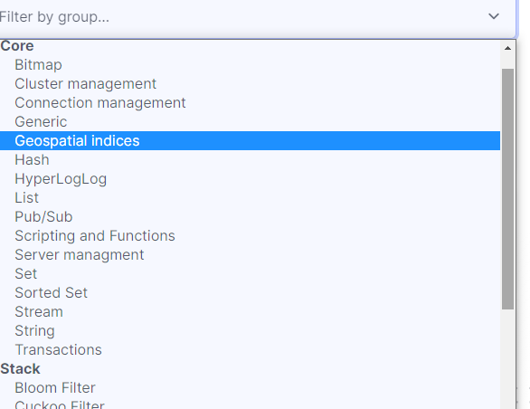

>  第一篇：go-redis使用，介绍Redis基本数据结构和其他特性，以及 go-redis 连接到Redis(本篇) 
>  https://www.cnblogs.com/jiujuan/p/17207166.html
>  第二篇：go-redis使用，Redis5种基本数据类型操作
>  https://www.cnblogs.com/jiujuan/p/17215125.html
>  第三篇：go-redis使用，Redis高级数据结构和其它特性
>  https://www.cnblogs.com/jiujuan/p/17231723.html

## 一、Redis数据结构和一些特性介绍

> redis7.0

先来了解一下 Redis 的数据结构有哪些，它有什么特性功能。

1. **基本的 5 种数据结构**：

- 字符串 string
- 列表 list
- 哈希 hash
- 集合 set
- 有序集合 sorted set

2. **其他比较高级的数据结构：**

- HyperLogLog 基数统计算法
- Geospatial index 地理空间索引
- Stream 流
- Bitmap 位图

3. **其它特性功能**

还有 BloomFilter 布隆过滤器的插件**RedisBloom**。

还有一些其它功能：

- pub/sub
- transaction
- Lua Scripts
- pipeline

它还有一些扩展功能，比如 server-side functions in Lua，支持 module 开发等等。

它还有一个 [Redis Stack](https://redis.io/docs/stack/) 包含了 5 项功能: [RedisJSON](https://redis.io/docs/stack/json), [RediSearch](https://redis.io/docs/stack/search), [RedisGraph](https://redis.io/docs/stack/graph), [RedisTimeSeries](https://redis.io/docs/stack/timeseries), and [RedisBloom](https://redis.io/docs/stack/bloom).

要了解更多功能：https://redis.io/docs/data-types/

https://redis.io/docs/data-types/tutorial/

4. **Redis 命令使用**

Redis 官方有一个很详细的文档：https://redis.io/commands/

可以分类查询命令怎么使用：



## 二、go-redis 安装

如果使用 Redis 版本小于等于 6，安装 v8 版本：

```shell
go get github.com/go-redis/redis/v8
```

如果使用 Redis 版本大于等于 7，安装 v9 版本：

```shell
go get github.com/go-redis/redis/v9
```

## 三、connect连接Redis

### 3.1 普通模式

连接到单个 Redis。

1. 第一种方法

```go
import "github.com/go-redis/redis/v8"

rdb := redis.NewClient(&redis.Options{
    Addr: "localhost:6379",
    Password: "", // 如果密码为空
    DB: 0,        // 使用默认db
})
```

2. 第二种方法

```go
opt, err := redis.ParseURL("redis://<user>:<pass>@localhost:6379/<db>")
if err != nil {
	panic(err)
}

rdb := redis.NewClient(opt)
```

### 3.2 sentinel 模式

> 文档：https://redis.uptrace.dev/guide/go-redis-sentinel.html

1. 连接到 Redis 服务器

```go
import "github.com/go-redis/redis/v8"

rdb := redis.NewFailoverClient(&redis.FailoverOptions{
    MasterName:    "master-name",
    SentinelAddrs: []string{":9126", ":9127", ":9128"},
})
```

2. Redis v8 版本中一个实验性质的方法 NewFailoverClusterClient，**只读**方式连接到 Redis 从节点

```go
import "github.com/go-redis/redis/v8"

rdb := redis.NewFailoverClusterClient(&redis.FailoverOptions{
    MasterName:    "master-name",
    SentinelAddrs: []string{":9126", ":9127", ":9128"},

    // To route commands by latency or randomly, enable one of the following.
    //RouteByLatency: true,
    //RouteRandomly: true,
})
```

3. 连接到 Redis Sentinel 自身

```shell
import "github.com/go-redis/redis/v8"

sentinel := redis.NewSentinelClient(&redis.Options{
    Addr: ":9126",
})

addr, err := sentinel.GetMasterAddrByName(ctx, "master-name").Result()
```

### 3.3 Redis Cluster 模式

连接到 Redis Cluster：

```go
import "github.com/go-redis/redis/v8"

rdb := redis.NewClusterClient(&redis.ClusterOptions{
    Addrs: []string{":7000", ":7001", ":7002", ":7003", ":7004", ":7005"},

    // To route commands by latency or randomly, enable one of the following.
    //RouteByLatency: true,
    //RouteRandomly: true,
})
```

遍历集群中每个 shard 方法：

```go
err := rdb.ForEachShard(ctx, func(ctx context.Context, shard *redis.Client) error {
    return shard.Ping(ctx).Err()
})
if err != nil {
    panic(err)
}
```

如果要遍历 master node，可以用 `ForEachMaster` 方法。遍历 slave nodes ，可以用 `ForEachSlave` 方法

还可以改变连接到一些shard分片的信息选项：

```go
rdb := redis.NewClusterClient(&redis.ClusterOptions{
    NewClient: func(opt *redis.Options) *redis.NewClient {
        user, pass := userPassForAddr(opt.Addr)
        opt.Username = user
        opt.Password = pass

        return redis.NewClient(opt)
    },
})
```

### 3.4 Redis Ring 模式

Ring 也是 Redis 的客户端之一，它使用一致性 hash 算法在多台 Redis Server 之间分配数据。它可以在多个 goroutine 之间安全操作数据。

Ring 会监控每个分片的状态并且会移除无用的分片数据。当有一个新的 Redis 分片时，该分片会加入到一致性 hash 环中。这实现了最大的可用性和分区容错性，但是 Ring 这种方式不保证不同分片之间数据的一致性，每个客户端使用自己可用的分片数据，分片状态变更时不会与其它客户端协调。

当你用多台 Redis 服务器进行缓存时，可以容忍其中某台服务器上的数据丢失，那么你可以使用 Ring 模式。否则，请使用 Redis Cluster 模式、sentinel 模式 或普通模式。

1. 3 台分片组成的 Ring Cluster

```go
import "github.com/go-redis/redis/v8"

rdb := redis.NewRing(&redis.RingOptions{
    Addrs: map[string]string{
        "shard1": ":7000",
        "shard2": ":7001",
        "shard3": ":7002",
    },
})

if err := rdb.Set(ctx, "foo", "bar", 0).Err(); err != nil {
    panic(err)
}
```

2. 也可以改变连接的信息

```go
rdb := redis.NewRing(&redis.RingOptions{
    NewClient: func(opt *redis.Options) *redis.NewClient {
        user, pass := userPassForAddr(opt.Addr)
        opt.Username = user
        opt.Password = pass

        return redis.NewClient(opt)
    },
})
```

3. keys 的分布算法

Ring 采用的默认一致性 hash 算法是 [Rendezvous](https://medium.com/@dgryski/consistent-hashing-algorithmic-tradeoffs-ef6b8e2fcae8)，Ring 使用这个算法将数据分布到多台分片服务器上。

如果想修改默认的一致性 hash 算法：

```go
import "github.com/golang/groupcache/consistenthash"

ring := redis.NewRing(&redis.RingOptions{
    NewConsistentHash: func() {
        return consistenthash.New(100, crc32.ChecksumIEEE)
    },
})
```

### 3.5 通用客户端连接

go-redis 也有一个通用的客户端连接方法：`NewUniversalClient`。它 Wrapper 了原来的客户端，根据不同的选项此方法可以返回不同的客户端，比如返回 ClusterClient、FailoverClient 或单节点客户端。

这个方法对于在本地测试具体的集群模式或应用程序中需要用到不同的客户端，它就很有用。

`NewUniversalClient` 方法返回客户端类型的选项条件：

1. 如果指定了 MasterName 选项，那么返回哨兵模式的客户端 - FailoverClient

2. 如果选项 Addrs 的数量为两个或多个，那么返回集群模式的客户端 - ClusterClient

3. 否则就返回单节点的客户端

代码例子：

```go
// rdb is *redis.Client.
rdb := NewUniversalClient(&redis.UniversalOptions{
    Addrs: []string{":6379"},
})

// rdb is *redis.ClusterClient.
rdb := NewUniversalClient(&redis.UniversalOptions{
    Addrs: []string{":6379", ":6380"},
})

// rdb is *redis.FailoverClient.
rdb := NewUniversalClient(&redis.UniversalOptions{
    Addrs: []string{":6379"},
    MasterName: "mymaster",
})
```


> 完整代码请查看 github：https://github.com/jiujuan/go-exercises/tree/main/redis/go-redis/v8

---
>  第二篇：go-redis使用，Redis5种基本数据类型操作
>  https://www.cnblogs.com/jiujuan/p/17215125.html
>  第三篇：go-redis使用，Redis高级数据结构和其它特性
>  https://www.cnblogs.com/jiujuan/p/17231723.html

---
---

也可以到我的公众号 [九卷沉思录：golang常用库包：redis操作库go-redis使用(01)-Redis数据类型简介和连接Redis的几种方式](https://mp.weixin.qq.com/s/4MG14k2XnxfgrReLQ-_Hgg) 讨论


## 四、参考

- https://redis.io/docs/data-types/tutorial/
- https://redis.uptrace.dev/guide/