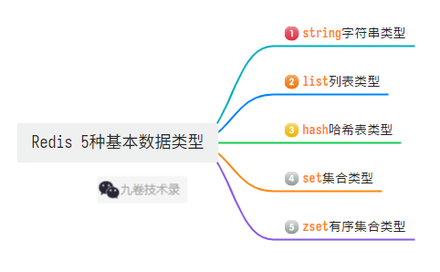
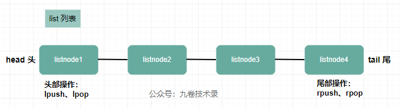
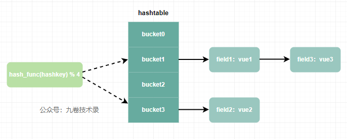
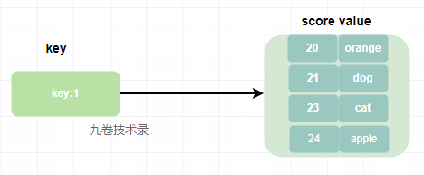

>  第一篇：go-redis使用，介绍Redis基本数据结构和其他特性，以及 go-redis 连接到Redis 
>  https://www.cnblogs.com/jiujuan/p/17207166.html
>  第二篇：go-redis使用，Redis5种基本数据类型操作(本篇)
>  https://www.cnblogs.com/jiujuan/p/17215125.html
>  第三篇：go-redis使用，Redis高级数据结构和其它特性
>  https://www.cnblogs.com/jiujuan/p/17231723.html

这篇接着讲基本数据类型的操作。

## 四、Redis基本数据类型代码示例

> 这里示例使用 go-redis v8 ，不过 go-redis latest 是 v9
>
> 安装v8：go get github.com/go-redis/redis/v8

我们根据 [Redis doc data-type](https://redis.io/docs/data-types/) 来进行相应分类操作示例。

也可以看我前面的文章：https://www.cnblogs.com/jiujuan/p/10407955.html，redis 命令分类，仅供参考。

Redis 5 种基本数据类型：



### 最基本的Set/Get操作

setget.go

```go
package main

import (
	"context"
	"fmt"
	"time"

	"github.com/go-redis/redis/v8"
)

func main() {
	rdb := redis.NewClient(&redis.Options{
		Addr:        "localhost:6379",
		Password:    "",
		DB:          0,
		IdleTimeout: 350,
		PoolSize:    50, // 连接池连接数量
	})
	ctx, cancel := context.WithTimeout(context.Background(), time.Second*10)
	defer cancel()
	_, err := rdb.Ping(ctx).Result() // 检查连接redis是否成功
	if err != nil {
		fmt.Println("Connect Failed: %v \n", err)
		panic(err)
	}

	ctx = context.Background()
	// 设置 key 的值，0 表示永不过期
	err = rdb.Set(ctx, "setkey-1", "value-1", 0).Err()
	if err != nil {
		panic(err)
	}

	// 设置 key 的值的过期时间为 30 秒
	err = rdb.Set(ctx, "setkey-2", "value-2", time.Second*30).Err()
	if err != nil {
		panic(err)
	}

	// 获取key的值
	val, err := rdb.Get(ctx, "setkey-1").Result()
	if err == redis.Nil { // 如果返回 redis.Nil 说明key不存在
		fmt.Println("key not exixt")
	} else if err != nil {
		fmt.Println("Get Val error: ", err)
		panic(err)
	}
	fmt.Println("Get Val: ", val)

	val, _ = rdb.Get(ctx, "setkey-2").Result()
	fmt.Println("Get Val setkey-2: ", val)
}
```

### string(s)字符串类型

可以从 redis docs 的 [COMMANDS](https://redis.io/commands/?group=string) 查询 string 的所有命令。

String 类型命令文档：https://redis.io/commands/?group=string ，
更具体的用法比如详细语法，参数设置等，点击每一个命令然后进去查看。
比如点进去后 SET 的详细语法格式：

```
SET key value [NX | XX] [GET] [EX seconds | PX milliseconds |
  EXAT unix-time-seconds | PXAT unix-time-milliseconds | KEEPTTL]
```

具体命令用法可以搜索上面 command 然后点进去查看，这里主要是代码示例，就不介绍具体命令用法了。

> string 的底层是 SDS 数据结构，原理简析可以看这篇文章：https://www.cnblogs.com/jiujuan/p/15828302.html。

string 常用命令：

> 1.SET/GET：设置获取值。
>
> 2.SETNX/EXISTS：SETNX设置并指定过期时间仅key不存在，EXISTS 检查某个 key 是否存在。
>
> 3.MSET/MGET：批量设置获取值。
>
> 4.DEL：删除值。
>
> 5.INCR/INCRBY - DECR/DECRBY：INCR 原子加1，INCRBY 加具体数值。DECR/DECRBY 刚好相反。
>
> 6.GetRange：字符串截取，返回字符串的总长度。
>
> 7.Expire/ExpireAt/TTL：设置值的过期时间端/点。TTL 获取过期的时间。
>
> 8.StrLen：获取key的值长度

- 1、SET/GET：设置和获取值，见最上面SET/GET例子
- 2、SETNX/EXISTS

> SETNX：设置并指定过期时间，仅当 key 不存在时候才设置有效。
>
> EXISTS: 检查某个 key 是否存在

```go
package main

import (
	"context"
	"fmt"
	"time"

	"github.com/go-redis/redis/v8"
)

func main() {
	rdb := redis.NewClient(&redis.Options{
		Addr:        "localhost:6379",
		Password:    "",
		DB:          0,
		IdleTimeout: 350,
		PoolSize:    50, // 连接池连接数量
	})
	ctx, cancel := context.WithTimeout(context.Background(), time.Second*10)
	defer cancel()
	_, err := rdb.Ping(ctx).Result() // 检查连接redis是否成功
	if err != nil {
		fmt.Println("Connect Failed: %v \n", err)
		panic(err)
	}

	ctx = context.Background()

	// SetNX， 设置并指定过期时间，仅当 key 不存在时候才设置有效
	err = rdb.SetNX(ctx, "setnx-key", "setnx-val", 0).Err()
	if err != nil {
		fmt.Println("setnx value failed: ", err)
		panic(err)
	}

	// 这里用SetNX设置值，第二次运行后 val2 返回 false，因为第二次运行时 setnx-key2 已经存在
	val2, err := rdb.SetNX(ctx, "setnx-key2", "setnx-val2", time.Second*20).Result()
	if err != nil {
		panic(err)
	}
	fmt.Printf("val2: %v \n", val2)

	// Exists， 检查某个key是否存在
	n, _ := rdb.Exists(ctx, "setnx-key").Result()
	if n > 0 {
		fmt.Println("n: ", n)
		fmt.Println("set nx key exists")
	} else {
		fmt.Println("set nx key not exists")
	}

	val, _ := rdb.Get(ctx, "setnx-key").Result()
	fmt.Println(val)
}
```

- 3、MSET/MGET：批量设置值，批量获取值

```go
ctx = context.Background()
// MSet 设置值
err = rdb.MSet(ctx, "mset-key1", "mset-val1", "mset-key2", "mset-val2", "mset-key3", "mset-val3").Err()
if err != nil {
    fmt.Println("MSet ERROR : ", err)
}
// MGet 获取值
vals, err := rdb.MGet(ctx, "mset-key1", "mset-key2", "mset-key3").Result()
if err != nil {
    fmt.Println("MGet ERROR: ", err)
    panic(err)
}
fmt.Println("vals: ", vals)
```

- 4、DEL：删除操作，支持删除多个 key 的操作

```go
ctx = context.Background()
n, err := rdb.Del(ctx, "setkey", "setnx-key").Result()
if err != nil {
    panic(err)
}
fmt.Println("del nums: ", n)
```

- 5、INCR/INCRBY - DECR/DECRBY

> INCR：对数字进行原子加 1 操作；INCRBY：加某个数值。
>
> 同理 DECR 都是相反操作

```go
package main

import (
	"context"
	"fmt"
	"time"

	"github.com/go-redis/redis/v8"
)

func main() {
	rdb := redis.NewClient(&redis.Options{
		Addr:        "localhost:6379",
		Password:    "",
		DB:          0,
		IdleTimeout: 350,
		PoolSize:    50, // 连接池连接数量
	})
	ctx, cancel := context.WithTimeout(context.Background(), time.Second*10)
	defer cancel()
	_, err := rdb.Ping(ctx).Result() // 检查连接redis是否成功
	if err != nil {
		fmt.Println("Connect Failed: %v \n", err)
		panic(err)
	}

	ctx = context.Background()

	err = rdb.SetNX(ctx, "nums", 2, 0).Err()
	if err != nil {
		panic(err)
	}
	fmt.Println("set nums : ", 2)

	// Incr
	val, err := rdb.Incr(ctx, "nums").Result()
	if err != nil {
		panic(err)
	}
	fmt.Println("incr: ", val)

	// IncrBy
	val, err = rdb.IncrBy(ctx, "nums", 10).Result()
	if err != nil {
		panic(err)
	}
	fmt.Println("incrby: ", val)

	//Decr
	val, _ = rdb.Decr(ctx, "nums").Result()
	fmt.Println("desc: ", val)

	//DecrBy
	val, _ = rdb.DecrBy(ctx, "nums", 5).Result()
	fmt.Println("decrby: ", val)
}
```

- 6、GetRange：字符串截取，返回字符串的总长度

```go
// GetRange，字符串截取操作，返回字符串截取后的值
val, _ = rdb.GetRange(ctx, "setkey-1", 1, 3).Result()
fmt.Println("get range: ", val)
```

可以放到GET/SET代码里去测试

- 7、Expire/ExpireAt/TTL 设置过期时间

> Expire：设置某个时间段后过期。
>
> ExpireAt：设置某个时间点过期。
>
> TTL：获取剩余时间

```go
package main

import (
	"context"
	"fmt"
	"time"

	"github.com/go-redis/redis/v8"
)

func main() {
	rdb := redis.NewClient(&redis.Options{
		Addr:        "localhost:6379",
		Password:    "",
		DB:          0,
		IdleTimeout: 350,
		PoolSize:    50, // 连接池连接数量
	})
	ctx, cancel := context.WithTimeout(context.Background(), time.Second*10)
	defer cancel()
	_, err := rdb.Ping(ctx).Result() // 检查连接redis是否成功
	if err != nil {
		fmt.Println("Connect Failed: %v \n", err)
		panic(err)
	}

	ctx = context.Background()

	rdb.Set(ctx, "setkey-expire-1", "value-expire-1", 0).Err()
	rdb.Set(ctx, "setkey-expire-2", "value-expire-2", time.Second*40).Err()

	// Expire, 设置key在某个时间段后过期
	val1, _ := rdb.Expire(ctx, "setkey-expire-1", time.Second*20).Result()
	fmt.Println("expire: ", val1)

	// ExpireAt，设置key在某个时间点后过期
	val2, _ := rdb.ExpireAt(ctx, "setkey-expire-2", time.Now().Add(time.Second*50)).Result()
	fmt.Println("expire at: ", val2)

	// TTL
	expire, err := rdb.TTL(ctx, "setkey-expire-1").Result()
	fmt.Println(expire, err)
}
/**
expire:  true
expire at:  true
20s <nil>
**/
```

- 8、StrLen 获取key的值的长度

```go
// STRLEN，获取key的值的长度
strlen, _ := rdb.StrLen(ctx, "setkey-1").Result()
fmt.Println("strlen: ", strlen)
```

### list列表类型

list 类型的操作命令文档：https://redis.io/commands/?group=list 。

list 列表是一个字符串列表，可以从头部或尾部插入元素。



> list 的源码简析可以看这篇文章：https://www.cnblogs.com/jiujuan/p/15839269.html。

list 常用命令：

> 1.LPUSH：list头部(左边)插入值，最后的值在最前面。LPUSHX 仅当列表值存在时才插入值
>
> 2.LPOP：移除列表的头部值并返回这个值
>
> 3.RPUSH：list尾部(右边)插入值。RPUSHX 仅当列表值存在才插入值
>
> 4.RPOP：移除列表的尾部值并返回这个值
>
> 5.LRANGE：返回key列表指定区间的值
>
> 6.BLPOP: 语法 `BLPOP key [key ...] timeout`，从 key 列表头部弹出一个值，没有就阻塞 timeout 秒，如果 timeout=0 则一直阻塞
>
> 7.BRPOP：与上面 BLPOP 用法相似，只不过 BRPOP 是从尾部弹出一个值
>
> 8.LLEN：返回列表的长度
>
> 9.LINSERT：在指定位置插入数据
>
> 10.LREM：删除列表中的数据
>
> 11.LINDEX：根据索引查询列表中的值
>
> 12.LSET：根据索引设置列表中的某个值

```go
package main

import (
	"context"
	"fmt"
	"time"

	"github.com/go-redis/redis/v8"
)

func main() {
	rdb := redis.NewClient(&redis.Options{
		Addr:        "localhost:6379",
		Password:    "",
		DB:          0,
		IdleTimeout: 350,
		PoolSize:    50, // 连接池连接数量
	})
	ctx, cancel := context.WithTimeout(context.Background(), time.Second*10)
	defer cancel()
	_, err := rdb.Ping(ctx).Result() // 检查连接redis是否成功
	if err != nil {
		fmt.Println("Connect Failed: %v \n", err)
		panic(err)
	}

	ctx = context.Background()
	// LPUSH 从头部(左边)插入数据，最后的值在最前面
	count, err := rdb.LPush(ctx, "listkeyone", "one", "two", "three", "four").Result()
	if err != nil {
		fmt.Println("lpush err：", err)
	}
	fmt.Println("lpush count: ", count)

	// LRANGE 返回列表范围数据。例子中返回 0 到 -1，就是返回所有数据
	rangeval, err := rdb.LRange(ctx, "listkeyone", 0, -1).Result()
	if err != nil {
		panic(err)
	}
	fmt.Println("LRange values: ", rangeval)

	// LLen 返回列表数据大小
	len, err := rdb.LLen(ctx, "listkeyone").Result()
	if err != nil {
		panic(err)
	}
	fmt.Println("llen: ", len)

	// LInsert 在指定位置插入数据
	err = rdb.LInsert(ctx, "listkeyone", "before", "two", 2).Err()
	if err != nil {
		panic(err)
	}

	vals, _ := rdb.LRange(ctx, "listkeyone", 0, -1).Result()
	fmt.Println("LInsert val: ", vals)

	// RPUSH 在 list 尾部插入值
	count, err := rdb.RPush(ctx, "listkeyone", "six", "five").Result()
	if err != nil {
		panic(err)
	}
	fmt.Println("RPush count: ", count)

	// RPOP 删除list列表尾部(右边)值
	val, err := rdb.RPop(ctx, "listkeyone").Result()
	if err != nil {
		panic(err)
	}
	fmt.Println("rpop val: ", val)
	vals, _ = rdb.LRange(ctx, "listkeyone", 0, -1).Result()
	fmt.Println("(rpop)lrange val: ", vals)

	// LPOP 删除list列表头部(左边)值
	val, err = rdb.LPop(ctx, "listkeyone").Result()
	fmt.Println("rpop val: ", val)

	// LIndex 根据索引查询值，索引是从0开始
	val1, _ := rdb.LIndex(ctx, "listkeyone", 3).Result()
	fmt.Println("LIndex val: ", val1)

	// LSET 根据索引设置某个值，索引从0开始
	val2, _ := rdb.LSet(ctx, "listkeyone", 3, "han").Result()
	fmt.Println("lset: ", val2)

	// LREM 删除列表中的数据
	del, err := rdb.LRem(ctx, "listkeyone", 1, 5) // 从列表左边开始删除值 5，出现重复元素只删除一次
	if err != nil {
		panic(err)
	}
	fmt.Println("del : ", del)

	rdb.LRem(ctx, "listkeyone", 2, 5) // 从列表头部(左边)开始删除值 5，如果存在多个值 5，则删除 2 个 5

	rdb.LRem(ctx, "listkeyone", -3, 6) // 从列表尾部(右边)开始删除值 6，如果存在多个值 6， 则删除 3 个 6

}
```

### hash哈希表类型

hash类型数据操作命令：https://redis.io/commands/?group=hash ，官方文档

hash类型原理简析：https://www.cnblogs.com/jiujuan/p/15944061.html 参考文档

hash 数据结构图：



hash 哈希表数据类型常用命令，redisdoc.com 这个地址把Redis分类列出来了，还有详细解释：

> 1.HSET 单个设置值。 
>
> 2.HGET 单个获取值。 
>
> 3.HMSET 批量设置。
>
> 4.HMGET 批量获取值。 
>
> 5.HGETALL 获取所有值。
>
> 6.HDEL 删除字段，支持删除多个字段。
>
> 7.HLEN 获取hash表中key的值数量。
>
> 8.HEXISTS 判断元素是否存在。
>
> 9.HINCRBY 根据key的field字段的整数值加减一个数值。
>
> 10.HSETNX 如果某个字段不存在则设置该字段值。
>
> 更多命令请查看：https://redis.io/commands/?group=hash

代码示例：

```go
package main

import (
	"context"
	"fmt"
	"time"

	"github.com/go-redis/redis/v8"
)

func main() {
	rdb := redis.NewClient(&redis.Options{
		Addr:        "localhost:6379",
		Password:    "",
		DB:          0,
		IdleTimeout: 350,
		PoolSize:    50, // 连接池连接数量
	})
	ctx, cancel := context.WithTimeout(context.Background(), time.Second*10)
	defer cancel()
	_, err := rdb.Ping(ctx).Result() // 检查连接redis是否成功
	if err != nil {
		fmt.Println("Connect Failed: %v \n", err)
		panic(err)
	}

	ctx = context.Background()
	// HSET，根据key设置field字段值
	err = rdb.HSet(ctx, "hashkey", "field-val", "value-one").Err()
	if err != nil {
		panic(err)
	}
	_ = rdb.HSet(ctx, "hashkey", "field1", "value1", "field2", "value2").Err()
	_ = rdb.HSet(ctx, "hashkey", map[string]interface{}{"field3": "value3", "field4": "value4"}).Err()
	_ = rdb.HSet(ctx, "hashkey-two", []string{"field0", "value0", "field1", "value1"}).Err()

	// HSETNX，如果某个字段不存在则设置值
	ok, err := rdb.HSetNX(ctx, "hashkey", "field1", "oneval").Result() // 字段 field1 已存在，所以返回ok值为false
	if err != nil {
		panic(err)
	}
	fmt.Println("HSetNX bool: ", ok)

	// HGET，根据key和field查询值
	val, err := rdb.HGet(ctx, "hashkey", "field-val").Result()
	if err != nil {
		panic(err)
	}
	fmt.Println("HGet: ", val)

	val, _ = rdb.HGet(ctx, "hashkey-two", "field0").Result()
	fmt.Println("HGet hashkey-two: ", val)

	// HGETALL，获取key的所有field-val值
	fieldvals, err := rdb.HGetAll(ctx, "hashkey").Result()
	if err != nil {
		panic(err)
	}
	fmt.Println("HGetAll: ", fieldvals) // 返回 map 类型

	// HMSET，根据hash key设置多个字段值，与上面的 HSet 设置多个值很像
	fieldvalues := make(map[string]interface{})
	fieldvalues["age"] = 23
	fieldvalues["firstname"] = "Chare"
	fieldvalues["lastname"] = "Jimmy"
	err = rdb.HMSet(ctx, "hmsetkey", fieldvalues).Err()
	if err != nil {
		panic(err)
	}
	/*//也可以像上面HSet直接设置map值

	rdb.HMSet(ctx, "hmsetkey", map[string]interface{}{"age":23,"firstname":"Chare","LastName":"Jimmy"}).Err()
	*/

	// HMGET, 根据hash key和多个字段获取值
	vals, err := rdb.HMGet(ctx, "hmsetkey", "age", "lastname").Result()
	if err != nil {
		panic(err)
	}
	fmt.Println("HMGET vals: ", vals)

	// HEXISTX，某个hashkey中字段field否存在
	ok, _ = rdb.HExists(ctx, "hmsetkey", "lastname").Result()
	fmt.Println("HExists: ", ok) // HExists: true

	// HLen，获取hashkey的字段多少
	len, _ := rdb.HLen(ctx, "hashkey").Result()
	fmt.Println("HLen hashkey： ", len) // HLen hashkey: 5

	// HIncrBy，根据key的field字段的整数值加减一个数值
	age, err := rdb.HIncrBy(ctx, "hmsetkey", "age", -3).Result()
	if err != nil {
		panic(err)
	}
	fmt.Println("HIncrBy : ", age) // HIncrBy :  20

	// HDel，删除字段，支持删除多个字段
	rdb.HSet(ctx, "hashkeydel", map[string]interface{}{"field10": "value10", "field11": "value11", "field12": "value12", "field13": "value13"}).Err()
	rdb.HDel(ctx, "hashkeydel", "field10", "field12") //删除多个字段

	delvals, err := rdb.HGetAll(ctx, "hashkeydel").Result()
	if err != nil {
		panic(err)
	}
	fmt.Println("HGetAll hashkeydel: ", delvals)

}

/**
HSetNX bool:  false
HGet:  value-one
HGet hashkey-two:  value0
HGetAll:  map[field-val:value-one field1:value1 field2:value2 field3:value3 field4:value4]
HMGET vals:  [23 Jimmy]
HExists:  true
HLen hashkey：  5
HIncrBy :  20
HGetAll hashkeydel:  map[field11:value11 field13:value13]
 * */
```

### set集合类型

Redis 中的 set 集合类型是一个无序的唯一值集合，也就是说一个set集合中的值唯一，它的存储顺序不会按照插入顺序进行存储。

set与list的区别：

> 1. list 可以存储重复的元素，而 set 不能
> 2. list 可以按照元素先后顺序存储，而 set 不能



set 集合操作命令文档：

- 1.https://redis.io/commands/?group=set 

- 2.http://redisdoc.com/set/index.html

set 常用命令：

>1. SADD：SADD key member [member...]，将一个或多个元素数据添加到集合 key 中
>2. SISMEMBER: SISMEMBER key member，判断 member 是否是集合 key 的成员
>3. SMEMBERS: SMEMBERS key，获取 key 中的所有元素数据
>4. SREM：SREM key member [member ...]，删除 key 中的一个或多个数据
>5. SPOP：SPOP key，随机移除集合中的一个数据并返回
>6. SCARD：SCARD key，获取集合 key 中元素的数量
>7. SDIFF：SDIFF key [key...]，计算多个集合的差集
>8. SUNION：SUNION key [key...]，计算多个集合的并集
>9. SINTER：SINTER key [key...]，计算多个集合的交集

代码例子：

```go
package main

import (
	"context"
	"fmt"
	"time"

	"github.com/go-redis/redis/v8"
)

func main() {
	rdb := redis.NewClient(&redis.Options{
		Addr:        "localhost:6379",
		Password:    "",
		DB:          0,
		IdleTimeout: 350,
		PoolSize:    50, // 连接池连接数量
	})
	ctx, cancel := context.WithTimeout(context.Background(), time.Second*10)
	defer cancel()
	_, err := rdb.Ping(ctx).Result() // 检查连接redis是否成功
	if err != nil {
		fmt.Println("Connect Failed: %v \n", err)
		panic(err)
	}

	ctx = context.Background()
	// SADD，将一个或多个元素数据添加到集合中
	err = rdb.SAdd(ctx, "setkey:1", 20, "dog").Err()
	if err != nil {
		panic(err)
	}
	rdb.SAdd(ctx, "setkey:1", []string{"hanmeimei", "lilei", "tom", "dog", "one"}) // 切片增加数据，dog只有一个数据
	rdb.SAdd(ctx, "setkey:2", []string{"jimmy", "pig", "dog", "lilei"})

	// SMEMBERS，获取集合中的所有元素数据
	smembers, err := rdb.SMembers(ctx, "setkey:1").Result()
	if err != nil {
		panic(err)
	}
	fmt.Println("SMembers，setkey:1: ", smembers)

	// SCARD，获取集合中的元素数量
	scards, err := rdb.SCard(ctx, "setkey:2").Result()
	if err != nil {
		panic(err)
	}
	fmt.Println("SCard,setkey:2: ", scards)

	// SPOP，随机移除一个数据并返回这个数据
	rdb.SAdd(ctx, "setkey:3", []string{"one", "two", "three", "four", "six"})
	spop, _ := rdb.SPop(ctx, "setkey:3").Result()
	res, _ := rdb.SMembers(ctx, "setkey:3").Result()
	fmt.Println("spop: ", spop, ", SMembers: ", res)
	// SPOPN，随机移除多个元素并返回
	spopn, _ := rdb.SPopN(ctx, "setkey:3", 2).Result()
	res, _ = rdb.SMembers(ctx, "setkey:3").Result()
	fmt.Println("spopn: ", spopn, ", SMembers: ", res)

	// SISMEMBER，判断元素是否在集合中
	ok, err := rdb.SIsMember(ctx, "setkey:3", "two").Result()
	if err != nil {
		panic(err)
	}
	fmt.Println("SIsMember, two : ", ok)

	// SDIFF,差集，SDIFF key1,key2 与 SDIFF key1,key2 差集是不同，看下面的例子
	diff, _ := rdb.SDiff(ctx, "setkey:1", "setkey:2").Result()
	fmt.Println("sdiff: ", diff)
	diff2, _ := rdb.SDiff(ctx, "setkey:2", "setkey:1").Result()
	fmt.Println("sdiff2: ", diff2)
	// SUNION,并集
	union, _ := rdb.SUnion(ctx, "setkey:1", "setkey:2").Result()
	fmt.Println("union: ", union)
	// SINTER,交集
	inter, _ := rdb.SInter(ctx, "setkey:1", "setkey:2").Result()
	fmt.Println("inter: ", inter)

	// SREM , 删除值，返回删除元素个数
	rdb.SAdd(ctx, "setkey:4", []string{"one", "two", "three"})
	count, err := rdb.SRem(ctx, "setkey:4", "one", "three").Result()
	if err != nil {
		panic(err)
	}
	fmt.Println("SRem: ", count)
}

/*
SMembers，setkey:1:  [20 hanmeimei one lilei tom dog]
SCard,setkey:2:  4
spop:  six , SMembers:  [four three one two]
spopn:  [one two] , SMembers:  [four three]
SIsMember, two :  false
sdiff:  [tom 20 hanmeimei one]
sdiff2:  [jimmy pig]
union:  [hanmeimei one jimmy lilei tom dog 20 pig]
inter:  [lilei dog]
SRem:  2
*/
```

### zset有序集合类型

zset 是一个不重复值的有序集合，与 set 集合一样值是不能重复。

zset 排序集是按照相关分数排序的唯一字符串（成员）的集合。它的底层数据结构是由压缩列表或跳表（skiplist）实现的。

如果有序集合元素个数小于 128 且每个元素值小于 64 字节，redis 会使用 压缩列表作为 zset 类型的底层数据结构；如果不满足上面的条件，那么就用跳表作为底层数据结构。

跳表的原理简析：https://www.cnblogs.com/jiujuan/p/12884824.html

zset 有序集合命令列表：

- https://redis.io/commands/?group=sorted-set
- http://redisdoc.com/sorted_set/zadd.html

zset有序集合图：


zset 有序集合常用命令：

> 1. ZADD：ZADD key score member [[score member] [score member] …]，将一个或多个member元素以及score加入到有序集合key中
> 2. ZSCORE：ZSCORE key member，返回集合 key 中 member 成员的分数
> 3. ZRANGE：ZRANGE key start stop [WITHSCORES]，返回集合 key 中指定区间的元素，score 从小到大排序，start 和 stop 都是 0 开始。
> 4. ZREVRANGE：ZREVRANGE key start stop [WITHSCORES]，与 zrange 相反，返回集合 key 中指定区间元素，score 从大到小排序。
> 5. ZRANGEBYSCORE：ZRANGEBYSCORE key min max [WITHSCORES] [LIMIT offset count]，返回结果的数量区间，score 从小到大排序，LIMIT 参数指定返回结果集的数量和区间，后面可选的 [limit offset count] 像 SQL 中的 select ... limit offset,count。
> 6. ZREVRANGEBYSCORE：与上面 ZRANGEBYSCORE 几乎相同，不同是 score 是从大到小排序
> 7. ZREVRANGEBYSCOREWITHSCORES：和 ZRANGEBYSCORE 一样，区别是它不仅返回集合元素，也返回元素对应分数
> 8. ZREM：删除元素
> 9. ZREMRANGEBYRank：根据索引范围删除
> 10. ZREMRANGEBYSCORE：根据分数区间删除
>
> 还有 ZCOUNT 获取区间内元素个数；ZCARD 获取元素个数；ZINCRBY 增加元素分数；ZRANK 根据元素查询在集合中的排名，分数从小到大排序查询。

代码示例：

```go
package main

import (
	"context"
	"fmt"
	"time"

	"github.com/go-redis/redis/v8"
)

func main() {
	rdb := redis.NewClient(&redis.Options{
		Addr:        "localhost:6379",
		Password:    "",
		DB:          0,
		IdleTimeout: 350,
		PoolSize:    50, // 连接池连接数量
	})
	ctx, cancel := context.WithTimeout(context.Background(), time.Second*10)
	defer cancel()
	_, err := rdb.Ping(ctx).Result() // 检查连接redis是否成功
	if err != nil {
		fmt.Println("Connect Failed: %v \n", err)
		panic(err)
	}

	ctx = context.Background()
	// ZADD，添加一个或多个数据到集合中
	//* 添加一个*/
	n, err := rdb.ZAdd(ctx, "zsetkey", &redis.Z{23.0, "tom"}).Result()
	/* 或把字段写上
	member := &redis.Z{
		Score:  23.0,
		Member: "tom",
	}

	n, err := rdb.ZAdd(ctx, "zsetkey", member).Result()
	if err != nil {
		panic(err)
	}
	*/
	fmt.Println("zadd: ", n)
	val, _ := rdb.ZRange(ctx, "zsetkey", 0, -1).Result()
	fmt.Println("ZRange, zsetkey: ", val)

	//* ZADD批量增加*/
	fruits_price_z := []*redis.Z{
		&redis.Z{Score: 5.0, Member: "apple"},
		&redis.Z{Score: 3.5, Member: "orange"},
		&redis.Z{Score: 6.0, Member: "banana"},
		&redis.Z{Score: 9.1, Member: "peach"},
		&redis.Z{Score: 19.0, Member: "cherry"},
	}
	num, err := rdb.ZAdd(ctx, "fruits_price", fruits_price_z...).Result()
	if err != nil {
		panic(err)
	}
	fmt.Println("zadd : ", num)

	// ZRANGE，索引范围返回元素，分数从小到大， 0 到 -1 就是所有元素
	vals, err := rdb.ZRange(ctx, "fruits_price", 0, -1).Result()
	if err != nil {
		panic(err)
	}
	fmt.Println("ZRange,fruits_price: ", vals)

	// ZREVRANGE，分数从大到小
	vals, err = rdb.ZRevRange(ctx, "fruits_price", 0, -1).Result()
	if err != nil {
		panic(err)
	}
	fmt.Println("ZRevRange,fruits_price: ", vals)

	// ZRANGEBYSCORE ， offset 和 count 可用于分页
	rangbyscore := &redis.ZRangeBy{
		Min:    "3", // 最小分数
		Max:    "7", // 最大分数
		Offset: 0,   // 开始偏移量
		Count:  4,   // 一次返回多少数据
	}
	vals, err = rdb.ZRangeByScore(ctx, "fruits_price", rangbyscore).Result()
	if err != nil {
		panic(err)
	}
	fmt.Println("ZRangeByScore: ", vals)

	// ZCOUNT ，统计某个分数内的元素个数
	count, _ := rdb.ZCount(ctx, "fruits_price", "3", "7").Result()
	fmt.Println("ZCount: ", count)

	// ZREVRANGEBYSCOREWITHSCORES, 和 ZRANGEBYSCORE 一样，区别是它不仅返回集合元素，也返回元素对应分数
	rangbyscorewithscores := &redis.ZRangeBy{
		Min:    "3", // 最小分数
		Max:    "7", // 最大分数
		Offset: 0,   // 开始偏移量
		Count:  4,   // 一次返回多少数据
	}
	keyvals, err := rdb.ZRangeByScoreWithScores(ctx, "fruits_price", rangbyscorewithscores).Result()
	if err != nil {
		panic(err)
	}
	fmt.Println("ZRangeByScoreWithScores: ", keyvals)

	// ZCRORE, 查询集合中元素的分数
	score, _ := rdb.ZScore(ctx, "fruits_price", "peach").Result()
	fmt.Println("ZScore: ", score)

	// ZRANK 根据元素查询在集合中的排名，分数从小到大排序查询
	rank, _ := rdb.ZRank(ctx, "fruits_price", "peach").Result()
	fmt.Println("ZRank: ", rank)

	// ZREM，根据Member删除值，一次可以删除一个或多个
	age_z := []*redis.Z{
		&redis.Z{Score: 20, Member: "tom"},
		&redis.Z{Score: 34, Member: "jim"},
		&redis.Z{Score: 23, Member: "lilei"},
		&redis.Z{Score: 43, Member: "hanxu"},
		&redis.Z{Score: 30, Member: "jimmy"},
		&redis.Z{Score: 55, Member: "MA"},
		&redis.Z{Score: 50, Member: "MB"},
		&redis.Z{Score: 52, Member: "MC"},
		&redis.Z{Score: 54, Member: "MD"},
		&redis.Z{Score: 59, Member: "ME"},
		&redis.Z{Score: 70, Member: "MF"},
		&redis.Z{Score: 75, Member: "MG"},
	}
	rdb.ZAdd(ctx, "people_age", age_z...).Err()

	rdb.ZRem(ctx, "people_age", "jim").Err() // 删除一个
	// rdb.ZRem(ctx, "people_age", "jim", "jimmy").Err() // 删除多个
	agevals, _ := rdb.ZRange(ctx, "people_age", 0, -1).Result()
	fmt.Println("ZRem, ZRange age: ", agevals)

	//ZREMRANGEBYSCORE， 根据分数区间删除
	// rdb.ZRemRangeByScore("people_age", "20", "30").Err()  // 删除 20<=分数<=30
	rdb.ZRemRangeByScore(ctx, "people_age", "20", "(30").Err() // 删除 20<=分数<30

	agevals, _ = rdb.ZRange(ctx, "people_age", 0, -1).Result()
	fmt.Println("ZRemRangeByScore, ZRange age: ", agevals)

	// ZREMRANGEBYRANK，根据分数排名删除
	// 从低分到高分进行排序，然后按照索引删除
	rdb.ZRemRangeByRank(ctx, "people_age", 6, 7) // 低分到高分排序，删除第6个元素到第7个元素
	agevals, _ = rdb.ZRange(ctx, "people_age", 0, -1).Result()
	fmt.Println("ZRemRangeByRank, ZRange age: ", agevals)
	// 如果写成负数，那么从高分开始删除
	// rdb.ZRemRangeByRank(ctx, "people_age", -6, -7)

	// ZIncrBy, 增加分数
	rdb.ZIncrBy(ctx, "people_age", 12, "MG").Err()
	score, _ = rdb.ZScore(ctx, "people_age", "MG").Result()
	fmt.Println("ZScore: ", score)
}

/*
zadd:  0
ZRange, zsetkey:  [tom]
zadd :  0
ZRange,fruits_price:  [orange apple banana peach cherry]
ZRevRange,fruits_price:  [cherry peach banana apple orange]
ZRangeByScore:  [orange apple banana]
ZCount:  3
ZRangeByScoreWithScores:  [{3.5 orange} {5 apple} {6 banana}]
ZScore:  9.1
ZRank:  3
ZRem, ZRange age:  [tom lilei jimmy hanxu MB MC MD MA ME MF MG]
ZRemRangeByScore, ZRange age:  [jimmy hanxu MB MC MD MA ME MF MG]
ZRemRangeByRank, ZRange age:  [jimmy hanxu MB MC MD MA MG]
ZScore:  87
*/
```

> 完整代码请查看 github：https://github.com/jiujuan/go-exercises/tree/main/redis/go-redis/v8

---

也可以到我的公众号：[九卷沉思录：golang常用库包：redis操作库go-redis使用(02)-Redis5种基本数据类型操作](https://mp.weixin.qq.com/s/Qf9qYvoShOuhRv9M040M2Q)

## 五、参考

- https://redis.io/docs/ redis doc
- https://redis.io/docs/data-types/tutorial/ redis 各种类型用法
- https://redis.io/commands/ redis command doc
- https://redis.io/commands/?group=string 查询 string 类型所有命令
- https://redis.io/commands/set/ set 命令的详情页
- https://redis.uptrace.dev/guide/  go-redis guide
- https://pkg.go.dev/github.com/redis/go-redis go-redis doc
- https://pkg.go.dev/github.com/redis/go-redis/v9#pkg-examples go-redis(v9) examples
- https://github.com/redis/go-redis go-redis 
- https://www.cnblogs.com/jiujuan/p/10407955.html redis 命令分类表
- http://redisdoc.com/ redis 命令参考文档