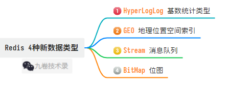
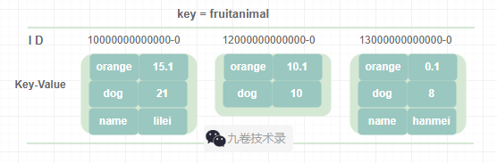
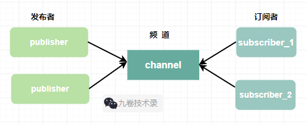

Redis 高级数据结构操作和其它特性

>  第一篇：go-redis使用，介绍Redis基本数据结构和其他特性，以及 go-redis 连接到Redis 
>  https://www.cnblogs.com/jiujuan/p/17207166.html
>  第二篇：go-redis使用，Redis5种基本数据类型操作
>  https://www.cnblogs.com/jiujuan/p/17215125.html
>  第三篇：go-redis使用，Redis高级数据结构和其它特性
>  https://www.cnblogs.com/jiujuan/p/17231723.html

## 一、Redis的新数据类型

在redis中，后面添加了几个比较高级的数据类型 hyperloglog基数统计、GEO存储地理位置、bitmap位图、stream为消息队列设计的数据类型 这 4 种数据类型。



### HyperLogLog类型

#### HyperLogLog简介

HyperLogLog 是一种用于数据统计的集合类型，叫基数统计。它有点类似布隆过滤器的算法。

比如说 Google 要计算用户执行不同搜索的数量，这种统计量肯定很大，精确计算话需要消耗大量内存空间来计算。但是如果我们不要求计算精确的数量，而是大致的数量，就可以用 HyperLogLog 这种近似算法来计算集合中的不同元素数量，它可以去重。虽然这种算法不能算出精确数量值，但计算的值也是八九不离十，且占用内存空间少很多。

统计大量数据的 UV、PV 就可以用这个数据类型。

hyperloglog 的命令文档：

- https://redis.io/commands/?group=hyperloglog，官方文档
- https://redis.io/docs/data-types/hyperloglogs/
- http://redisdoc.com/hyperloglog/index.html，参考文档

#### 命令介绍

hyperloglog 常用命令：

> 1. PFADD：PFADD key element [element …]，将任意数量的元素添加到指定 hyperloglog 中
> 2. PFCOUNT：PFCOUNT key [key ...]，如果是单个键，返回给定键在hyperloglog中的近似值，不存在则返回 0；如果是多个键，返回给定hyperloglog的并集的近似值。
> 3. PFMERGE：PFMERGE destkey sourcekey [sourcekey …]，将多个hyperloglog合并为一个hyperloglog，合并后近似值为并集

#### 代码例子

代码例子，官方的一个例子，[hll/main.go](https://github.com/redis/go-redis/blob/v8/example/hll/main.go)，改一点：

```go
package main

import (
	"context"
	"fmt"
	"time"

	"github.com/go-redis/redis/v8"
)

func main() {
	ctx := context.Background()
	rdb := redis.NewClient(&redis.Options{
		Addr:        "localhost:6379",
		Password:    "",
		DB:          0,
		IdleTimeout: 350,
		PoolSize:    50, // 连接池连接数量
	})

	ctx, cancel := context.WithTimeout(context.Background(), time.Second*10)
	defer cancel()
	_, err := rdb.Ping(ctx).Result() // 检查连接redis是否成功
	if err != nil {
		fmt.Println("Connect Failed: %v \n", err)
		panic(err)
	}

	// 设置hyperloglog的键myset
	for i := 0; i < 10; i++ {
		if err := rdb.PFAdd(ctx, "myset", fmt.Sprint(i)).Err(); err != nil {
			panic(err)
		}
	}

	ctx = context.Background()
	//PFCount, 返回hyperloglog的近似值
	card, err := rdb.PFCount(ctx, "myset").Result()
	if err != nil {
		panic(err)
	}
	fmt.Println("PFCount: ", card)

	// PFMerge，合并2个hyperloglog
	for i := 0; i < 10; i++ {
		if err = rdb.PFAdd(ctx, "myset2", fmt.Sprintf("val%d", i)).Err(); err != nil {
			panic(err)
		}
	}
	rdb.PFMerge(ctx, "mergeset", "myset", "myset2")
	card, _ = rdb.PFCount(ctx, "mergeset").Result()
	fmt.Println("merge: ", card)
}

/*output:
PFCount:  10
merge:  20
*/
```

### GEO地理位置空间索引

#### GEO简介

GEO(Geospatial) 主要用于存储地理位置信息，存储地理位置经纬度信息。我们点餐用的 APP 就会用到地理位置信息服务。这些都是 属于 LBS(Location-Based Service) 地理位置信息服务。

geospatial index 地理位置空间索引，可以用经纬度查询彼此之间距离，范围大小等。

GEO 命令文档：

- https://redis.io/commands/?group=geo，官方文档
- https://redis.io/docs/data-types/geospatial/
- http://redisdoc.com/geo/index.html，参考文档

#### 命令介绍

GEO 常用命令：

> 1. GEOADD：将纬度、经度、名字添加到指定的键里
> 2. GEORADIUS：以给定的经纬度为中心，返回键包含的位置元素中，与中心的距离不超过给定最大距离的所有位置元素。在Redis6.2.0 废弃
> 3. GEOPOS：GEOPOS key [member [member ...]]，从键里返回所有给定位置元素的位置（经度和纬度）
> 4. GEODIST：返回两个位置之间的距离
> 5. GEOHASH：返回一个或多个位置元素的 Geohash 表示

#### 代码例子

```go
package main

import (
	"context"
	"fmt"
	"time"

	"github.com/go-redis/redis/v8"
)

func main() {
	rdb := redis.NewClient(&redis.Options{
		Addr:        "localhost:6379",
		Password:    "",
		DB:          0,
		IdleTimeout: 350,
		PoolSize:    50, // 连接池连接数量
	})
	ctx, cancel := context.WithTimeout(context.Background(), time.Second*10)
	defer cancel()
	_, err := rdb.Ping(ctx).Result() // 检查连接redis是否成功
	if err != nil {
		fmt.Println("Connect Failed: %v \n", err)
		panic(err)
	}

	ctx = context.Background()
	// GEOADD，添加一个
	val, err := rdb.GeoAdd(ctx, "town-geo-key", &redis.GeoLocation{
		Longitude: 113.2442,
		Latitude:  23.12592,
		Name:      "niwan-town",
	}).Result()
	if err != nil {
		panic(err)
	}
	fmt.Println("GeoAdd: ", val)
	// GEOADD，添加多个
	val, _ = rdb.GeoAdd(ctx, "town-geo-key",
		&redis.GeoLocation{Longitude: 113.2442, Latitude: 23.12592, Name: "niwan-town"},
		&redis.GeoLocation{Longitude: 113.38397, Latitude: 22.93599, Name: "panyu-town"},
		&redis.GeoLocation{Longitude: 113.60845, Latitude: 22.77144, Name: "nansha-town"},
		&redis.GeoLocation{Longitude: 113.829579, Latitude: 23.290497, Name: "zengcheng-town"},
	).Result()
	fmt.Println("Mulit GeoAdd : ", val)

	// GEOPOS，根据名字获取经纬度
	lonlats, err := rdb.GeoPos(ctx, "town-geo-key", "zengcheng-town", "panyu-town").Result()
	if err != nil {
		panic(err)
	}
	for _, lonlat := range lonlats {
		fmt.Println("GeoPos, ", "Longitude: ", lonlat.Longitude, "Latitude: ", lonlat.Latitude)
	}

	// GEODIST , 计算两地距离
	distance, err := rdb.GeoDist(ctx, "town-geo-key", "niwan-town", "nansha-town", "m").Result() // m-米，km-千米，mi-英里
	if err != nil {
		panic(err)
	}
	fmt.Println("GeoDist: ", distance, " m")

	// GEOHASH，计算hash值
	hash, _ := rdb.GeoHash(ctx, "town-geo-key", "zengcheng-town").Result()
	fmt.Println("zengcheng-town geohash: ", hash)

	// GEORADIUS，计算范围内包含的经纬度位置
	radius, _ := rdb.GeoRadius(ctx, "town-geo-key", 113.829579, 23.290497, &redis.GeoRadiusQuery{
		Radius:      800,
		Unit:        "km",
		WithCoord:   true,  // WITHCOORD参数，返回结果会带上匹配位置的经纬度
		WithDist:    true,  // WITHDIST参数，返回结果会带上匹配位置与给定地理位置的距离。
		WithGeoHash: true,  // WITHHASH参数，返回结果会带上匹配位置的hash值。
		Count:       4,     // COUNT参数，可以返回指定数量的结果。
		Sort:        "ASC", // 传入ASC为从近到远排序，传入DESC为从远到近排序。
	}).Result()
	for _, v := range radius {
		fmt.Println("GeoRadius: ", v)
	}
	// 上面式子里参数更多详情请看这里：http://redisdoc.com/geo/georadius.html

}

/*
GeoAdd:  0
Mulit GeoAdd :  0
GeoPos,  Longitude:  113.8295790553093 Latitude:  23.290497021802757
GeoPos,  Longitude:  113.3839675784111 Latitude:  22.935990920457606
GeoDist:  54280.9773  m
zengcheng-town geohash:  [ws0uqrbhvr0]
GeoRadius:  {zengcheng-town 113.8295790553093 23.290497021802757 0 4046592114973855}
GeoRadius:  {panyu-town 113.3839675784111 22.935990920457606 60.2724 4046531372960175}
*/

```

### Stream作为消息队列

#### stream简介

Redis5.0 增加了 Stream 数据类型，stream 类型可以支持消息队列，因为它具备消息队列的很多特性。

Stream 是什么呢？

> stream 是一种数据结构，它类似于一种追加日志。你能够使用 stream 实时记录并关联相关事件。stream 使用场景：
>
> - Event sourcing 事件硕源（比如跟踪用户操作，点击事件等）
> - Sensor monitoring 传感器监控（比如从设备中读取数据）
> - Notifications 通知（比如将每个用户的通知信息单独记录在 stream 中）
>
> stream 是一个包含零个或任意多个元素数据的有序队列，队列中的每个元素都包含一个 ID 和任意多个键值对，这些元素根据 ID 大小在流中有序排列。ID 是由毫秒和顺序数组成，比如 10000000000000-0。
>
> stream 流中的每个元素可以包含一个或任意多个键值对，同一流中不同元素可以包含不同数量的键值对。

来一张 stream 流的存储示意图：



#### stream命令用法讲解

stream 命令文档：

- https://redis.io/commands/?group=stream

Stream 是 5.0 才增加的数据类型，所以详细讲解下相关命令的用法。

消息队列相关的命令：

1. XADD：向某个消息队列中添加消息，添加到流尾部，https://redis.io/commands/xadd/

> ```go   
> // 语法
> XADD key [NOMKSTREAM] [<MAXLEN | MINID> [= | ~] threshold [LIMIT count]] <* | id> field value [field value ...]
> ```
>
> - key：表示消息队列名称
>
> - [NOMKSTREAM]：可选参数，表示 key 不存在新建
>
> - [<MAXLEN | MINID> [= | ~] threshold [LIMIT count]：可选参数，<MAXLEN | MINID> 表示消息队列中消息的最大长度或消息ID的最小值；
>
>   [= | ~] 设置精确的值或大约值；
>
>   threshold 表示具体设置的值，超过 threshold 值后会将旧的值删除；
>
>   [LIMIT count] (Redis6.2后加入的参数) 限制数量；
>
>   <* | id> 表示消息 ID，* 表示由 Redis 生成，id 则是自定义生成；
>
>   field value [field value ...] 具体消息内容的键值对，可以传入多个。

redis-cli 下示例：

```go
> XADD mystream * sensor-id 1234 temperature 19.8
1518951480106-0
// 用 XADD 命令增加了2组数据 sensor-id:1234 和 temperature:19.8，消息队列的 key 是 mystream，* 表示Redis自动生成id。
// 1518951480106-0，返回redis生成的id，由毫秒时间和顺序编号组成。
```

2. XREAD：从某一消息队列中读取消息

> ```
> XREAD [COUNT count] [BLOCK milliseconds] STREAMS key [key ...] id[id ...]
> ```
>
> - [COUNT count]：可选参数，表示读取消息的数量，COUNT 为关键字，小写count表示具体的数值
> - [BLOCK milliseconds]：可选参数，BLOCK 为关键字，表示设置 XREAD 为阻塞模式，默认非阻塞，milliseconds 表示阻塞具体时间
> - STREAMS key [key ...]：STREAMS 为关键字，key 表示消息队列名称，可以传入多个消息队列名称
> - id[id ...]：表示从哪个消息ID读取，与上面的 key 一一对应。id为0表示从第一条开始读取。阻塞模式可以使用$表示最新消息ID

redis-cli 下示例：

```go
> xread COUNT 2 STREAMS mystream 0-0

// 读取 2 个消息队列stream
> xadd myapple * applekeyone apple1
> xread COUNT 2 STREAMS mystream myapple 0-0 0-0
```

3. XLEN：获取消息队列长度

>```
>// 语法
>XLEN key
>```
>- key: 表示消息队列名称

```go
> xlen mystream
```


4. XRANGE：获取范围队列长度

> ```
> XRANGE key start end [COUNT count]
> ```
> - key： 消息队列名称
> - start：起始消息 ID
> - end：结束消息 ID
> - [COUNT count]：读取指定消息的数量。COUNT 关键字，count 数值

例子：

```go
// - + 表示读取所有
> xrange mystream - +  
```


5. XDEL：消息队列删除，https://redis.io/commands/xdel/

> ```
> XDEL key id [id ...]
> ```
> - key：消息队列名称
> - id：消息队列ID

例子：

```go
> xadd myapple * applekeyone apple1
"1678952235530-0"
> xadd myapple * two apple2
"1678953271739-0"
> xadd myapple * three apple3
"1678953284915-0"

> xdel myapple 1678953271739-0
```

**XGROUP 相关命令**

6. XGROUP CREATE：创建消费者组

> ```
> XGROUP CREATE key group <id | $> [MKSTREAM]
> ```
> - CREATE：关键字
> - key： 消息队列名
> - group：要创建的消费者组名称
> - <id | $>：消费者从哪个 ID 开始消费数据，id - 指定消息id，id为0表示从第一个获取，$ - 表示只消费新产生的消息。
> - [MKSTREAM]：可选参数，如果指定消息队列不存在，则自动创建

7. XGROUP SETID：设置消费者组中下一条要读取的命令

>```
>XGROUP SETID key group <id | $>
>```
>
>- SETID：关键字
>- key：消息队列名
>- group：消费者组名
>- <id | $>：指定具体消息id，0 可以表示重新开始处理消费者组中所有消息，$ 表示只处理新产生的消息

8. XGROUP DESTORY：销毁消费者组

> ```
> XGROUP DESTROY key group
> ```
>
> - DESTORY：关键字
> - key：消息队列名
> - group：要销毁的消费组名

9. XGROUP CRATECONSUMER：创建消费者

> ```
> XGROUP CREATECONSUMER key group consumer
> ```
>
> - CREATECONSUMER：关键字
> - key：消息队列名称
> - group：消费者组名称
> - consumer：要创建的消费者名称

10：XGROUP DELCONSUMER：删除消费者

> ```
> XGROUP DELCONSUMER key group consumer
> ```


**XINFO 相关命令**

11. XINFO CONSUMERS：用于监控消费者，https://redis.io/commands/xinfo-consumers/

> ```
> XINFO CONSUMERS key group
> ```
>
> - CONSUMERS：关键字
> - key：消息队列名
> - group：消费者组名

12. XIFNO GROUPS：用于监控消费者组

> ```
> XINFO GROUPS key
> ```

13. XINFO STREAM：监控消息队列

> ```
> XINFO STREAM key [FULL [COUNT count]]
> ```
>
> - STREAM：关键字
> - key：消息队列名
> - [FULL [COUNT count]]：FULL 表示所有消息队列；COUNT 关键字，count 表示数值，多少个消息队列

14. XREADGROUP：分组消费

> ```
> XREADGROUP GROUP group consumer [COUNT count] [BLOCK milliseconds]
> [NOACK] STREAMS key [key ...] id [id ...]
> ```
>
> - GROUP：关键字
> - group：消费者组名
> - [COUNT count]：可选参数，指定读取消息的数量。COUNT 为关键字，count 读取具体的数值
> - [BLOCK milliseconds]：可选参数，设置为阻塞读取。BLOCK 为关键字，milliseconds 设置阻塞时间。默认为非阻塞
> - [NOACK]：可选参数，表示不要将消息加入Pending等待队列中，相当于消息读取时进行消息确认
> - STREAMS：关键字
> - key [key ...]：消息队列的名称，可以传入多个名称。
> - id [id ...]：从哪个消息ID开始读，与上面的 key 一一对应。如果为 0 表示从第一条消息开始读。在阻塞模式中，可以用 $ 表示最新的消息ID。非阻塞模式下 $ 没有意义。

15. XPENDING：用于获取等待队列。等待队列中保存了消费者组内被读取但还未完成处理的消息，也就是还没被ACK的消息

> ```
> XPENDING key group [[IDLE min-idle-time] start end count [consumer]]
> ```
>
> - key：消息队列名
> - group：消费者组的名称
> - [IDLE min-idle-time]：可选参数，IDLE 关键字，表示指定消息已读取时长，min-idle-time 表示具体数值
> - start：起始消息ID
> - end：结束消息ID
> - count：读取消息的条数
> - [consumer]：可选参数，表示消费者名称

16. XACK：用于进行消息确认

> ```
> XACK key group id [id ...]
> ```
>
> - key：消息队列名
> - group：消费者组名
> - id：消息ID，可以传入多个

17. XCLAIM：消息转移。当某个等待队列中的消息长时间没有被处理（没被ACK）时，可以用这个命令将其转移到其它消费者等待列表中。

> ```
> XCLAIM key group consumer min-idle-time id [id ...] [IDLE ms]
> [TIME unix-time-milliseconds] [RETRYCOUNT count] [FORCE] [JUSTID]
> [LASTID lastid]
> ```
>
> - key：消息队列名
> - group：消费者组名
> - consumer：消费者名
> - min-idle-time：表示消息空闲时长（表示消息已经读取，但还未处理）
> - id [id...]：可选参数，要转移的消息ID，可传入多个ID
> - [IDLE ms]：可选参数，设置消息空闲时间
> - [TIME unix-time-milliseconds]：可选参数，它将空闲时间设置为特定的UNIX时间，以毫秒为单位。
> - [RETRYCOUNT count]：可选参数，设置重试计数器的值，每次消息读取时，计数器的值都会递增。一般不需要修改这个值。
> - [FORCE]：可选参数，强制将消息ID加入到执行消费者的等待列表中
> - [JUSTID]：可选参数，仅返回要转移消息的ID，使用此参数意味着重试计数器不会递增
> - [LASTID lastid]：可选参数，返回最后一个消息ID

18. XREADGROUP：对消息组进行读取

> ```
> XREADGROUP GROUP group consumer [COUNT count] [BLOCK milliseconds]
> [NOACK] STREAMS key [key ...] id [id ...]
> ```
>
> - GROUP：关键字
> - group：消费者组名
> - consumer：消费者名
> - [COUNT count]：可选参数，每个流读取的数量，COUNT 为关键字，count为读取数值
> - [BLOCK milliseconds]：可选参数，用阻塞的方式执行。BLOCK 为关键字，milliseconds为阻塞毫秒数。如果为 0 表示阻塞直到出现可返回的元素为止。
> - [NOACK]：可选参数，读取消息时是否确认。true-需要确认，false-不需要确认
> - STREAMS key [key ...] id [id ...]：STREAMS 关键字，key 消息队列明，id 消息ID。

18. XTRIM：对流进行裁剪，

#### stream tutorial

官方地址：https://redis.io/docs/data-types/streams-tutorial/

#### 代码例子

1. xadd 添加一个消息队列：

```go
package main

import (
	"context"
	"fmt"
	"time"

	"github.com/go-redis/redis/v8"
)

func main() {
	rdb := redis.NewClient(&redis.Options{
		Addr:        "localhost:6379",
		Password:    "",
		DB:          0,
		IdleTimeout: 350,
		PoolSize:    50, // 连接池连接数量
	})
	ctx, cancel := context.WithTimeout(context.Background(), time.Second*10)
	defer cancel()
	_, err := rdb.Ping(ctx).Result() // 检查连接redis是否成功
	if err != nil {
		fmt.Println("Connect Failed: %v \n", err)
		panic(err)
	}

	ctx = context.Background()

	// XADD，添加消息到对尾（这个代码每运行一次就增加一次内容）
	err = rdb.XAdd(ctx, &redis.XAddArgs{
		Stream:     "mystreamone", // 设置流stream的 key，消息队列名
		NoMkStream: false,         //为false，key不存在会新建
		MaxLen:     10000,         //消息队列最大长度，队列长度超过设置最大长度后，旧消息会被删除
		Approx:     false,         //默认false，设为true时，模糊指定stram的长度
		ID:         "*",           //消息ID，* 表示由Redis自动生成
		Values: []interface{}{ //消息队列的内容，键值对形式
			"apple", "12.0",
			"orange", "5.6",
			"banana", "7.6",
		},
		// MinID: "id",//超过设置长度值，丢弃小于MinID消息id
		// Limit: 1000, //限制长度，基本不用
	}).Err()
	if err != nil {
		panic(err)
	}
}
```

2. 创建一个消费者组

```go
package main

import (
	"context"
	"fmt"
	"time"

	"github.com/go-redis/redis/v8"
)

func main() {
	rdb := redis.NewClient(&redis.Options{
		Addr:        "localhost:6379",
		Password:    "",
		DB:          0,
		IdleTimeout: 350,
		PoolSize:    50, // 连接池连接数量
	})
	ctx, cancel := context.WithTimeout(context.Background(), time.Second*10)
	defer cancel()
	_, err := rdb.Ping(ctx).Result() // 检查连接redis是否成功
	if err != nil {
		fmt.Println("Connect Failed: %v \n", err)
		panic(err)
	}

	ctx = context.Background()

	// XGroupCreate，创建一个消费者组

	err = rdb.XGroupCreate(ctx, "mystreamone", "test_group1", "0").Err() // 0-从第一个获取，$-从最新获取
	if err != nil {
		panic(err)
	}

}
```

3. 获取、读取消息队列信息、确认信息、获取流信息、消费者组信息、消费者信息

```go
package main

import (
	"context"
	"fmt"
	"time"

	"github.com/go-redis/redis/v8"
)

func main() {
	rdb := redis.NewClient(&redis.Options{
		Addr:        "localhost:6379",
		Password:    "",
		DB:          0,
		IdleTimeout: 350,
		PoolSize:    50, // 连接池连接数量
	})
	ctx, cancel := context.WithTimeout(context.Background(), time.Second*10)
	defer cancel()
	_, err := rdb.Ping(ctx).Result() // 检查连接redis是否成功
	if err != nil {
		fmt.Println("Connect Failed: %v \n", err)
		panic(err)
	}

	ctx = context.Background()

	//XLEN，获取stream中元素数量，也就是消息队列长度
	len, err := rdb.XLen(ctx, "mystreamone").Result()
	if err != nil {
		panic(err)
	}
	fmt.Println("XLen: ", len)

	// XRead，从消息队列获取数据，阻塞或非阻塞
	val, err := rdb.XRead(ctx, &redis.XReadArgs{
		Block:   time.Second * 10,               // 如果Block设置为0，表示一直阻塞，默认非阻塞。这里设置阻塞10s
		Count:   2,                              // 读取消息的数量
		Streams: []string{"mystreamone", "0-0"}, // 消息队列名称，从哪个ID开始读起，0-0 表示从mystreamone的第一个ID开始读
	}).Result()
	if err != nil {
		panic(err)
	}
	fmt.Println("XRead: ", val)

	// XRANGE，从队列左边获取值，ID 从小到大
	vals, err := rdb.XRange(ctx, "mystreamone", "-", "+").Result() //- + 表示读取所有
	if err != nil {
		panic(err)
	}
	fmt.Println("XRange: ", vals)
	// XRangeN，从队列左边获取N个值，ID 从小到大
	vals, _ = rdb.XRangeN(ctx, "mystreamone", "-", "+", 2).Result() //顺序获取队列前2个值
	fmt.Println("XRangeN: ", vals)

	// XRevRange，从队列右边获取值，ID 从大到小，与XRANGE相反
	vals, _ = rdb.XRevRange(ctx, "mystreamone", "+", "-").Result()
	fmt.Println("XRevRange: ", vals)
	// XRevRangeN，从队列右边获取N个值，ID 从大到小
	// rdb.XRevRangeN(ctx, "mystreamone", "+", "-", 2).Result()

	//XDEL - 删除消息
	//err = rdb.XDel(ctx, "mystreamone", "1678984704869-0").Err()

	// ========= 消费者组相关操作 API ===========

	// XGroupCreate，创建一个消费者组

	/*
		    err = rdb.XGroupCreate(ctx, "mystreamone", "test_group1", "0").Err() // 0-从第一个获取，$-从最新获取
			if err != nil {
				panic(err)
			}
	*/

	// XReadGroup，读取消费者中消息
	readgroupval, err := rdb.XReadGroup(ctx, &redis.XReadGroupArgs{
		// Streams第二个参数为ID，list of streams and ids, e.g. stream1 stream2 id1 id2
		// id为 >，表示最新未读消息ID，也是未被分配给其他消费者的最新消息
		// id为 0 或其他，表示可以获取已读但未确认的消息。这种情况下BLOCK和NOACK都会忽略
		// id为具体ID，表示获取这个消费者组的pending的历史消息，而不是新消息
		Streams:  []string{"mystreamone", ">"},
		Group:    "test_group1",    //消费者组名
		Consumer: "test_consumer1", // 消费者名
		Count:    1,
		Block:    0,    // 是否阻塞，=0 表示阻塞且没有超时限制。只要大于1条消息就立即返回
		NoAck:    true, // true-表示读取消息时确认消息
	}).Result()
	if err != nil {
		panic(err)
	}
	fmt.Println("XReadGroup: ", readgroupval)

	// XPending，获取待处理的消息
	count, err := rdb.XPending(ctx, "mystreamone", "test_group1").Result()
	if err != nil {
		panic(err)
	}
	fmt.Println("XPending: ", count)

	// XAck , 将消息标记为已处理
	err = rdb.XAck(ctx, "mystreamone", "test_group1", "1678984704869-0").Err()

	// XClaim ， 转移消息的归属权
	claiminfo, err := rdb.XClaim(ctx, &redis.XClaimArgs{
		Stream:   "mystreamone",
		Group:    "test_group1",
		Consumer: "test_consumer2",
		MinIdle:  time.Second * 10, // 表示要转移的消息需要最少空闲 10s 才能转移
		Messages: []string{"1678984704869-0"},
	}).Result()
	if err != nil {
		panic(err)
	}
	fmt.Println("XClaim: ", claiminfo)

	// XInfoStream , 获取流的消息
	info, err := rdb.XInfoStream(ctx, "mystreamone").Result()
	if err != nil {
		panic(err)
	}
	fmt.Println("XInfoStream: ", info)

	// XInfoGroups , 获取消费者组消息
	groupinfo, _ := rdb.XInfoGroups(ctx, "mystreamone").Result()
	fmt.Println("XInfoGroups: ", groupinfo)

	// XInfoConsumer ，获取消费者信息
	consumerinfo, _ := rdb.XInfoConsumers(ctx, "mystreamone", "test_group1").Result()
	fmt.Println("XInfoConsumers: ", consumerinfo)
}

```

4. 删除相关信息

删除消息队列里的消息

```go
ctx = context.Background()
//XDEL - 删除消息
count, _ := rdb.XDel(ctx, "mystreamone", "1678984704869-0", "1678984915646-0", "1678985389693-0", "1678985099142-0").Result()
fmt.Println("XDel: ", count)

```

删除消费者信息和消费者组信息

```go
ctx = context.Background()

//XGroupDelConsumer，删除消费者
count, _ := rdb.XGroupDelConsumer(ctx, "mystreamone", "test_group1", "test_consumer1").Result()
fmt.Println("XGroupDelConsumer: ", count)

// XGroupDestroy , 删除消费者组
count, _ = rdb.XGroupDestroy(ctx, "mystreamone", "test_group1").Result()
fmt.Println("XGroupDestroy: ", count)
```

## 二、Pipelining管道化

Redis 中的 pipelining 是一种通过一次发送多个命令而不必等待对每个命令响应，用这种方式来提高性能的一种技术。

下面的大部分代码来自 go-redis 官方文档：https://redis.uptrace.dev/guide/go-redis-pipelines.html。

1. pipeline 基础使用， 用 pipeline 一次执行多条命令：

```go
package main

import (
	"context"
	"fmt"
	"time"

	"github.com/go-redis/redis/v8"
)

func main() {
	rdb := redis.NewClient(&redis.Options{
		Addr:        "localhost:6379",
		Password:    "",
		DB:          0,
		IdleTimeout: 350,
		PoolSize:    50, // 连接池连接数量
	})
	ctx, cancel := context.WithTimeout(context.Background(), time.Second*10)
	defer cancel()
	_, err := rdb.Ping(ctx).Result() // 检查连接redis是否成功
	if err != nil {
		fmt.Println("Connect Failed: %v \n", err)
		panic(err)
	}

	ctx = context.Background()
	// 一次执行 2 个删除命令
	rdb.Set(ctx, "setkey1", "value1", 0).Err()
	rdb.Set(ctx, "setkey2", "value2", 0).Err()

	pipe := rdb.Pipeline()
	pipe.Del(ctx, "setkey1")
	pipe.Del(ctx, "setkey2")
	cmds, err := pipe.Exec(ctx)
	if err != nil {
		panic(err)
	}
	fmt.Println("Pipeline: ", cmds)

	// 一次执行写和加上过期时间命令，用 pipeline 一次执行这2条命令
	incr := pipe.Incr(ctx, "pipeline_counter")           // Incr 相当于写入
	pipe.Expire(ctx, "pipeline_counter", time.Second*60) // 加上过期时间

	cmds, err = pipe.Exec(ctx)  // 执行 pipeline
	if err != nil {
		panic(err)
	}
    // 执行 pipe.Exec() 后获取结果
	fmt.Println("Pipeline: ", incr.Val())

}
```

2. Pipelined 方法
- 它可以把 pipeline 执行多条命令作为一个函数整体来执行，看着像省略 Exec() 执行方法，其实这个 Pipelined 函数里就包含了 Exec()。执行后返回结果。代码示例如下：

```go
// Pipelined, 另外一种方法 Pipelined
var incr2 *redis.IntCmd
cmds, err := rdb.Pipelined(ctx, func(pipe redis.Pipeliner) error {
    incr2 = pipe.Incr(ctx, "pipeline_counter2")
    pipe.Expire(ctx, "pipeline_counter2", time.Second*60)
    return nil
})
if err != nil {
    panic(err)
}
fmt.Println("Pipelined: ", incr2.Val())
```


- 批量结果，Pipelined 执行后批量返回结果，返回结果都存储在类似于 *redis.XXXCmd 的指针中，

```go
// 遍历 pipeline 命令执行后的返回值
cmds, err := rdb.Pipelined(ctx, func(pipe redis.Pipeliner) error {
    for i := 0; i < 5; i++ {
        pipe.Set(ctx, fmt.Sprintf("key%d", i), fmt.Sprintf("val%d", i), 0)
    }
    return nil
})
if err != nil {
    panic(err)
}

for _, cmd := range cmds {
    fmt.Println(cmd.(*redis.StatusCmd).Val())
}
```


- Pipelined() 方法简析，源码如下：

```go
// https://github.com/redis/go-redis/blob/v8/pipeline.go#L128
func (c *Pipeline) Pipelined(ctx context.Context, fn func(Pipeliner) error) ([]Cmder, error) {
	if err := fn(c); err != nil {
		return nil, err
	}
    cmds, err := c.Exec(ctx) // 看见没，这里会执行 Exec() 方法
	_ = c.Close()
	return cmds, err
}

// Pipeliner 是一个接口，接口就可以调用实现了它的方法了
type Pipeliner interface {
	StatefulCmdable
	Len() int
	Do(ctx context.Context, args ...interface{}) *Cmd
	Process(ctx context.Context, cmd Cmder) error
	Close() error
	Discard() error
	Exec(ctx context.Context) ([]Cmder, error)
}
```

## 三、Transaction事务

### 事务命令介绍

Redis 事务允许在单个步骤中执行一组命令。

事务中所有命令都被序列化并按照顺序执行。另外一个客户端发送的请求永远不会在Redis事务执行过程中得到处理，这保证了命令作为单个命令原子执行。

在 Redis 中使用事务时，有几个相关命令，`EXEC、MULTI、WATCH、UNWATCH`，还有一个 `DISCARD`。

> - MULTI：标记一个事务开始。在一个事务内有多条命令会按照先后顺序放进一个队列中，最后由 EXEC 命令原子的执行。

multi 命令例子：

```shell
127.0.0.1:6379> MULTI
OK
127.0.0.1:6379> INCR count1
QUEUED
127.0.0.1:6379> INCR count2
QUEUED
127.0.0.1:6379> PING
QUEUED
127.0.0.1:6379> EXEC
1) (integer) 1
2) (integer) 2
3) PONG
127.0.0.1:6379>
```


> - EXEC：触发执行事务内的所有命令，如上面的例子。
>
> 如果某个或某些 key 正处于 WATCH 命令监视之下，并且事务中有和这些 key 相关的命令，那么 EXEC 命令只有在这个或这些key 没有被其他命令所改动的情况下执行并生效，否则该事务会被打断。

> - WATCH：监视一个key或多个key，如果事务在执行之前，这个key或多个key被其他命令改动，那么事务将被打断
>
> `WATCH key [key …]`
>
> - UNWATCH：取消 WATCH 命令对所有key的监视。它没有任何参数。

```shell
127.0.0.1:6379> WATCH lockone locktwo
OK
127.0.0.1:6379> MULTI
OK
127.0.0.1:6379> SET lockone "testwatch"
QUEUED
127.0.0.1:6379> INCR locktwo
QUEUED
127.0.0.1:6379> EXEC
1) OK
2) (integer) 1
```

如果你又开另外一个客户端：

```shell
127.0.0.1:6379> WATCH lockone locktwo
OK
127.0.0.1:6379> MULTI
OK
127.0.0.1:6379> SET lockone "testwatch2"
QUEUED
127.0.0.1:6379> INCR locktwo
QUEUED
127.0.0.1:6379> EXEC  # locktwo 这时被另外一个客户端修改了，testwatch2 执行也失败
(nil)
```

UNWATCH 命令：

```shell
127.0.0.1:6379> UNWATCH
```


> - DISCARD：取消事务，放弃执行事务内的所有命令

DISCARD 命令例子：

```shell
127.0.0.1:6379> MULTI
OK
127.0.0.1:6379> PING
QUEUED
127.0.0.1:6379> SET helloworld "hello"
QUEUED
127.0.0.1:6379> DISCARD
OK
```

### TxPipeline和TxPipelined包装MULTI和EXEC

TxPipeline 和 TxPipelined 是把 Redis 中的 2 个事务命令 MULTI 和 EXEC 包装起来，然后用 pipeline 来执行命令。

这 2 个命令和 pipeline 和 pipelined 用法几乎相同。

### 代码例子

```go
package main

import (
	"context"
	"fmt"
	"time"

	"github.com/go-redis/redis/v8"
)

func main() {
	rdb := redis.NewClient(&redis.Options{
		Addr:        "localhost:6379",
		Password:    "",
		DB:          0,
		IdleTimeout: 350,
		PoolSize:    50, // 连接池连接数量
	})
	ctx, cancel := context.WithTimeout(context.Background(), time.Second*10)
	defer cancel()
	_, err := rdb.Ping(ctx).Result() // 检查连接redis是否成功
	if err != nil {
		fmt.Println("Connect Failed: %v \n", err)
		panic(err)
	}

	ctx = context.Background()

	// 一次执行 2 个删除命令
	rdb.Set(ctx, "setkey1", "value1", 0).Err()
	rdb.Set(ctx, "setkey2", "value2", 0).Err()
	//TxPipeline
	txpipe := rdb.TxPipeline()
	txpipe.Del(ctx, "setkey1")
	txpipe.Del(ctx, "setkey2")
	cmds, err := txpipe.Exec(ctx) // 执行 TxPipeline 里的命令
	if err != nil {
		panic(err)
	}
	fmt.Println("TxPipeline: ", cmds)

	// TxPipelined
	var incr2 *redis.IntCmd
	cmds, err = rdb.TxPipelined(ctx, func(txpipe redis.Pipeliner) error {
		txpipe.Set(ctx, "txpipeline_counter2", 30, time.Second*120)
		incr2 = txpipe.Incr(ctx, "txpipeline_counter2")
		txpipe.Expire(ctx, "txpipeline_counter2", time.Second*300)
		return nil
	})
	if err != nil {
		panic(err)
	}
	fmt.Println("TxPipelined: ", incr2.Val())
	fmt.Println("cmds: ", cmds)
}

/*
TxPipeline:  [del setkey1: 1 del setkey2: 1]
TxPipelined:  31
cmds:  [set txpipeline_counter2 30 ex 120: OK incr txpipeline_counter2: 31 expire txpipeline_counter2 300: true]
*/
```

### Watch监视

watch 监视一个key或多个key。如果事务在执行之前，这个key或多个key被其他命令改动，那么事务将被打断。

你使用 watch 在一个客户端上监视一些操作命令，然后另外开一个客户端执行相同的命令，那么 watch 会监视这种变动从而取消事务操作。

### 代码例子

这是官方文档的一个例子，改一下：

```go
package main

import (
	"context"
	"fmt"
	"strconv"
	"sync"
	"time"

	"github.com/go-redis/redis/v8"
)

func main() {
	rdb := redis.NewClient(&redis.Options{
		Addr:        "localhost:6379",
		Password:    "",
		DB:          0,
		IdleTimeout: 350,
		PoolSize:    50, // 连接池连接数量
	})
	ctx, cancel := context.WithTimeout(context.Background(), time.Second*10)
	defer cancel()
	_, err := rdb.Ping(ctx).Result() // 检查连接redis是否成功
	if err != nil {
		fmt.Println("Connect Failed: %v \n", err)
		panic(err)
	}

	ctx = context.Background()

	var incr func(string) error
	incr = func(key string) error {
		err = rdb.Watch(ctx, func(tx *redis.Tx) error { //Watch 监控函数
			n, err := tx.Get(ctx, key).Int64() // 先查询下当前watch监听的key的值
			if err != nil && err != redis.Nil {
				return err
			}

			// 如果key的值没有改变的话，pipe 函数才会调用成功
			_, err = tx.TxPipelined(ctx, func(pipe redis.Pipeliner) error {
				pipe.Set(ctx, key, strconv.FormatInt(n+1, 10), 0)
				return nil
			})
			return err
		}, key)

		if err == redis.TxFailedErr {
			return incr(key)
		}
		return err
	}

	keyname := "keynameone"
	var wg sync.WaitGroup

	for i := 0; i < 10; i++ {
		wg.Add(1)
		go func() {
			defer wg.Done()

			err := incr(keyname)
			fmt.Println("[for] err: ", err)
		}()
	}
	wg.Wait()

	n, err := rdb.Get(ctx, keyname).Int64()
	if err != nil {
		panic(err)
	}
	fmt.Println("last key val: ", n)
}
```

## 四、pub/sub 发布/订阅

### 简介

Redis 的发布订阅功能，有三大部分：发布者、订阅者和 Channel 频道。发布者和订阅者都是 Redis 客户端，Channel 频道是Redis 服务器。发布者将消息发送到某个频道，订阅了这条频道的订阅者就能收到这条消息。



### 常用命令

> - PUBLISH ：`publish channel message`，向channel频道发布消息
>
> - SUBSCRIBE：`subscribe channel [channel ...]`，订阅频道
>
> - PSUBSCRIBE：`psubscribe pattern [pattern …]`，订阅多个符合模式的频道
>
> - UNSUBSCRIBE：`unsubscribe [channel [channel …]]`，客户端退订频道，可以退订多个频道
>
> - PUNSUBSCRIBE：`punsubscribe [pattern [pattern …]]`，指定客户端退订多个符合模式的频道
>
> - PUBSUB：查看订阅和发布系统状态的命令，它由数个不同格式子命令组成

### 代码例子

publish 频道发布消息：

```go
package main

import (
	"context"
	"fmt"
	"time"

	"github.com/go-redis/redis/v8"
)

func main() {
	rdb := redis.NewClient(&redis.Options{
		Addr:        "localhost:6379",
		Password:    "",
		DB:          0,
		IdleTimeout: 350,
		PoolSize:    50, // 连接池连接数量
	})
	ctx, cancel := context.WithTimeout(context.Background(), time.Second*10)
	defer cancel()
	_, err := rdb.Ping(ctx).Result() // 检查连接redis是否成功
	if err != nil {
		fmt.Println("Connect Failed: %v \n", err)
		panic(err)
	}

	ctx = context.Background()

	// 向频道 mychannel1 发布消息 payload1
	err = rdb.Publish(ctx, "mychannel1", "payload1").Err()
	if err != nil {
		panic(err)
	}

	val, err := rdb.Publish(ctx, "mychannel1", "hello").Result()
	if err != nil {
		panic(err)
	}
	fmt.Println(val)

	rdb.Publish(ctx, "mychannel2", "hello2").Err()
}
```

subscribe 订阅频道消息：

```go
// Subscribe，订阅频道接收消息
// pubsub := rdb.Subscribe(ctx, "mychannel1")
pubsub := rdb.Subscribe(ctx, "mychannel1", "mychannel2")
defer pubsub.Close()

// 第一种接收消息方法
// ch := pubsub.Channel()
// for msg := range ch {
// 	fmt.Println(msg.Channel, msg.Payload)
// }

// 第二种接收消息方法
for {
    msg, err := pubsub.ReceiveMessage(ctx)
    if err != nil {
        panic(err)
    }
    fmt.Println(msg.Channel, msg.Payload)
}
```

PSubscribe 模式匹配订阅频道消息：

```go
pubsub := rdb.PSubscribe(ctx, "mychannel*")
defer pubsub.Close()

// 第一种接收消息方法
ch := pubsub.Channel()
for msg := range ch {
    fmt.Println(msg.Channel, msg.Payload)
}
```

Unsubscribe 退订频道：

```go
// Subscribe，订阅频道
pubsub := rdb.Subscribe(ctx, "mychannel1", "mychanne2")
defer pubsub.Close()

// 退订具体频道
unsub := pubsub.Unsubscribe(ctx, "mychannel1", "mychannel2")

// 按照模式匹配退订
pubsub.PUnsubscribe(ctx, "mychannel*")
```

查询频道相关信息、订阅者信息：

```go
ps := rdb.Subscribe(ctx, "mychannel*")
defer ps.Close()
// PubSubChannels，查询活跃的频道
fmt.Println("====PubSubChannels====")
channels, _ := rdb.PubSubChannels(ctx, "").Result() //"" 为空，查询所有活跃的channel频道
for ch, v := range channels {
    fmt.Println(ch, v)
}
// 指定匹配模式
channels, _ = rdb.PubSubChannels(ctx, "mychannel*").Result()
for ch, v := range channels {
    fmt.Println("PubSubChannels* ：", ch, v)
}

fmt.Println("====PubSubNumSub====")
// PubSubNumSub，具体的channel有多少个订阅者
numsub, _ := rdb.PubSubNumSub(ctx, "mychannel1", "mychannel2").Result()
for ch, count := range numsub {
    fmt.Println(ch, ",", count) // ch-channel名字，count-channel的订阅者数量
}

// PubSubNumPat， 模式匹配
pubsub := rdb.PSubscribe(ctx, "mychannel*")
defer pubsub.Close()
numsubpat, _ := rdb.PubSubNumPat(ctx).Result()
fmt.Println("PubSubNumPat: ", numsubpat)
```

## 五、Lua脚本

### 介绍

从Redis2.6开始，通过内置的 Lua 解释器，可以使用 EVAL 命令对 lua 脚本进行求值。

> - EVAL：语法 `EVAL script numkeys key [key …] arg [arg …]`
>   - script：一段 lua5.1脚本程序，它会被运行在redis服务器下
>   - numkeys：用于指定健名参数的个数
>   - key [key …]：从 EVAL 的第三个参数开始算起，表示在脚本中所用到的那些 Redis 键(key)。这些键可以通过lua的全局变量KEYS数组获取，用 1 访问形式 KEYS[1], 2 是 KEYS[2]
>   - arg [arg …]：附加参数，可以在lua中用全局变量 ARGV 数组访问，访问形式 ARGV[1]，ARGC[2] 等。

命令例子：

```shell
> eval "return {KEYS[1],KEYS[2],ARGV[1],ARGV[2]}" 2 key1 key2 first second
1) "key1"
2) "key2"
3) "first"
4) "second"
// first second 都是附加参数
```

在 Lua 脚本中，可以用 redis.call() 和 redis.pcall() 来还行 Redis 命令。

### 代码例子

直接拿官网的例子来看，

```go
// https://github.com/redis/go-redis/blob/master/example/lua-scripting/main.go
package main

import (
	"context"
	"fmt"

	"github.com/redis/go-redis/v9"
)

func main() {
	ctx := context.Background()

	rdb := redis.NewClient(&redis.Options{
		Addr: ":6379",
	})
	_ = rdb.FlushDB(ctx).Err()

	fmt.Printf("# INCR BY\n")
	for _, change := range []int{+1, +5, 0} {
		num, err := incrBy.Run(ctx, rdb, []string{"my_counter"}, change).Int()
		if err != nil {
			panic(err)
		}
		fmt.Printf("incr by %d: %d\n", change, num)
	}

	fmt.Printf("\n# SUM\n")
	sum, err := sum.Run(ctx, rdb, []string{"my_sum"}, 1, 2, 3).Int()
	if err != nil {
		panic(err)
	}
	fmt.Printf("sum is: %d\n", sum)
}

var incrBy = redis.NewScript(`
local key = KEYS[1]
local change = ARGV[1]
local value = redis.call("GET", key)
if not value then
  value = 0
end
value = value + change
redis.call("SET", key, value)
return value
`)

var sum = redis.NewScript(`
local key = KEYS[1]
local sum = redis.call("GET", key)
if not sum then
  sum = 0
end
local num_arg = #ARGV
for i = 1, num_arg do
  sum = sum + ARGV[i]
end
redis.call("SET", key, sum)
return sum
`)
```

## 六、Do任意命令和用户自定义命令

go-redis 中提供了一个 Do 方法，它可以执行任意方法.

Do方法例子：

```go
package main

import (
	"context"
	"fmt"
	"time"

	"github.com/go-redis/redis/v8"
)

func main() {
	rdb := redis.NewClient(&redis.Options{
		Addr:        "localhost:6379",
		Password:    "",
		DB:          0,
		IdleTimeout: 350,
		PoolSize:    50, // 连接池连接数量
	})
	ctx, cancel := context.WithTimeout(context.Background(), time.Second*10)
	defer cancel()
	_, err := rdb.Ping(ctx).Result() // 检查连接redis是否成功
	if err != nil {
		fmt.Println("Connect Failed: %v \n", err)
		panic(err)
	}

	v := rdb.Do(ctx, "get", "key_does_not_exist").String()
	fmt.Printf("%q \n", v)

	err = rdb.Do(ctx, "set", "set-key", "set-val", "EX", time.Second*120).Err()
	fmt.Println("Do set: ", err)
	v = rdb.Do(ctx, "get", "set-key").String()
	fmt.Println("Do get: ", v)
}
```

Do 源码：

```go
// https://github.com/redis/go-redis/blob/v8.2.0/redis.go#LL592C2-L592C2
func (c *Client) Do(ctx context.Context, args ...interface{}) *Cmd {
	cmd := NewCmd(ctx, args...) // 构造 Cmd struct
	_ = c.Process(ctx, cmd) // 执行 cmd
	return cmd
}
//https://github.com/redis/go-redis/blob/v8.2.0/command.go#L196
func NewCmd(ctx context.Context, args ...interface{}) *Cmd {
	return &Cmd{
		baseCmd: baseCmd{
			ctx:  ctx,
			args: args,
		},
	}
}
// https://github.com/redis/go-redis/blob/v8.2.0/command.go#L183
type Cmd struct {
	baseCmd

	val interface{}
}
//https://github.com/redis/go-redis/blob/v8.2.0/command.go#L111 
type baseCmd struct {
	ctx    context.Context
	args   []interface{}
	err    error
	keyPos int8

	_readTimeout *time.Duration
}
```

> 完整代码请查看 github：https://github.com/jiujuan/go-exercises/tree/main/redis/go-redis/v8

---

也可以到我的公众号 [九卷沉思录：golang常用库包：redis操作库go-redis使用(03)-高级数据结构和其它特性](https://mp.weixin.qq.com/s/aQJIbBofsDlWeTeGgq2fmw) 继续讨论

## 七、参考

- https://redis.io/docs/ redis doc
- https://redis.io/docs/data-types/tutorial/ redis 各种类型用法
- https://redis.io/commands/ redis command doc
- https://redis.uptrace.dev/guide/  go-redis guide
- https://pkg.go.dev/github.com/redis/go-redis go-redis doc
- https://redis.io/docs/data-types/streams/ stream
- https://redis.io/docs/data-types/streams-tutorial/ stream tutorial
- https://redis.io/docs/data-types/hyperloglogs/ hyperloglogs
- https://redis.uptrace.dev/guide/go-redis-pipelines.html pipeline
- https://redis.io/docs/manual/pipelining/ redis pipelining
- https://redis.uptrace.dev/guide/lua-scripting.html lua scripting