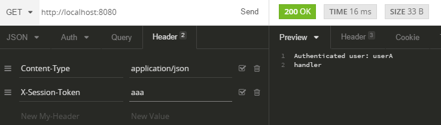
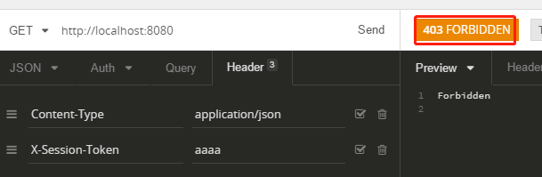

[golang常用库：gorilla/mux-http路由库使用](https://www.cnblogs.com/jiujuan/p/12768907.html)
[golang常用库：配置文件解析库/管理工具-viper使用](https://www.cnblogs.com/jiujuan/p/13799976.html)
[golang常用库：操作数据库的orm框架-gorm基本使用](https://www.cnblogs.com/jiujuan/p/12676195.html)

## 一：golang自带路由介绍

golang自带路由库 http.ServerMux ，实际上是一个 map[string]Handler，是请求的url路径和该url路径对于的一个处理函数的映射关系。这个实现比较简单，有一些缺点：

1. 不支持参数设定，例如/user/:uid 这种泛型类型匹配
1. 无法很友好的支持REST模式，无法限制访问方法（POST，GET等）
1. 也不支持正则


## 二：gorilla/mux路由

> github地址：[https://github.com/gorilla/mux](https://github.com/gorilla/mux)
>
> [http://www.gorillatoolkit.org/pkg/mux](http://www.gorillatoolkit.org/pkg/mux)
>
> https://github.com/gorilla/mux#examples


上面所指出来的glang自带路由的缺点，[gorilla/mux](https://github.com/gorilla/mux) 都具备，而且还兼容 http.ServerMux。除了支持路径正则，命名路由，还支持中间件等等功能。所以mux是一个短小精悍，功能很全的路由。

### 1. 普通路由

示例 demo1.go

```go
package main

import (
	"fmt"
	"github.com/gorilla/mux"
	"net/http"
)

func main() {
	r := mux.NewRouter()
	//普通路由
	r.HandleFunc("/", IndexHandler)
	r.HandleFunc("/products", ProductsHandler)

	http.ListenAndServe(":8080", r)
}

func IndexHandler(w http.ResponseWriter, r *http.Request) {
	w.WriteHeader(http.StatusOK)
	fmt.Fprintf(w, "hello world")
}

func ProductsHandler(w http.ResponseWriter, r *http.Request) {
	w.WriteHeader(http.StatusOK)
	fmt.Fprintf(w, "hello, Products")
}
```
上面mux的普通路由是不是似曾相识，跟golang标准库用法一样

在浏览器访问：[http://localhost:8080/products](http://localhost:8080/products)

输出：hello, Products

### 2. 参数路由

参数路由，可以是普通路由，还可以是正则匹配<br />示例 demo2.go：
```go
package main

import (
	"net/http"

	"fmt"

	"github.com/gorilla/mux"
)

//路由参数
func main() {
	r := mux.NewRouter()
	//1. 普通路由参数
	// r.HandleFunc("/articles/{title}", TitleHandler)

	//2. 正则路由参数，下面例子中限制为英文字母
	r.HandleFunc("/articles/{title:[a-z]+}", TitleHandler)

	http.ListenAndServe(":8080", r)
}

//https://github.com/gorilla/mux#examples
func TitleHandler(w http.ResponseWriter, r *http.Request) {
	vars := mux.Vars(r) // 获取参数
	w.WriteHeader(http.StatusOK)
	fmt.Fprintf(w, "title: %v\n", vars["title"])
}
```

第1个普通路由参数，就是啥参数都可以，不管是字母，数字，还是中文等<br />第2个正则路由参数，限制了只能是英文字母，否则会报 `404 page not found`

### 3. 路由匹配 Matching Routes

[https://github.com/gorilla/mux#matching-routes](https://github.com/gorilla/mux#matching-routes)<br />我们也可以限制路由或者子路由。

#### 3.1 匹配host

```go
r := mux.NewRouter()
//只匹配 www.example.com
r.Host("www.example.com")
// 动态匹配子路由
r.Host("{subdomain:[a-z]+}.example.com")
```

#### 3.2 更多的一些其他匹配

见下面的更多匹配的例子：

```go
r := mux.NewRouter()

r.PathPrefix("/products/")    //前缀匹配
r.Methods("GET", "POST")      //请求方法匹配
r.Schemes("https")            //schemes
r.Headers("X-Requested-With", "XMLHttpRequest")  //header 匹配
r.Queries("key", "value")  //query的值匹配

// 用户自定义方法 匹配
r.MatcherFunc(func(r *http.Request, rm *RouteMatch) bool { 
    return r.ProtoMajor == 0
})
```

<br />把上面的联合起来在一个单独的route里
```go
r.HandleFunc("/products", ProductsHandler).
  Host("www.example.com").
  Methods("GET").
  Schemes("http")
```


#### 3.3 子路由匹配

Subrouter() 可以设置子路由
```go
r := mux.NewRouter()
s := r.Host("www.example.com").Subrouter()

s.HandleFunc("/products/", ProductsHandler)
s.HandleFunc("/products/{key}", ProductHandler)
s.HandleFunc("/articles/{category}/{id:[0-9]+}", ArticleHandler)
```


#### 3.4 多个路由匹配的顺序

如果有多个路由添加到路由器里面，那么匹配顺序是怎么样？按照添加的先后顺序匹配。比如有2个路由都匹配了，那么优先匹配第一个路由。
```go
r := mux.NewRouter()
r.HandleFunc("/specific", specificHandler)
r.PathPrefix("/").Handler(catchAllHandler)
```

### 4. 设置路由前缀

PathPrefix() 设置路由前缀
```go
r := mux.NewRouter()

//PathPrefix() 可以设置路由前缀
product := r.PathPrefix("/products").HandleFunc("/", ProductsHandler)
```
> 路由前缀一般情况下不会单独使用，而是和子路由结合起来用，实现路由分组


### 5. 分组路由

可以根据前面的子路由和路由前缀的功能，综合运用就可以设置分组路由了。

实例：grouprouter.go
```go
package main

import (
	"fmt"
	"github.com/gorilla/mux"
	"net/http"
)

//子路由, 分组路由
func main() {
	r := mux.NewRouter()

	//PathPrefix() 可以设置路由前缀，设置路由前缀为products
	products := r.PathPrefix("/products").Subrouter()
	//"http://localhost:8080/products/", 最后面的斜线一定要，不然路由不正确，页面出现404
	products.HandleFunc("/", ProductsHandler)
	//"http://localhost:8080/products/{key}"
	products.HandleFunc("/{key}", ProductHandler)

	users := r.PathPrefix("/users").Subrouter()
	// "/users"
	users.HandleFunc("/", UsersHandler)
	// "/users/id/参数/name/参数"
	users.HandleFunc("/id/{id}/name/{name}", UserHandler)

	http.ListenAndServe(":8080", r)
}

func ProductsHandler(w http.ResponseWriter, r *http.Request) {
	w.WriteHeader(http.StatusOK)
	fmt.Fprintf(w, "%s", "products")
}

func ProductHandler(w http.ResponseWriter, r *http.Request) {
	vars := mux.Vars(r) //获取路由的值
	fmt.Fprintf(w, "key: %s", vars["key"])
}

func UsersHandler(w http.ResponseWriter, r *http.Request) {
	fmt.Fprintf(w, " %s \r\n", "users handler")
}

func UserHandler(w http.ResponseWriter, r *http.Request) {
	vars := mux.Vars(r) //获取值
	id := vars["id"]
	name := vars["name"]
	fmt.Fprintf(w, "id: %s, name: %s \r\n", id, name)
}

```

### 6. 路由中间件

[https://github.com/gorilla/mux#middleware](https://github.com/gorilla/mux#middleware)<br />Mux middlewares are defined using the de facto standard type: 在mux中路由中间件的定义
> type MiddlewareFunc func(http.Handler) http.Handler


#### 示例1：middleware1.go

```go
package main

import (
	"fmt"
	"net/http"

	"github.com/gorilla/mux"
)

func main() {
	r := mux.NewRouter()
	r.HandleFunc("/", handler)

	r.Use(loggingMiddleware)

	http.ListenAndServe(":8080", r)
}

func loggingMiddleware(next http.Handler) http.Handler {
	return http.HandlerFunc(func(w http.ResponseWriter, r *http.Request) {
		//Do stuff here
		fmt.Println(r.RequestURI)
		fmt.Fprintf(w, "%s\r\n", r.URL)
		// Call the next handler, which can be another middleware in the chain, or the final handler.
		next.ServeHTTP(w, r)
	})
}

func handler(w http.ResponseWriter, r *http.Request) {
	w.Write([]byte("handle middleware"))
	fmt.Println("print handler")
}
```

#### 示例2：middleware2.go

在来看一个复杂点的例子：
```go
package main

import (
	"fmt"
	"net/http"
	"strings"

	"github.com/gorilla/mux"
)

type authMiddleware struct {
	tokenUsers map[string]string
}

func (amw *authMiddleware) Populate() {
	amw.tokenUsers = make(map[string]string)
	amw.tokenUsers["000"] = "user0"
	amw.tokenUsers["aaa"] = "userA"
	amw.tokenUsers["05ft"] = "randomUser"
	amw.tokenUsers["deadbeef"] = "user0"
}

func (amw *authMiddleware) Middleware(next http.Handler) http.Handler {
	return http.HandlerFunc(func(w http.ResponseWriter, r *http.Request) {
		token := strings.Trim(r.Header.Get("X-Session-Token"), " ")
		if token == "" {
			fmt.Fprintf(w, "token is error \r\n")
		}

		if user, found := amw.tokenUsers[token]; found {
			//we found the token in out map
			fmt.Printf("Authenticated user: %s\n", user)
			fmt.Fprintf(w, "Authenticated user: %s\n", user)
			// Pass down the request to the next middleware (or final handler)
			next.ServeHTTP(w, r)
		} else {
			// Write an error and stop the handler chain
			http.Error(w, "Forbidden", http.StatusForbidden)
		}
	})
}

func main() {
	r := mux.NewRouter()
	r.HandleFunc("/", handler)

	amw := authMiddleware{}
	amw.Populate()

	r.Use(amw.Middleware)

	http.ListenAndServe(":8080", r)
}

func handler(w http.ResponseWriter, r *http.Request) {
	w.Write([]byte("handler"))
}

```

**用 insomnia 软件测试，如下图**：



X-Session-Token=aaa 返回时正确


那 -Session-Token=aaaa 呢




返回 403 了


### 7. Walking Routes 遍历注册的所有路由

```go
package main

import (
	"fmt"
	"net/http"
	"strings"

	"github.com/gorilla/mux"
)

func handler(w http.ResponseWriter, r *http.Request) {
	return
}

//https://github.com/gorilla/mux#walking-routes
func main() {
	r := mux.NewRouter()
	r.HandleFunc("/", handler)
	r.HandleFunc("/products", handler).Methods("POST")
	r.HandleFunc("/articles", handler).Methods("GET")
	r.HandleFunc("/articles/{id}", handler).Methods("GET", "PUT")
	r.HandleFunc("/authors", handler).Queries("surname", "{surname}")
	err := r.Walk(func(route *mux.Route, router *mux.Router, ancestors []*mux.Route) error {
		pathTemplate, err := route.GetPathTemplate()
		if err == nil {
			fmt.Println("ROUTE:", pathTemplate)
		}
		pathRegexp, err := route.GetPathRegexp()
		if err == nil {
			fmt.Println("Path regexp:", pathRegexp)
		}
		queriesTemplates, err := route.GetQueriesTemplates()
		if err == nil {
			fmt.Println("Queries templates:", strings.Join(queriesTemplates, ","))
		}
		queriesRegexps, err := route.GetQueriesRegexp()
		if err == nil {
			fmt.Println("Queries regexps:", strings.Join(queriesRegexps, ","))
		}
		methods, err := route.GetMethods()
		if err == nil {
			fmt.Println("Methods:", strings.Join(methods, ","))
		}
		fmt.Println()
		return nil
	})

	if err != nil {
		fmt.Println(err)
	}

	http.Handle("/", r)
	http.ListenAndServe(":8080", nil)
}

```

### 8. 其他示例

####    请求方法限制

demo3.go:
```go
package main

import (
	"fmt"
	"github.com/gorilla/mux"
	"net/http"
)

// 请求方法的限制, Methods()
func main() {
	r := mux.NewRouter()

	r.HandleFunc("/products", ProductsHandler).Methods("GET", "POST")

	r.Handle("/products/{id}", &ProductsIdHandler{}).Methods("GET")
	http.ListenAndServe(":8080", r)
}

func ProductsHandler(w http.ResponseWriter, r *http.Request) {
	w.WriteHeader(http.StatusOK)
	fmt.Fprintf(w, "hello, products! ")
}

type ProductsIdHandler struct{}

func (handler *ProductsIdHandler) ServeHTTP(w http.ResponseWriter, r *http.Request) {
	vars := mux.Vars(r)
	w.WriteHeader(http.StatusOK)
	fmt.Fprintf(w, "products id: %s", vars["id"])
}
```


####    请求头限制

在路由定义中可以通过Headers() 方法来限制设置请求头的匹配。

demo4.go

```go
package main

import (
	"fmt"
	"net/http"

	"github.com/gorilla/mux"
)

// 请求头的限制，用Headers() 来限制
func main() {
	r := mux.NewRouter()

	r.HandleFunc("/products", func(w http.ResponseWriter, r *http.Request) {
		header := "Request-Limit-Test"
		fmt.Fprintf(w, "contain headers: %s = %s \n", header, r.Header[header])
	}).Headers("Request-Limit-Test", "RequestLimitTest").Methods("POST")

	http.ListenAndServe(":8080", r)
}

```

####    自定义匹配规

用 MatcherFunc() 来自定义规则

示例 demo5.go：**

```go
package main

import (
	"fmt"
	"net/http"

	"github.com/gorilla/mux"
)

//自定义匹配 MatcherFunc()
func main() {
	r := mux.NewRouter()

	r.HandleFunc("/products/matcher", func(w http.ResponseWriter, r *http.Request) {
		fmt.Fprintf(w, "FormValue: %s ", r.FormValue("func"))
	}).MatcherFunc(func(req *http.Request, match *mux.RouteMatch) bool {
		b := false
		if req.FormValue("func") == "matcherfunc" {
			b = true
		}
		return b
	})

	http.ListenAndServe(":8080", r)
}
```


在浏览器中：[http://127.0.0.1:8080/products/matcher?func=matcherfunc](http://127.0.0.1:8080/products/matcher?func=matcherfunc)

输出：FormValue: matcherfunc 


####    命名路由 Registered URLs

namerouter.go
```go
package main

import (
	"fmt"
	"github.com/gorilla/mux"
	// "log"
	"net/http"
)

// 命名路由 Name(), 获取路由URL， URL()
func main() {
	r := mux.NewRouter()
	r.HandleFunc("/products/{category}/{id:[0-9]+}", ProductHandler).Name("product")

	//获取路由的URL
	url1, err := r.Get("product").URL()
	fmt.Println(err) //error: mux: number of parameters must be multiple of 2, got [/]
	if err == nil {
		fmt.Println("get URL: \r\n", url1)
	}

	//获取路由的url后，也可以拼装你需要的URL
	url2, err := r.Get("product").URL("category", "tech", "id", "13")
	if err == nil {
		fmt.Println("new url: ", url2) //new url:  /products/tech/13
	}

	http.ListenAndServe(":8080", r)
}

func ProductHandler(w http.ResponseWriter, r *http.Request) {
	w.WriteHeader(http.StatusOK)
	vars := mux.Vars(r)

	fmt.Fprintf(w, "url: %s, category: %s, id: %s", r.URL, vars["category"], vars["id"])
	//浏览器： http://localhost:8080/products/id/23

	//output
	//url: /products/id/23, category: id, id: 23
}
```

根据命名的路由来获取路由URL r.Get("product").URL()

------------

也欢迎到我的公众号继续讨论：[九卷沉思录-golang常用库：gorilla/mux-http路由库使用](https://mp.weixin.qq.com/s/yfISwce63TuPqxutk0bMSg)

## 三：参考

[https://github.com/gorilla/mux](https://github.com/gorilla/mux#middleware)