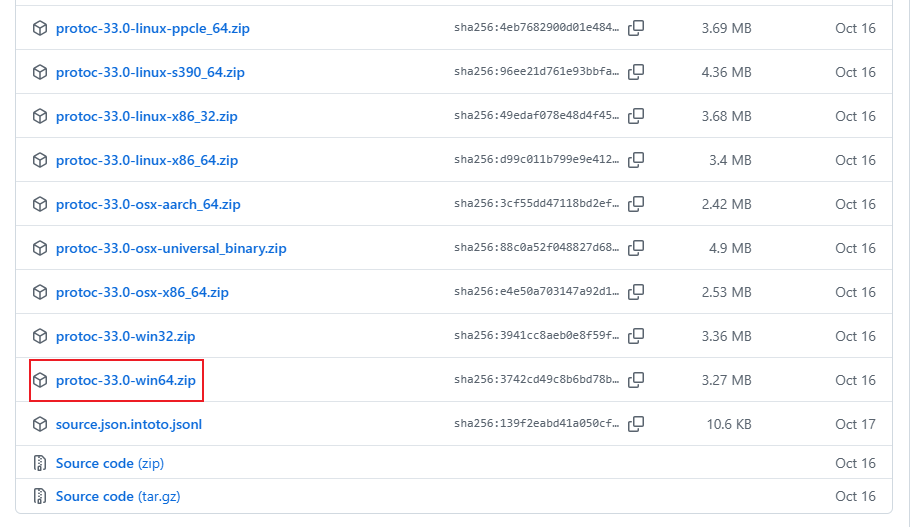
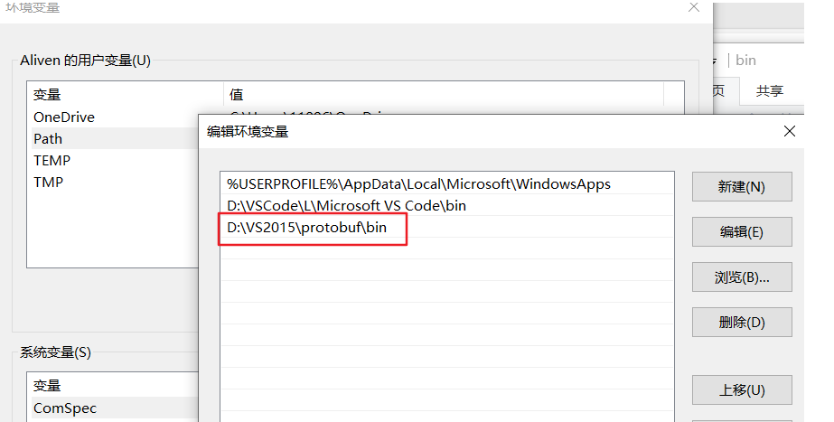

# Go gRPC 完整教程

## 目录
1. [安装环境](#安装环境)
2. [快速开始](#快速开始)
3. [核心概念](#核心概念)
4. [功能介绍](#功能介绍)
5. [深入使用](#深入使用)
6. [高级特性](#高级特性)
7. [实战示例](#实战示例)
8. [最佳实践](#最佳实践)
9. [常见问题](#常见问题)

---

## 安装环境

### 前置要求

在开始之前，确保你的系统已安装：
- Go 1.19 或更高版本
- Protocol Buffer 编译器（protoc）

### 安装步骤

**1. 安装 Protocol Buffer 编译器**

在 macOS 上使用 Homebrew：
```bash
brew install protobuf
```

在 Linux 上：
```bash
# Ubuntu/Debian
apt install -y protobuf-compiler

# 或从源码安装
PB_REL="https://github.com/protocolbuffers/protobuf/releases"
curl -LO $PB_REL/download/v21.12/protoc-21.12-linux-x86_64.zip
unzip protoc-21.12-linux-x86_64.zip -d $HOME/.local
export PATH="$PATH:$HOME/.local/bin"
```

验证安装：
```bash
protoc --version
```

在 windows 上：

到protobuf下载页面 https://github.com/protocolbuffers/protobuf/releases/ 下载对应的版本，我这里下载win版本



然后解压下载的zip文件，我把解压的文件 protoc-33.0-win64 放到 E 盘，并重新命名了，可以不重新命名。

E:\programfiles\protoc-win64

最后一步：设置 PATH 环境变量。

然后将这个地址复制到用户的环境变量，如下图（别人设置环境变量的图）



通过 `protoc --version` 指令来查看是否配置成功

**2. 安装 Go 插件**

```bash
go install google.golang.org/protobuf/cmd/protoc-gen-go@latest
go install google.golang.org/grpc/cmd/protoc-gen-go-grpc@latest
```

**3. 更新 PATH 环境变量**

确保 Go 的 bin 目录在你的 PATH 中：
```bash
export PATH="$PATH:$(go env GOPATH)/bin"
```

**4. 安装 gRPC Go 库**

在你的项目中：
```bash
go get -u google.golang.org/grpc
go get -u google.golang.org/protobuf
```

---

## 快速开始

让我们创建一个简单的 gRPC 服务，实现一个问候服务。

### 第一步：项目结构

```
grpc-hello/
├── proto/
│   └── hello.proto
├── server/
│   └── main.go
├── client/
│   └── main.go
└── go.mod
```

### 第二步：定义 Protocol Buffer

创建 `proto/hello.proto`：

```protobuf
syntax = "proto3";

package hello;

option go_package = "grpc-hello/proto";

// 定义问候服务
service Greeter {
  // 发送问候
  rpc SayHello (HelloRequest) returns (HelloReply) {}
}

// 请求消息
message HelloRequest {
  string name = 1;
}

// 响应消息
message HelloReply {
  string message = 1;
}
```

### 第三步：生成代码

```bash
protoc --go_out=. --go_opt=paths=source_relative \
    --go-grpc_out=. --go-grpc_opt=paths=source_relative \
    proto/hello.proto
```

这会生成两个文件：
- `hello.pb.go` - 包含消息类型
- `hello_grpc.pb.go` - 包含服务接口

### 第四步：实现服务端

创建 `server/main.go`：

```go
package main

import (
    "context"
    "fmt"
    "log"
    "net"

    pb "grpc-hello/proto"
    "google.golang.org/grpc"
)

// 服务实现
type server struct {
    pb.UnimplementedGreeterServer
}

// 实现 SayHello 方法
func (s *server) SayHello(ctx context.Context, in *pb.HelloRequest) (*pb.HelloReply, error) {
    log.Printf("收到请求: %v", in.GetName())
    return &pb.HelloReply{Message: "你好 " + in.GetName()}, nil
}

func main() {
    // 监听端口
    lis, err := net.Listen("tcp", ":50051")
    if err != nil {
        log.Fatalf("监听失败: %v", err)
    }

    // 创建 gRPC 服务器
    s := grpc.NewServer()
    
    // 注册服务
    pb.RegisterGreeterServer(s, &server{})
    
    fmt.Println("服务器启动在端口 :50051")
    
    // 启动服务
    if err := s.Serve(lis); err != nil {
        log.Fatalf("服务启动失败: %v", err)
    }
}
```

### 第五步：实现客户端

创建 `client/main.go`：

```go
package main

import (
    "context"
    "log"
    "time"

    pb "grpc-hello/proto"
    "google.golang.org/grpc"
    "google.golang.org/grpc/credentials/insecure"
)

func main() {
    // 连接服务器
    conn, err := grpc.Dial("localhost:50051", 
        grpc.WithTransportCredentials(insecure.NewCredentials()))
    if err != nil {
        log.Fatalf("连接失败: %v", err)
    }
    defer conn.Close()

    // 创建客户端
    c := pb.NewGreeterClient(conn)

    // 设置超时
    ctx, cancel := context.WithTimeout(context.Background(), time.Second)
    defer cancel()

    // 调用远程方法
    r, err := c.SayHello(ctx, &pb.HelloRequest{Name: "世界"})
    if err != nil {
        log.Fatalf("调用失败: %v", err)
    }
    
    log.Printf("响应: %s", r.GetMessage())
}
```

### 第六步：运行

初始化模块：
```bash
go mod init grpc-hello
go mod tidy
```

启动服务器：
```bash
go run server/main.go
```

在另一个终端运行客户端：
```bash
go run client/main.go
```

你应该看到输出：`响应: 你好 世界`

---

## 核心概念

### Protocol Buffers

Protocol Buffers（protobuf）是 Google 开发的一种语言中立、平台中立的序列化结构数据的方法。它比 JSON 和 XML 更小、更快、更简单。

**主要特点：**
- 强类型系统
- 高效的序列化和反序列化
- 向后兼容和向前兼容
- 支持多种编程语言

### gRPC 通信模式

gRPC 支持四种通信模式：

**1. 一元 RPC（Unary RPC）**

客户端发送单个请求，服务端返回单个响应，类似普通函数调用。

```protobuf
rpc SayHello(HelloRequest) returns (HelloReply) {}
```

**2. 服务端流式 RPC（Server Streaming RPC）**

客户端发送单个请求，服务端返回一个数据流。客户端从流中读取消息序列，直到没有更多消息。

```protobuf
rpc ListFeatures(Rectangle) returns (stream Feature) {}
```

**3. 客户端流式 RPC（Client Streaming RPC）**

客户端发送一个消息序列给服务端。一旦客户端完成消息写入，它等待服务端读取所有消息并返回响应。

```protobuf
rpc RecordRoute(stream Point) returns (RouteSummary) {}
```

**4. 双向流式 RPC（Bidirectional Streaming RPC）**

双方都使用读写流发送消息序列。两个流独立操作，客户端和服务端可以按任意顺序读写。

```protobuf
rpc RouteChat(stream RouteNote) returns (stream RouteNote) {}
```

### HTTP/2 协议

gRPC 构建在 HTTP/2 之上，带来以下优势：
- 二进制传输
- 多路复用（在单个连接上并发多个请求）
- 头部压缩
- 服务端推送
- 流量控制

### 元数据（Metadata）

元数据是关于特定 RPC 调用的键值对信息（如认证令牌），以 HTTP 头的形式在客户端和服务器之间传输。

### 拦截器（Interceptors）

拦截器类似于中间件，可以在 RPC 调用前后执行逻辑，用于日志记录、认证、监控等。

---

## 功能介绍

### 错误处理

gRPC 使用状态码来表示 RPC 调用的结果：

```go
import (
    "google.golang.org/grpc/codes"
    "google.golang.org/grpc/status"
)

func (s *server) GetUser(ctx context.Context, req *pb.GetUserRequest) (*pb.User, error) {
    if req.Id == "" {
        return nil, status.Error(codes.InvalidArgument, "用户ID不能为空")
    }
    
    user := findUser(req.Id)
    if user == nil {
        return nil, status.Error(codes.NotFound, "用户不存在")
    }
    
    return user, nil
}
```

客户端处理错误：

```go
resp, err := client.GetUser(ctx, req)
if err != nil {
    st, ok := status.FromError(err)
    if ok {
        log.Printf("错误码: %v, 消息: %v", st.Code(), st.Message())
    }
}
```

### 超时和截止时间

设置请求超时：

```go
ctx, cancel := context.WithTimeout(context.Background(), 5*time.Second)
defer cancel()

resp, err := client.SayHello(ctx, req)
```

### 重试机制

配置服务级别的重试：

```go
retryPolicy := `{
    "methodConfig": [{
        "name": [{"service": "hello.Greeter"}],
        "retryPolicy": {
            "MaxAttempts": 4,
            "InitialBackoff": ".01s",
            "MaxBackoff": ".01s",
            "BackoffMultiplier": 1.0,
            "RetryableStatusCodes": [ "UNAVAILABLE" ]
        }
    }]
}`

conn, err := grpc.Dial(
    address,
    grpc.WithDefaultServiceConfig(retryPolicy),
)
```

### 健康检查

实现标准的健康检查协议：

```go
import "google.golang.org/grpc/health/grpc_health_v1"

healthServer := health.NewServer()
grpc_health_v1.RegisterHealthServer(s, healthServer)
healthServer.SetServingStatus("", grpc_health_v1.HealthCheckResponse_SERVING)
```

---

## 深入使用

### 流式 RPC 详解

**服务端流式示例：**

定义服务：
```protobuf
service NumberService {
  rpc GetNumbers(NumberRequest) returns (stream NumberResponse) {}
}

message NumberRequest {
  int32 max = 1;
}

message NumberResponse {
  int32 number = 1;
}
```

服务端实现：
```go
func (s *server) GetNumbers(req *pb.NumberRequest, stream pb.NumberService_GetNumbersServer) error {
    for i := int32(1); i <= req.Max; i++ {
        if err := stream.Send(&pb.NumberResponse{Number: i}); err != nil {
            return err
        }
        time.Sleep(time.Second) // 模拟处理
    }
    return nil
}
```

客户端接收：
```go
stream, err := client.GetNumbers(ctx, &pb.NumberRequest{Max: 10})
if err != nil {
    log.Fatal(err)
}

for {
    resp, err := stream.Recv()
    if err == io.EOF {
        break
    }
    if err != nil {
        log.Fatal(err)
    }
    log.Printf("收到数字: %d", resp.Number)
}
```

**客户端流式示例：**

```go
// 服务端
func (s *server) RecordNumbers(stream pb.NumberService_RecordNumbersServer) error {
    var sum int32
    for {
        req, err := stream.Recv()
        if err == io.EOF {
            return stream.SendAndClose(&pb.SumResponse{Sum: sum})
        }
        if err != nil {
            return err
        }
        sum += req.Number
    }
}

// 客户端
stream, err := client.RecordNumbers(ctx)
if err != nil {
    log.Fatal(err)
}

numbers := []int32{1, 2, 3, 4, 5}
for _, num := range numbers {
    if err := stream.Send(&pb.NumberRequest{Number: num}); err != nil {
        log.Fatal(err)
    }
}

resp, err := stream.CloseAndRecv()
if err != nil {
    log.Fatal(err)
}
log.Printf("总和: %d", resp.Sum)
```

**双向流式示例：**

```go
// 服务端
func (s *server) Chat(stream pb.ChatService_ChatServer) error {
    for {
        msg, err := stream.Recv()
        if err == io.EOF {
            return nil
        }
        if err != nil {
            return err
        }
        
        reply := &pb.ChatMessage{
            User: "服务器",
            Text: "收到: " + msg.Text,
        }
        
        if err := stream.Send(reply); err != nil {
            return err
        }
    }
}

// 客户端
stream, err := client.Chat(ctx)
if err != nil {
    log.Fatal(err)
}

// 发送 goroutine
go func() {
    messages := []string{"你好", "这是测试", "再见"}
    for _, msg := range messages {
        if err := stream.Send(&pb.ChatMessage{
            User: "客户端",
            Text: msg,
        }); err != nil {
            log.Fatal(err)
        }
        time.Sleep(time.Second)
    }
    stream.CloseSend()
}()

// 接收 goroutine
for {
    msg, err := stream.Recv()
    if err == io.EOF {
        break
    }
    if err != nil {
        log.Fatal(err)
    }
    log.Printf("%s: %s", msg.User, msg.Text)
}
```

### 元数据使用

**发送元数据（客户端）：**

```go
import "google.golang.org/grpc/metadata"

md := metadata.Pairs(
    "authorization", "Bearer token123",
    "user-id", "12345",
)
ctx := metadata.NewOutgoingContext(context.Background(), md)

resp, err := client.SayHello(ctx, req)
```

**接收元数据（服务端）：**

```go
func (s *server) SayHello(ctx context.Context, req *pb.HelloRequest) (*pb.HelloReply, error) {
    md, ok := metadata.FromIncomingContext(ctx)
    if !ok {
        return nil, status.Error(codes.Internal, "无法获取元数据")
    }
    
    if auth := md.Get("authorization"); len(auth) > 0 {
        log.Printf("认证令牌: %s", auth[0])
    }
    
    // 发送响应元数据
    header := metadata.Pairs("response-header", "value")
    grpc.SendHeader(ctx, header)
    
    return &pb.HelloReply{Message: "你好"}, nil
}
```

### 拦截器实现

**服务端拦截器：**

```go
// 一元拦截器
func unaryInterceptor(ctx context.Context, req interface{}, info *grpc.UnaryServerInfo, 
    handler grpc.UnaryHandler) (interface{}, error) {
    
    start := time.Now()
    
    // 调用前逻辑
    log.Printf("开始调用方法: %s", info.FullMethod)
    
    // 调用实际的 RPC 方法
    resp, err := handler(ctx, req)
    
    // 调用后逻辑
    log.Printf("方法完成: %s, 耗时: %v", info.FullMethod, time.Since(start))
    
    return resp, err
}

// 流式拦截器
func streamInterceptor(srv interface{}, ss grpc.ServerStream, info *grpc.StreamServerInfo,
    handler grpc.StreamHandler) error {
    
    log.Printf("开始流式调用: %s", info.FullMethod)
    
    err := handler(srv, ss)
    
    log.Printf("流式调用完成: %s", info.FullMethod)
    
    return err
}

// 创建服务器时添加拦截器
s := grpc.NewServer(
    grpc.UnaryInterceptor(unaryInterceptor),
    grpc.StreamInterceptor(streamInterceptor),
)
```

**客户端拦截器：**

```go
func clientInterceptor(ctx context.Context, method string, req, reply interface{},
    cc *grpc.ClientConn, invoker grpc.UnaryInvoker, opts ...grpc.CallOption) error {
    
    start := time.Now()
    
    log.Printf("调用方法: %s", method)
    
    err := invoker(ctx, method, req, reply, cc, opts...)
    
    log.Printf("方法完成: %s, 耗时: %v", method, time.Since(start))
    
    return err
}

conn, err := grpc.Dial(
    address,
    grpc.WithUnaryInterceptor(clientInterceptor),
)
```

---

## 高级特性

### TLS 安全连接

**服务端配置 TLS：**

```go
import (
    "crypto/tls"
    "google.golang.org/grpc/credentials"
)

// 加载证书
creds, err := credentials.NewServerTLSFromFile("server.crt", "server.key")
if err != nil {
    log.Fatal(err)
}

// 创建安全服务器
s := grpc.NewServer(grpc.Creds(creds))
```

**客户端连接 TLS：**

```go
creds, err := credentials.NewClientTLSFromFile("server.crt", "")
if err != nil {
    log.Fatal(err)
}

conn, err := grpc.Dial(address, grpc.WithTransportCredentials(creds))
```

### 认证授权

**Token 认证实现：**

```go
type TokenAuth struct {
    token string
}

func (t TokenAuth) GetRequestMetadata(ctx context.Context, uri ...string) (map[string]string, error) {
    return map[string]string{
        "authorization": "Bearer " + t.token,
    }, nil
}

func (TokenAuth) RequireTransportSecurity() bool {
    return true
}

// 客户端使用
conn, err := grpc.Dial(
    address,
    grpc.WithPerRPCCredentials(TokenAuth{token: "your-token"}),
)
```

**服务端验证：**

```go
func authInterceptor(ctx context.Context, req interface{}, info *grpc.UnaryServerInfo,
    handler grpc.UnaryHandler) (interface{}, error) {
    
    md, ok := metadata.FromIncomingContext(ctx)
    if !ok {
        return nil, status.Error(codes.Unauthenticated, "缺少元数据")
    }
    
    auth := md.Get("authorization")
    if len(auth) == 0 {
        return nil, status.Error(codes.Unauthenticated, "缺少认证令牌")
    }
    
    if !validateToken(auth[0]) {
        return nil, status.Error(codes.Unauthenticated, "无效的令牌")
    }
    
    return handler(ctx, req)
}
```

### 负载均衡

**客户端负载均衡：**

```go
import _ "google.golang.org/grpc/balancer/roundrobin"

conn, err := grpc.Dial(
    "dns:///my-service.example.com",
    grpc.WithDefaultServiceConfig(`{"loadBalancingPolicy":"round_robin"}`),
)
```

### 连接池

```go
type ConnectionPool struct {
    target string
    size   int
    conns  []*grpc.ClientConn
    next   uint32
}

func NewConnectionPool(target string, size int) (*ConnectionPool, error) {
    pool := &ConnectionPool{
        target: target,
        size:   size,
        conns:  make([]*grpc.ClientConn, size),
    }
    
    for i := 0; i < size; i++ {
        conn, err := grpc.Dial(target, grpc.WithTransportCredentials(insecure.NewCredentials()))
        if err != nil {
            return nil, err
        }
        pool.conns[i] = conn
    }
    
    return pool, nil
}

func (p *ConnectionPool) GetConn() *grpc.ClientConn {
    n := atomic.AddUint32(&p.next, 1)
    return p.conns[n%uint32(p.size)]
}

func (p *ConnectionPool) Close() {
    for _, conn := range p.conns {
        conn.Close()
    }
}
```

### gRPC 网关（REST API）

使用 grpc-gateway 将 gRPC 服务暴露为 REST API：

```protobuf
import "google/api/annotations.proto";

service Greeter {
  rpc SayHello (HelloRequest) returns (HelloReply) {
    option (google.api.http) = {
      post: "/v1/hello"
      body: "*"
    };
  }
}
```

### 反射服务

启用服务器反射，允许客户端在运行时发现服务：

```go
import "google.golang.org/grpc/reflection"

s := grpc.NewServer()
pb.RegisterGreeterServer(s, &server{})

// 注册反射服务
reflection.Register(s)
```

---

## 实战示例

### 微服务示例：用户管理系统

**proto 定义：**

```protobuf
syntax = "proto3";

package user;

option go_package = "user-service/proto";

service UserService {
  rpc CreateUser(CreateUserRequest) returns (User) {}
  rpc GetUser(GetUserRequest) returns (User) {}
  rpc UpdateUser(UpdateUserRequest) returns (User) {}
  rpc DeleteUser(DeleteUserRequest) returns (DeleteUserResponse) {}
  rpc ListUsers(ListUsersRequest) returns (stream User) {}
}

message User {
  string id = 1;
  string name = 2;
  string email = 3;
  int64 created_at = 4;
}

message CreateUserRequest {
  string name = 1;
  string email = 2;
}

message GetUserRequest {
  string id = 1;
}

message UpdateUserRequest {
  string id = 1;
  string name = 2;
  string email = 3;
}

message DeleteUserRequest {
  string id = 1;
}

message DeleteUserResponse {
  bool success = 1;
}

message ListUsersRequest {
  int32 page_size = 1;
  string page_token = 2;
}
```

**服务实现：**

```go
package main

import (
    "context"
    "fmt"
    "log"
    "net"
    "sync"
    "time"

    pb "user-service/proto"
    "github.com/google/uuid"
    "google.golang.org/grpc"
    "google.golang.org/grpc/codes"
    "google.golang.org/grpc/status"
)

type userServer struct {
    pb.UnimplementedUserServiceServer
    users map[string]*pb.User
    mu    sync.RWMutex
}

func newUserServer() *userServer {
    return &userServer{
        users: make(map[string]*pb.User),
    }
}

func (s *userServer) CreateUser(ctx context.Context, req *pb.CreateUserRequest) (*pb.User, error) {
    if req.Name == "" || req.Email == "" {
        return nil, status.Error(codes.InvalidArgument, "姓名和邮箱不能为空")
    }
    
    s.mu.Lock()
    defer s.mu.Unlock()
    
    user := &pb.User{
        Id:        uuid.New().String(),
        Name:      req.Name,
        Email:     req.Email,
        CreatedAt: time.Now().Unix(),
    }
    
    s.users[user.Id] = user
    
    log.Printf("创建用户: %v", user)
    return user, nil
}

func (s *userServer) GetUser(ctx context.Context, req *pb.GetUserRequest) (*pb.User, error) {
    s.mu.RLock()
    defer s.mu.RUnlock()
    
    user, ok := s.users[req.Id]
    if !ok {
        return nil, status.Error(codes.NotFound, "用户不存在")
    }
    
    return user, nil
}

func (s *userServer) UpdateUser(ctx context.Context, req *pb.UpdateUserRequest) (*pb.User, error) {
    s.mu.Lock()
    defer s.mu.Unlock()
    
    user, ok := s.users[req.Id]
    if !ok {
        return nil, status.Error(codes.NotFound, "用户不存在")
    }
    
    if req.Name != "" {
        user.Name = req.Name
    }
    if req.Email != "" {
        user.Email = req.Email
    }
    
    log.Printf("更新用户: %v", user)
    return user, nil
}

func (s *userServer) DeleteUser(ctx context.Context, req *pb.DeleteUserRequest) (*pb.DeleteUserResponse, error) {
    s.mu.Lock()
    defer s.mu.Unlock()
    
    if _, ok := s.users[req.Id]; !ok {
        return nil, status.Error(codes.NotFound, "用户不存在")
    }
    
    delete(s.users, req.Id)
    
    log.Printf("删除用户: %s", req.Id)
    return &pb.DeleteUserResponse{Success: true}, nil
}

func (s *userServer) ListUsers(req *pb.ListUsersRequest, stream pb.UserService_ListUsersServer) error {
    s.mu.RLock()
    defer s.mu.RUnlock()
    
    for _, user := range s.users {
        if err := stream.Send(user); err != nil {
            return err
        }
    }
    
    return nil
}

func main() {
    lis, err := net.Listen("tcp", ":50051")
    if err != nil {
        log.Fatalf("监听失败: %v", err)
    }
    
    s := grpc.NewServer()
    pb.RegisterUserServiceServer(s, newUserServer())
    
    fmt.Println("用户服务启动在端口 :50051")
    
    if err := s.Serve(lis); err != nil {
        log.Fatalf("服务启动失败: %v", err)
    }
}
```

### 带监控的服务

```go
import (
    "github.com/prometheus/client_golang/prometheus"
    "github.com/prometheus/client_golang/prometheus/promhttp"
)

var (
    requestCounter = prometheus.NewCounterVec(
        prometheus.CounterOpts{
            Name: "grpc_requests_total",
            Help: "gRPC 请求总数",
        },
        []string{"method", "status"},
    )
    
    requestDuration = prometheus.NewHistogramVec(
        prometheus.HistogramOpts{
            Name: "grpc_request_duration_seconds",
            Help: "gRPC 请求延迟",
        },
        []string{"method"},
    )
)

func init() {
    prometheus.MustRegister(requestCounter)
    prometheus.MustRegister(requestDuration)
}

func metricsInterceptor(ctx context.Context, req interface{}, info *grpc.UnaryServerInfo,
    handler grpc.UnaryHandler) (interface{}, error) {
    
    start := time.Now()
    
    resp, err := handler(ctx, req)
    
    duration := time.Since(start).Seconds()
    statusCode := "OK"
    if err != nil {
        statusCode = status.Code(err).String()
    }
    
    requestCounter.WithLabelValues(info.FullMethod, statusCode).Inc()
    requestDuration.WithLabelValues(info.FullMethod).Observe(duration)
    
    return resp, err
}

// 启动 Prometheus 指标服务器
go func() {
    http.Handle("/metrics", promhttp.Handler())
    http.ListenAndServe(":9090", nil)
}()
```

---

## 最佳实践

### 1. Proto 文件设计

**使用语义化版本控制**

在 package 名称中包含版本信息：
```protobuf
package myservice.v1;
option go_package = "github.com/mycompany/myservice/api/v1";
```

**保持向后兼容**

- 不要更改已有字段的编号
- 不要删除 required 字段（protobuf3 已移除 required）
- 使用 reserved 标记已删除的字段：
  ```protobuf
  message User {
    reserved 2, 15, 9 to 11;
    reserved "old_field", "deprecated_field";
    string name = 1;
    string email = 3;
  }
  ```

**合理的字段编号规划**

- 1-15：最常用字段（占用 1 字节编码）
- 16-2047：常用字段（占用 2 字节编码）
- 19000-19999：protobuf 保留，不可使用

```protobuf
message User {
  string id = 1;           // 最常访问
  string name = 2;         // 最常访问
  string email = 3;        // 最常访问
  int64 created_at = 16;   // 较少访问
  repeated string tags = 17;
}
```

**使用有意义的命名**

- 服务名使用名词，方法名使用动词
- 消息名使用 PascalCase
- 字段名使用 snake_case

```protobuf
service UserService {
  rpc CreateUser(CreateUserRequest) returns (CreateUserResponse) {}
  rpc GetUser(GetUserRequest) returns (GetUserResponse) {}
}

message CreateUserRequest {
  string user_name = 1;
  string email_address = 2;
}
```

**避免过度嵌套**

保持消息结构扁平化，避免深层嵌套：

```protobuf
// 不推荐
message Order {
  message Customer {
    message Address {
      message Street {
        string name = 1;
      }
    }
  }
}

// 推荐
message Street {
  string name = 1;
}

message Address {
  Street street = 1;
}

message Customer {
  Address address = 1;
}
```

### 2. 错误处理

**使用标准错误码**

```go
import (
    "google.golang.org/grpc/codes"
    "google.golang.org/grpc/status"
)

func (s *server) GetUser(ctx context.Context, req *pb.GetUserRequest) (*pb.User, error) {
    // 参数验证
    if req.Id == "" {
        return nil, status.Error(codes.InvalidArgument, "用户ID不能为空")
    }
    
    // 资源不存在
    user, err := s.db.FindUser(req.Id)
    if err == ErrNotFound {
        return nil, status.Error(codes.NotFound, "用户不存在")
    }
    
    // 权限检查
    if !hasPermission(ctx, user) {
        return nil, status.Error(codes.PermissionDenied, "无权访问该用户")
    }
    
    // 内部错误
    if err != nil {
        return nil, status.Error(codes.Internal, "服务器内部错误")
    }
    
    return user, nil
}
```

**提供详细的错误信息**

使用 status.Errorf 添加格式化的错误消息：

```go
return nil, status.Errorf(codes.InvalidArgument, 
    "无效的邮箱格式: %s", req.Email)
```

**使用错误详情**

对于需要返回结构化错误信息的场景：

```go
import (
    "google.golang.org/genproto/googleapis/rpc/errdetails"
)

st := status.New(codes.InvalidArgument, "请求参数验证失败")
br := &errdetails.BadRequest{}
br.FieldViolations = []*errdetails.BadRequest_FieldViolation{
    {
        Field:       "email",
        Description: "邮箱格式不正确",
    },
    {
        Field:       "name",
        Description: "名称不能为空",
    },
}

st, err := st.WithDetails(br)
if err != nil {
    return nil, status.Error(codes.Internal, "创建错误详情失败")
}

return nil, st.Err()
```

### 3. 上下文管理

**总是传递和检查 context**

```go
func (s *server) ProcessData(ctx context.Context, req *pb.Request) (*pb.Response, error) {
    // 检查上下文是否已取消
    select {
    case <-ctx.Done():
        return nil, status.Error(codes.Canceled, "请求已取消")
    default:
    }
    
    // 传递 context 到下游调用
    result, err := s.downstream.DoWork(ctx, req.Data)
    if err != nil {
        return nil, err
    }
    
    return &pb.Response{Result: result}, nil
}
```

**设置合理的超时**

```go
// 服务端：从请求中获取截止时间
func (s *server) LongRunningTask(ctx context.Context, req *pb.Request) (*pb.Response, error) {
    deadline, ok := ctx.Deadline()
    if ok {
        log.Printf("请求截止时间: %v", deadline)
    }
    
    // 创建带超时的子上下文
    ctx, cancel := context.WithTimeout(ctx, 30*time.Second)
    defer cancel()
    
    return s.processTask(ctx, req)
}

// 客户端：为不同操作设置不同超时
func createUser(client pb.UserServiceClient, req *pb.CreateUserRequest) error {
    ctx, cancel := context.WithTimeout(context.Background(), 5*time.Second)
    defer cancel()
    
    _, err := client.CreateUser(ctx, req)
    return err
}

func longQuery(client pb.UserServiceClient, req *pb.QueryRequest) error {
    ctx, cancel := context.WithTimeout(context.Background(), 30*time.Second)
    defer cancel()
    
    _, err := client.Query(ctx, req)
    return err
}
```

**传递请求级别的元数据**

```go
import "google.golang.org/grpc/metadata"

// 服务端：提取并传递追踪信息
func (s *server) HandleRequest(ctx context.Context, req *pb.Request) (*pb.Response, error) {
    md, ok := metadata.FromIncomingContext(ctx)
    if ok {
        if traceID := md.Get("trace-id"); len(traceID) > 0 {
            // 传递追踪ID到日志或下游服务
            ctx = context.WithValue(ctx, "trace-id", traceID[0])
        }
    }
    
    return s.process(ctx, req)
}
```

### 4. 连接管理

**复用连接**

gRPC 连接是长连接，应该复用而不是频繁创建：

```go
// 不推荐：每次调用都创建新连接
func callService() error {
    conn, err := grpc.Dial(address)
    if err != nil {
        return err
    }
    defer conn.Close()
    
    client := pb.NewServiceClient(conn)
    // 使用 client...
    return nil
}

// 推荐：复用连接
type Client struct {
    conn   *grpc.ClientConn
    client pb.ServiceClient
}

func NewClient(address string) (*Client, error) {
    conn, err := grpc.Dial(address,
        grpc.WithTransportCredentials(insecure.NewCredentials()),
        grpc.WithKeepaliveParams(keepalive.ClientParameters{
            Time:                10 * time.Second,
            Timeout:             3 * time.Second,
            PermitWithoutStream: true,
        }),
    )
    if err != nil {
        return nil, err
    }
    
    return &Client{
        conn:   conn,
        client: pb.NewServiceClient(conn),
    }, nil
}

func (c *Client) CallService() error {
    // 复用 client...
    return nil
}

func (c *Client) Close() error {
    return c.conn.Close()
}
```

**配置连接保活**

```go
var kacp = keepalive.ClientParameters{
    Time:                10 * time.Second, // 每10秒发送一次ping
    Timeout:             3 * time.Second,  // 3秒无响应认为连接失败
    PermitWithoutStream: true,             // 没有活动流时也发送ping
}

conn, err := grpc.Dial(
    address,
    grpc.WithKeepaliveParams(kacp),
)
```

**优雅关闭**

```go
func main() {
    lis, err := net.Listen("tcp", ":50051")
    if err != nil {
        log.Fatal(err)
    }
    
    s := grpc.NewServer()
    pb.RegisterServiceServer(s, &server{})
    
    // 监听系统信号
    sigChan := make(chan os.Signal, 1)
    signal.Notify(sigChan, os.Interrupt, syscall.SIGTERM)
    
    go func() {
        <-sigChan
        log.Println("收到关闭信号，开始优雅关闭...")
        
        // 停止接受新连接，等待现有请求完成
        s.GracefulStop()
        log.Println("服务器已关闭")
    }()
    
    log.Println("服务器启动在 :50051")
    if err := s.Serve(lis); err != nil {
        log.Fatalf("服务失败: %v", err)
    }
}
```

### 5. 性能优化

**使用连接池**

```go
type ClientPool struct {
    conns  []*grpc.ClientConn
    index  uint32
    target string
}

func NewClientPool(target string, size int) (*ClientPool, error) {
    pool := &ClientPool{
        conns:  make([]*grpc.ClientConn, size),
        target: target,
    }
    
    for i := 0; i < size; i++ {
        conn, err := grpc.Dial(target,
            grpc.WithTransportCredentials(insecure.NewCredentials()),
        )
        if err != nil {
            pool.Close()
            return nil, err
        }
        pool.conns[i] = conn
    }
    
    return pool, nil
}

func (p *ClientPool) Get() *grpc.ClientConn {
    idx := atomic.AddUint32(&p.index, 1) % uint32(len(p.conns))
    return p.conns[idx]
}

func (p *ClientPool) Close() error {
    for _, conn := range p.conns {
        if conn != nil {
            conn.Close()
        }
    }
    return nil
}
```

**批量操作**

对于需要多次调用的场景，考虑使用批量接口：

```protobuf
// 不推荐：单个操作
service UserService {
  rpc GetUser(GetUserRequest) returns (User) {}
}

// 推荐：批量操作
service UserService {
  rpc BatchGetUsers(BatchGetUsersRequest) returns (BatchGetUsersResponse) {}
}

message BatchGetUsersRequest {
  repeated string ids = 1;
}

message BatchGetUsersResponse {
  repeated User users = 1;
}
```

**流式处理大数据**

对于大量数据传输，使用流式 RPC：

```go
func (s *server) ExportUsers(req *pb.ExportRequest, stream pb.UserService_ExportUsersServer) error {
    // 分批查询和发送，避免一次性加载所有数据
    batchSize := 100
    offset := 0
    
    for {
        users, err := s.db.GetUsers(offset, batchSize)
        if err != nil {
            return status.Error(codes.Internal, "查询失败")
        }
        
        if len(users) == 0 {
            break
        }
        
        for _, user := range users {
            if err := stream.Send(user); err != nil {
                return err
            }
        }
        
        offset += batchSize
    }
    
    return nil
}
```

**消息压缩**

```go
import "google.golang.org/grpc/encoding/gzip"

// 客户端启用压缩
conn, err := grpc.Dial(
    address,
    grpc.WithDefaultCallOptions(grpc.UseCompressor(gzip.Name)),
)

// 服务端支持压缩
s := grpc.NewServer(
    grpc.MaxRecvMsgSize(10 * 1024 * 1024), // 10MB
    grpc.MaxSendMsgSize(10 * 1024 * 1024),
)
```

### 6. 日志和监控

**结构化日志**

```go
import (
    "go.uber.org/zap"
)

func loggingInterceptor(logger *zap.Logger) grpc.UnaryServerInterceptor {
    return func(ctx context.Context, req interface{}, info *grpc.UnaryServerInfo,
        handler grpc.UnaryHandler) (interface{}, error) {
        
        start := time.Now()
        
        // 从 context 提取追踪信息
        md, _ := metadata.FromIncomingContext(ctx)
        traceID := md.Get("trace-id")
        
        resp, err := handler(ctx, req)
        
        duration := time.Since(start)
        
        fields := []zap.Field{
            zap.String("method", info.FullMethod),
            zap.Duration("duration", duration),
        }
        
        if len(traceID) > 0 {
            fields = append(fields, zap.String("trace_id", traceID[0]))
        }
        
        if err != nil {
            st, _ := status.FromError(err)
            fields = append(fields,
                zap.String("error", st.Message()),
                zap.String("code", st.Code().String()),
            )
            logger.Error("RPC failed", fields...)
        } else {
            logger.Info("RPC completed", fields...)
        }
        
        return resp, err
    }
}
```

**追踪和监控**

集成 OpenTelemetry：

```go
import (
    "go.opentelemetry.io/contrib/instrumentation/google.golang.org/grpc/otelgrpc"
)

// 服务端
s := grpc.NewServer(
    grpc.StatsHandler(otelgrpc.NewServerHandler()),
)

// 客户端
conn, err := grpc.Dial(
    address,
    grpc.WithStatsHandler(otelgrpc.NewClientHandler()),
)
```

**Prometheus 指标**

```go
import (
    grpc_prometheus "github.com/grpc-ecosystem/go-grpc-prometheus"
)

// 服务端
s := grpc.NewServer(
    grpc.UnaryInterceptor(grpc_prometheus.UnaryServerInterceptor),
    grpc.StreamInterceptor(grpc_prometheus.StreamServerInterceptor),
)

grpc_prometheus.Register(s)

// 启动 metrics 端点
http.Handle("/metrics", promhttp.Handler())
go http.ListenAndServe(":9092", nil)
```

### 7. 测试

**单元测试**

```go
import (
    "testing"
    "google.golang.org/grpc"
    "google.golang.org/grpc/test/bufconn"
)

const bufSize = 1024 * 1024

var lis *bufconn.Listener

func init() {
    lis = bufconn.Listen(bufSize)
    s := grpc.NewServer()
    pb.RegisterGreeterServer(s, &server{})
    go func() {
        if err := s.Serve(lis); err != nil {
            log.Fatal(err)
        }
    }()
}

func bufDialer(context.Context, string) (net.Conn, error) {
    return lis.Dial()
}

func TestSayHello(t *testing.T) {
    ctx := context.Background()
    conn, err := grpc.DialContext(ctx, "bufnet",
        grpc.WithContextDialer(bufDialer),
        grpc.WithTransportCredentials(insecure.NewCredentials()),
    )
    if err != nil {
        t.Fatalf("Failed to dial bufnet: %v", err)
    }
    defer conn.Close()
    
    client := pb.NewGreeterClient(conn)
    
    resp, err := client.SayHello(ctx, &pb.HelloRequest{Name: "测试"})
    if err != nil {
        t.Fatalf("SayHello failed: %v", err)
    }
    
    if resp.Message != "你好 测试" {
        t.Errorf("期望 '你好 测试', 得到 '%s'", resp.Message)
    }
}
```

**Mock 测试**

使用 gomock 生成 mock：

```bash
mockgen -source=proto/service_grpc.pb.go -destination=mocks/mock_service.go
```

```go
import (
    "testing"
    "github.com/golang/mock/gomock"
    "your-project/mocks"
)

func TestBusinessLogic(t *testing.T) {
    ctrl := gomock.NewController(t)
    defer ctrl.Finish()
    
    mockClient := mocks.NewMockGreeterClient(ctrl)
    
    // 设置期望
    mockClient.EXPECT().
        SayHello(gomock.Any(), &pb.HelloRequest{Name: "测试"}).
        Return(&pb.HelloReply{Message: "你好 测试"}, nil)
    
    // 使用 mock 测试业务逻辑
    result := businessLogic(mockClient)
    
    if result != "你好 测试" {
        t.Errorf("期望 '你好 测试', 得到 '%s'", result)
    }
}
```

### 8. 安全性

**启用 TLS/mTLS**

```go
// 服务端：双向 TLS
cert, err := tls.LoadX509KeyPair("server.crt", "server.key")
if err != nil {
    log.Fatal(err)
}

certPool := x509.NewCertPool()
ca, err := ioutil.ReadFile("ca.crt")
if err != nil {
    log.Fatal(err)
}
certPool.AppendCertsFromPEM(ca)

creds := credentials.NewTLS(&tls.Config{
    ClientAuth:   tls.RequireAndVerifyClientCert,
    Certificates: []tls.Certificate{cert},
    ClientCAs:    certPool,
})

s := grpc.NewServer(grpc.Creds(creds))
```

**实现认证拦截器**

```go
func authInterceptor(ctx context.Context, req interface{}, info *grpc.UnaryServerInfo,
    handler grpc.UnaryHandler) (interface{}, error) {
    
    // 跳过某些方法的认证
    if info.FullMethod == "/health.Health/Check" {
        return handler(ctx, req)
    }
    
    md, ok := metadata.FromIncomingContext(ctx)
    if !ok {
        return nil, status.Error(codes.Unauthenticated, "缺少元数据")
    }
    
    token := md.Get("authorization")
    if len(token) == 0 {
        return nil, status.Error(codes.Unauthenticated, "缺少认证令牌")
    }
    
    // 验证令牌
    claims, err := validateJWT(token[0])
    if err != nil {
        return nil, status.Error(codes.Unauthenticated, "无效的令牌")
    }
    
    // 将用户信息添加到 context
    ctx = context.WithValue(ctx, "user", claims.UserID)
    
    return handler(ctx, req)
}
```

**限流**

```go
import "golang.org/x/time/rate"

type rateLimitInterceptor struct {
    limiter *rate.Limiter
}

func newRateLimitInterceptor(r rate.Limit, b int) *rateLimitInterceptor {
    return &rateLimitInterceptor{
        limiter: rate.NewLimiter(r, b),
    }
}

func (r *rateLimitInterceptor) Unary() grpc.UnaryServerInterceptor {
    return func(ctx context.Context, req interface{}, info *grpc.UnaryServerInfo,
        handler grpc.UnaryHandler) (interface{}, error) {
        
        if !r.limiter.Allow() {
            return nil, status.Error(codes.ResourceExhausted, "请求过于频繁")
        }
        
        return handler(ctx, req)
    }
}

// 使用
rateLimiter := newRateLimitInterceptor(100, 200) // 每秒100个请求，突发200
s := grpc.NewServer(
    grpc.UnaryInterceptor(rateLimiter.Unary()),
)
```

### 9. 代码组织

**推荐的项目结构**

```
my-grpc-service/
├── api/
│   └── v1/
│       ├── service.proto
│       ├── service.pb.go
│       └── service_grpc.pb.go
├── cmd/
│   ├── server/
│   │   └── main.go
│   └── client/
│       └── main.go
├── internal/
│   ├── server/
│   │   ├── server.go
│   │   └── handlers.go
│   ├── service/
│   │   └── business_logic.go
│   └── repository/
│       └── database.go
├── pkg/
│   ├── interceptors/
│   │   ├── auth.go
│   │   └── logging.go
│   └── middleware/
├── configs/
│   └── config.yaml
├── scripts/
│   └── generate.sh
├── go.mod
└── go.sum
```

**分离关注点**

```go
// internal/service/user_service.go - 业务逻辑
type UserService struct {
    repo UserRepository
}

func (s *UserService) CreateUser(ctx context.Context, name, email string) (*User, error) {
    // 业务逻辑和验证
    if !isValidEmail(email) {
        return nil, errors.New("无效的邮箱")
    }
    
    return s.repo.Save(ctx, &User{Name: name, Email: email})
}

// internal/server/grpc_server.go - gRPC 层
type grpcServer struct {
    pb.UnimplementedUserServiceServer
    service *service.UserService
}

func (s *grpcServer) CreateUser(ctx context.Context, req *pb.CreateUserRequest) (*pb.User, error) {
    // 将 protobuf 转换为领域模型
    user, err := s.service.CreateUser(ctx, req.Name, req.Email)
    if err != nil {
        return nil, status.Error(codes.InvalidArgument, err.Error())
    }
    
    // 将领域模型转换为 protobuf
    return &pb.User{
        Id:    user.ID,
        Name:  user.Name,
        Email: user.Email,
    }, nil
}
```

### 10. 配置管理

**使用配置文件**

```go
type Config struct {
    Server struct {
        Port            int           `yaml:"port"`
        MaxConnections  int           `yaml:"max_connections"`
        ReadTimeout     time.Duration `yaml:"read_timeout"`
        WriteTimeout    time.Duration `yaml:"write_timeout"`
    } `yaml:"server"`
    
    Database struct {
        Host     string `yaml:"host"`
        Port     int    `yaml:"port"`
        Username string `yaml:"username"`
        Password string `yaml:"password"`
    } `yaml:"database"`
    
    TLS struct {
        Enabled  bool   `yaml:"enabled"`
        CertFile string `yaml:"cert_file"`
        KeyFile  string `yaml:"key_file"`
    } `yaml:"tls"`
}

func LoadConfig(path string) (*Config, error) {
    data, err := ioutil.ReadFile(path)
    if err != nil {
        return nil, err
    }
    
    var config Config
    if err := yaml.Unmarshal(data, &config); err != nil {
        return nil, err
    }
    
    return &config, nil
}
```

**环境变量优先**

```go
func (c *Config) ApplyEnvOverrides() {
    if port := os.Getenv("SERVER_PORT"); port != "" {
        if p, err := strconv.Atoi(port); err == nil {
            c.Server.Port = p
        }
    }
    
    if dbHost := os.Getenv("DB_HOST"); dbHost != "" {
        c.Database.Host = dbHost
    }
}
```

---

## 常见问题

### 1. 连接问题

**问题：连接超时或连接被拒绝**

解决方案：
- 检查服务器是否正在运行
- 验证端口和地址是否正确
- 检查防火墙设置
- 使用健康检查验证服务状态

```go
conn, err := grpc.Dial(
    address,
    grpc.WithTransportCredentials(insecure.NewCredentials()),
    grpc.WithBlock(),
    grpc.WithTimeout(5*time.Second),
)
```

### 2. 消息大小限制

**问题：`ResourceExhausted desc = grpc: received message larger than max`**

解决方案：调整消息大小限制

```go
// 服务端
s := grpc.NewServer(
    grpc.MaxRecvMsgSize(10 * 1024 * 1024), // 10MB
    grpc.MaxSendMsgSize(10 * 1024 * 1024),
)

// 客户端
conn, err := grpc.Dial(
    address,
    grpc.WithDefaultCallOptions(
        grpc.MaxCallRecvMsgSize(10 * 1024 * 1024),
        grpc.MaxCallSendMsgSize(10 * 1024 * 1024),
    ),
)
```

### 3. 流式 RPC 中的错误处理

**问题：如何在流式 RPC 中正确处理错误**

解决方案：
```go
// 服务端
func (s *server) StreamData(req *pb.Request, stream pb.Service_StreamDataServer) error {
    for i := 0; i < 10; i++ {
        if err := stream.Send(&pb.Data{Value: i}); err != nil {
            // 返回错误会终止流
            return status.Error(codes.Internal, "发送失败")
        }
    }
    return nil // 正常结束流
}

// 客户端
stream, err := client.StreamData(ctx, req)
if err != nil {
    log.Fatal(err)
}

for {
    data, err := stream.Recv()
    if err == io.EOF {
        // 流正常结束
        break
    }
    if err != nil {
        // 处理错误
        st, ok := status.FromError(err)
        if ok {
            log.Printf("错误: %v", st.Message())
        }
        break
    }
    // 处理数据
}
```

### 4. Context 取消传播

**问题：取消请求后下游服务仍在执行**

解决方案：确保正确传播 context

```go
func (s *server) ProcessRequest(ctx context.Context, req *pb.Request) (*pb.Response, error) {
    // 检查 context 是否已取消
    select {
    case <-ctx.Done():
        return nil, ctx.Err()
    default:
    }
    
    // 传递 context 到下游
    result, err := s.downstream.DoWork(ctx, req.Data)
    if err != nil {
        return nil, err
    }
    
    return &pb.Response{Result: result}, nil
}
```

### 5. 生成的代码冲突

**问题：`proto` 文件更改后生成的代码不一致**

解决方案：
- 使用统一的 protoc 版本
- 在项目中固定插件版本
- 创建生成脚本

```bash
#!/bin/bash
# scripts/generate.sh

PROTOC_VERSION="3.21.12"
PROTOC_GEN_GO_VERSION="v1.28.1"
PROTOC_GEN_GO_GRPC_VERSION="v1.2.0"

protoc --go_out=. --go_opt=paths=source_relative \
    --go-grpc_out=. --go-grpc_opt=paths=source_relative \
    api/v1/*.proto
```

### 6. 内存泄漏

**问题：长时间运行后内存持续增长**

常见原因和解决方案：
- 未关闭连接：确保使用 `defer conn.Close()`
- 流未正确结束：确保调用 `stream.CloseSend()` 或 `stream.CloseAndRecv()`